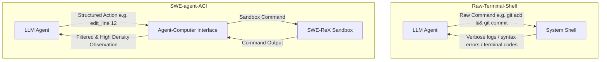
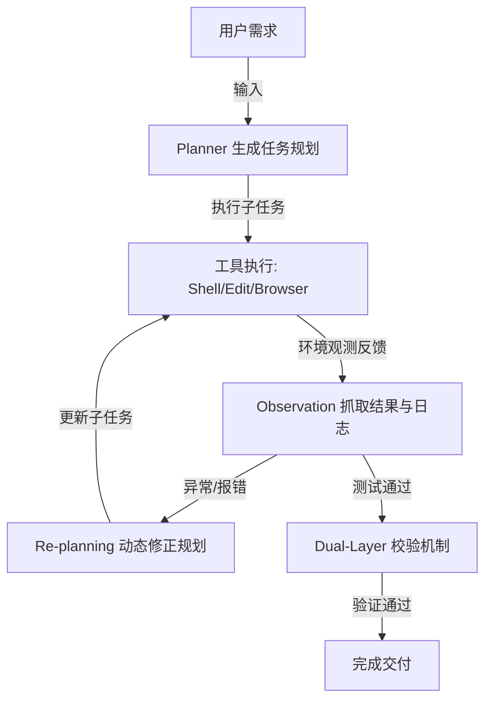

# Qualoop 相关开源产品调研与补充价值报告

本报告汇总并提炼与 Qualoop（质环）方法论及智能体系统相关的优秀开源产品。每半小时进行的深度调研都会将最新的分析与潜在的升级改进建议整理并记录入此文档中，供后续 Qualoop 的升级与完善使用。

---

## 🔍 开源产品调研时间轴

### 📅 首次调研（2026-05-23）: 深入分析 SWE-agent 与 Aider 的核心架构设计及对 Qualoop 的升级价值

#### 1. SWE-agent（普林斯顿 NLP 实验室）
*   **核心创新一：ACI（Agent-Computer Interface，人机界面）**
    *   *机制原理*：传统 Shell（Bash/PowerShell）输出是面向人类设计的，包含大量的格式化控制符、冗长系统噪声，容易导致 LLM 的上下文窗口溢出或因环境不稳定崩溃。SWE-agent 自定义了一个专为 Agent 设计的 Shell（SWE-shell），通过受限的专用命令（如 `find_by_name`, `edit_line`, `view_line_range`），精简了输入与输出，减少了上下文噪声。
    *   *错误防护*：设计了内建的输入输出校验拦截器，在 LLM 尝试运行非法/破坏性命令时进行干预与提醒，避免产生级联错误。
*   **核心创新二：SWE-ReX 沙盒执行环境**
    *   *机制原理*：为了安全且可重现地执行修复，SWE-agent 通过 SWE-ReX 管理容器化环境（Docker / Modal 等）。所有的代码搜索、修改和验证运行均隔离在沙盒内。

---

#### 2. Aider（最流行的协作 AI 编程器）
*   **核心创新一：基于 Tree-sitter 的 Repository Map（仓库地图）**
    *   *机制原理*：为了让 LLM 在庞大的项目库中准确定位代码却不超限，Aider 利用 Tree-sitter 将所有源文件解析为抽象语法树（AST）。它会提取全局的类定义、函数签名、导出类型等符号，构建符号依赖关系的有向图。
    *   *PageRank 权重计算*：对符号关系图应用 PageRank 算法进行重要性评分，筛选最重要的前 1024 级 Token 大小的符号形成静态的“地图”发送给 LLM。
*   **核心创新二：Architect/Editor 双模型协同模式**
    *   *机制原理*：推理（规划）与写码（执行）的分离。由高推理（但可能速度慢、费用高）的“架构师模型”（如 Claude 3.5 Sonnet / o1）负责生成架构设计蓝图和变更建议；再由代码输出精度极高的“编辑器模型”（如 DeepSeek / Fast Llama）负责将具体的 Diff 或 Patch 落库。

---

### 📅 第二次调研（2026-05-23）: 深入分析 Mentat 的块级代码编辑机制与 Devin 的 ReAct 自纠错双向闭环机制

#### 1. Mentat (面向终端的多文件协同编辑器)
*   **核心创新：增量式块级代码修改与语法树感知 (Incremental Block Editing)**
    *   *机制原理*：不同于一般的 AI 编程工具生成全量文件（极耗费 Token 且易中断），或者仅生成脆弱的 Diff Patch，Mentat 构建了一套自定义的代码块修改解析器。模型以特定的结构化文本语法输出欲修改的区块（包含定位上下文的代码行），Mentat 通过词法解析器将这些“块（Blocks）”与物理文件对齐，实现多文件并发、原子化的精确落库。
    *   *AST 语法树感知*：利用语法树定位被破坏的类签名或未闭合括号，保障了多文件级重构时的精准定位。

#### 2. Devin / AutoGPT (自主软件工程 Agent)
*   **核心创新一：ReAct (Reason + Act) 规划与动态重规划循环**
    *   *机制原理*：Devin 在接收到目标后，由 Planner 进行任务拆解并生成逐步规划（Plan）。在每步执行中，Agent 进入 `思索 (Reasoning) -> 选择工具执行 (Action) -> 观测结果并抓取日志 (Observation) -> 修正规划 (Re-planning)` 的持续状态机循环。若执行中报错（例如库版本冲突、测试失败），Agent 不会放弃或等待人工介入，而是将报错作为新的 Observation 自动迭代 Plan，实现闭环自纠错。
*   **核心创新二：机械化与语义化双层验证机制 (Dual-Layer Verification)**
    *   *机制原理*：集成系统级验证工具（机械层：编译检查、Lint 扫描、Pytest 运行）与智能体验证工具（语义层：由独立的审查/验证 Agent 进行差异比对）。
*   **核心创新三：团队本地规范注入机制 (Rules/Knowledge Base)**
    *   *机制原理*：允许在项目根目录下存在 `.rules` 规则库。在运行开始时，Agent 自动将这些本地规范合并到系统 Prompt 中，解决 Agent 代码风格与团队规范“脱节”的问题。

---

## 📊 跨维度深度对比分析

| 维度 | Qualoop (L1-L3 当前实现) | SWE-agent | Aider | Mentat | Devin / AutoGPT | 补充性价值与 Qualoop 演进方向 |
| :--- | :--- | :--- | :--- | :--- | :--- | :--- |
| **上下文管理** | 静态读取特定文件与 issues 列表 | 无，通过 ACI 限制只读特定行区间 | Tree-sitter PageRank 仓库地图 | 依赖交互式多文件 Context 选择 | 动态 Memory 载入 + 本地规则库 | **极高**：结合 PageRank 代码地图与本地 `.rules` 规范注入，兼顾框架性能与团队规范。 |
| **执行安全性** | 本地终端直接运行，无沙盒 | Docker / AWS Modal 沙盒隔离 (SWE-ReX) | 本地 Git 自动 Commit/Rollback 防灾 | 本地 Git 自动备份与撤销 | 完整的云端虚拟机容器沙盒隔离 | **高**：L3 级 Executor 应支持本地虚拟沙盒、临时分支防灾或虚拟机隔离。 |
| **命令交付形式** | 自然语言转 Python 脚本或 CLI 运行 | 专为 Agent 裁剪的高密 ACI 指令集 | 命令行快捷指令 + Chat 面板 | 交互式终端 UI 操作 | Web UI 交互及实时终端终端串流 | **高**：设计 `qualoop-shell` 和受限 ACI 工具，消除系统环境异构带来的执行副作用。 |
| **智能体架构** | 五/六角色（从发现到验证闭环） | 单一 Agent 状态循环 (Action Loop) | 经典的双模型 (Architect/Editor) 协同 | 单 Agent 高密交互模式 | ReAct 自主规划与动态重规划状态机 | **极高**：升级 Executor，引入动态重规划（Re-planning）自纠错状态机，解决自动修复低成功率痛点。 |

---

## 💡 核心价值提炼与升级建议

### 1. 执行器沙盒与安全性保障 (Sandbox & Safety)
*   **来源参考**：SWE-agent (SWE-ReX) / Aider (Git Savepoints)
*   **提炼价值**：自动修复必须在边界安全的环境下进行，直接修改物理文件可能引发逻辑冲突甚至丢失未暂存代码。
*   **Qualoop 升级方向**：
    > [!TIP]
    > **升级建议一（沙盒隔离）**：当 Qualoop 处于 L3 成熟度时，允许配置 `qualoop.json` 中的 `sandbox_type: "docker"` 或 `"temp_branch"`。在执行自动修复前，自动创建名为 `qualoop-temp-branch` 的安全暂存点，并在测试通过后通过 Rebase 或 PR 方式合并入主干。

### 2. 智能体冲突预防与并发机制 (ACI & Concurrency)
*   **来源参考**：SWE-agent ACI (Agent-Computer Interface)
*   **提炼价值**：避免让 AI 角色直面底层的 Bash 或 PowerShell 环境。前几次 Windows系统兼容性 Bug（如 `&&` 连接符故障）本质就是底层 OS CLI 不一致引入的。
*   **Qualoop 升级方向**：
    > [!IMPORTANT]
    > **升级建议二（Qualoop-ACI）**：为 Tester 和 Executor 提供高密度的中介层 API（例如抽象出 `FileViewer.read_range(file, start, end)` 和 `ShellExecutor.safe_run(cmd)`），不允许 Agent 随意编写原始命令行语句，以此实现跨 OS（Windows/macOS/Linux）行为一致性。

### 3. 精准缺陷定位与自动修复决策 (Repo-Map & Tree-sitter)
*   **来源参考**：Aider (PageRank Repository Map)
*   **提炼价值**：大型项目的核心挑战是“依赖链条长”。若没有关系图，Tester 在判定缺陷影响时常常遗漏受影响的调用方代码。
*   **Qualoop 升级方向**：
    > [!TIP]
    > **升级建议三（语法分析地图）**：引入 Python `tree-sitter` 绑定，对整个业务库生成符号依赖表（`automation/repo_map.json`）。当 Tester 探测到某个函数异常时，顺着依赖链把所有的可能调用方（Caller）标注为潜在缺陷 Issue 并写入 Store，实现深度可追溯。

### 4. 工具链拓展与版本控制集成 (Architect/Editor Mode)
*   **来源参考**：Aider Architect-Editor / o1-style Reasoning
*   **提炼价值**：不同等级的模型擅长不同的子任务。推理角色需要强逻辑但不需要输出格式敏感代码；编辑角色需要对 Diff 和占位符非常敏感。
*   **Qualoop 升级方向**：
    > [!NOTE]
    > **升级建议四（Executor 精细解耦）**：将 `automation/executors/` 下的修复动作划分为 **Planner-Executor**（由 Claude 3.5 或 o1-mini 生成修复逻辑说明）和 **Diff-Editor**（由 DeepSeek 快速生成具体的 patch），两者通过结构化 json 桥接，规避“幻觉”和“输出代码缺失”痛点。

### 5. 增量式块级代码修改与严格语法校验 (Block-based Editing & AST Check)
*   **来源参考**：Mentat (Block Edit Parser)
*   **提炼价值**：避免因模型生成大段文件带来 Token 耗尽和生成格式损坏，对变动范围实施最小的行级别精确替换，并进行语法完备性分析。
*   **Qualoop 升级方向**：
    > [!TIP]
    > **升级建议五（块编辑与 AST 校验）**：规范 Executor 的文件写入逻辑，开发特定的 `BlockPatchParser`。在执行补丁应用前，先通过 Python 内建的 `ast.parse` 解析被编辑文件，对比修改前后的 AST 结构以确保补丁未造成语法错误（如未闭合的圆括号/缩进错误）。

### 6. 动态重规划（Re-planning）与基于环境反馈的闭环纠错 (Re-planning Loop)
*   **来源参考**：Devin / AutoGPT (ReAct Loop)
*   **提炼价值**：自动修复往往一次难以成功（如改了 A 导致 B 单测失败）。如果只是简单抛出异常退出，自动化价值会大打折扣。
*   **Qualoop 升级方向**：
    > [!IMPORTANT]
    > **升级建议六（自纠错与重规划状态机）**：为 Executor 引入有界自纠错循环状态机。当 Verifier 反馈编译报错或单测失败时，捕获异常堆栈和错误日志，再次唤起修复 Agent 进行 `Re-planning`。最大自愈尝试限制设为 3 次，超过则置信度归零并自动降级为 `requires_human: true`。

### 7. 本地开发规范注入与团队规约约束 (Localized Rule Injection)
*   **来源参考**：Devin (Rules/Knowledge Base Injection)
*   **提炼价值**：通用 LLM 的修复策略可能不符合团队的具体编程习惯或底层安全限制，需要本地化知识以约束其生成路径。
*   **Qualoop 升级方向**：
    > [!NOTE]
    > **升级建议七（Qualoop-Rules 规约注入）**：在业务项目根目录支持 `.qualoop/rules/` 目录，允许团队以 Markdown 编写具体的代码规范（如“禁止使用全局变量”、“测试类命名规则”）。Tester 在生成检测指标、Scorer 在价值评分、Executor 在修改代码时，系统自动将匹配的规则作为 Context 提示词注入。
