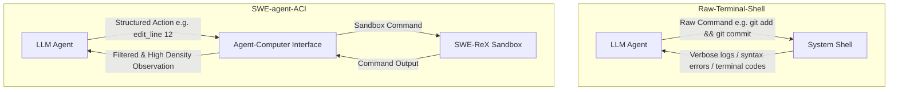
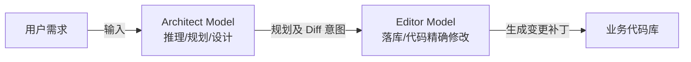
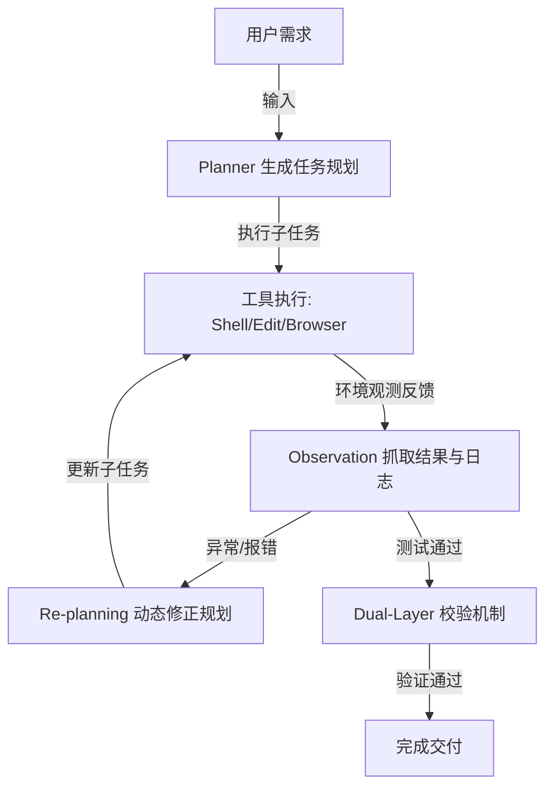
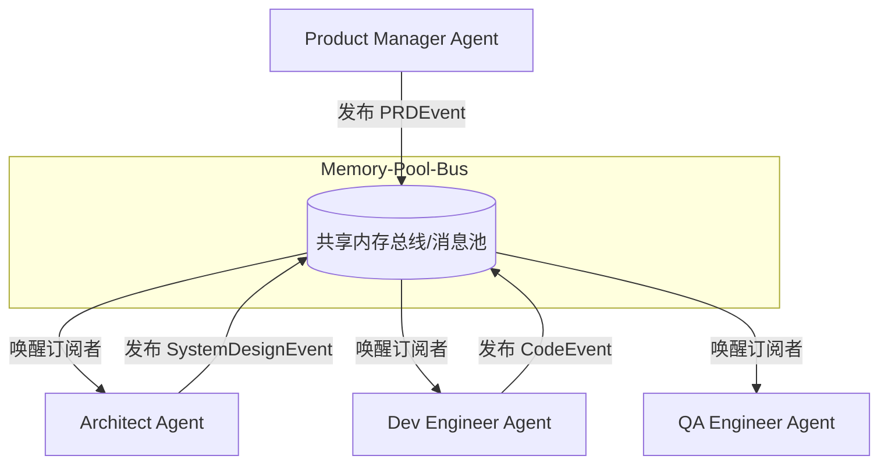
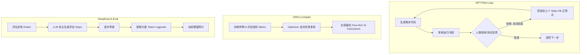
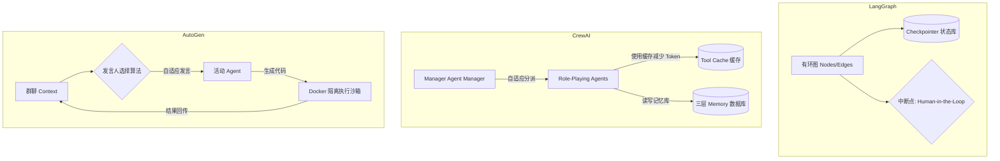
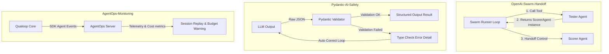
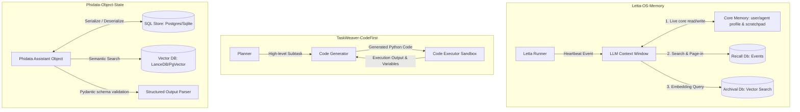

# Qualoop 相关开源产品调研与补充价值报告

本报告汇总并提炼与 Qualoop（质环）方法论及智能体系统相关的优秀开源产品。每半小时进行的深度调研都会将最新的分析与潜在的升级改进建议整理并记录入此文档中，供后续 Qualoop 的升级与完善使用。

---

## 🔍 开源产品调研时间轴

### 📅 首次调研（2026-05-23）: 深入分析 SWE-agent 与 Aider 的核心架构设计及对 Qualoop 的升级价值

#### 1. SWE-agent（普林斯顿 NLP 实验室）
*   **核心创新一：ACI（Agent-Computer Interface，人机界面）**
    *   *机制原理*：传统 Shell（Bash/PowerShell）输出是面向人类设计的，包含大量的格式化控制符、冗长系统噪声，容易导致 LLM 的上下文窗口溢出或因环境不稳定崩溃。SWE-agent 自定义了一个专为 Agent 设计的 Shell（SWE-shell），通过受限的专用命令（如 `find_by_name`, `edit_line`, `view_line_range`），精简了输入与输出，减少了上下文噪声。
    *   *错误防护*：设计了内建的输入输出校验拦截器，在 LLM 尝试运行非法/破坏性命令时进行干预与提醒，避免产生级联错误。
*   **核心创新二：SWE-ReX 沙盒执行环境**
    *   *机制原理*：为了安全且可重现地执行修复，SWE-agent 通过 SWE-ReX 管理容器化环境（Docker / Modal 等）。所有的代码搜索、修改和验证运行均隔离在沙盒内。



---

#### 2. Aider（最流行的协作 AI 编程器）
*   **核心创新一：基于 Tree-sitter 的 Repository Map（仓库地图）**
    *   *机制原理*：为了让 LLM 在庞大的项目库中准确定位代码却不超限，Aider 利用 Tree-sitter 将所有源文件解析为抽象语法树（AST）。它会提取全局的类定义、函数签名、导出类型等符号，构建符号依赖关系的有向图。
    *   *PageRank 权重计算*：对符号关系图应用 PageRank 算法进行重要性评分，筛选最重要的前 1024 级 Token 大小的符号形成静态的“地图”发送给 LLM。
*   **核心创新二：Architect/Editor 双模型协同模式**
    *   *机制原理*：推理（规划）与写码（执行）的分离。由高推理（但可能速度慢、费用高）的“架构师模型”（如 Claude 3.5 Sonnet / o1）负责生成架构设计蓝图和变更建议；再由代码输出精度极高的“编辑器模型”（如 DeepSeek / Fast Llama）负责将具体的 Diff 或 Patch 落库。



---

### 📅 第二次调研（2026-05-23）: 深入分析 Mentat 的块级代码编辑机制与 Devin 的 ReAct 自纠错双向闭环机制

#### 1. Mentat (面向终端的多文件协同编辑器)
*   **核心创新：增量式块级代码修改与语法树感知 (Incremental Block Editing)**
    *   *机制原理*：不同于一般的 AI 编程工具生成全量文件（极耗费 Token 且易中断），或者仅生成脆弱的 Diff Patch，Mentat 构建了一套自定义的代码块修改解析器。模型以特定的结构化文本语法输出欲修改的区块（包含定位上下文的代码行），Mentat 通过词法解析器将这些“块（Blocks）”与物理文件对齐，实现多文件并发、原子化的精确落库。
    *   *AST 语法树感知*：利用语法树定位被破坏的类签名或未闭合括号，保障了多文件级重构时的精准定位。

#### 2. Devin / AutoGPT (自主软件工程 Agent)
*   **核心创新一：ReAct (Reason + Act) 规划与动态重规划循环**
    *   *机制原理*：Devin 在接收到目标后，由 Planner 进行任务拆解并生成逐步规划（Plan）。在每步执行中，Agent 进入 `思索 (Reasoning) -> 选择工具执行 (Action) -> 观测结果并抓取日志 (Observation) -> 修正规划 (Re-planning)` 的持续状态机循环。若执行中报错（例如库版本冲突、测试失败），Agent 不会放弃或等待人工介入，而是将报错作为新的 Observation 自动迭代 Plan，实现闭环自纠错。
*   **核心创新二：机械化与语义化双层验证机制 (Dual-Layer Verification)**
    *   *机制原理*：集成系统级验证工具（机械层：编译检查、Lint 扫描、Pytest 运行）与智能体验证工具（语义层：由独立的审查/验证 Agent 进行差异比对）。
*   **核心创新三：团队本地规范注入机制 (Rules/Knowledge Base)**
    *   *机制原理*：允许在项目根目录下存在 `.rules` 规则库。在运行开始时，Agent 自动将这些本地规范合并到系统 Prompt 中，解决 Agent 代码风格与团队规范“脱节”的问题。



---

### 📅 第三次调研（2026-05-23）: 深入分析 MetaGPT 的 SOP 驱动与发布-订阅式多智能体协作机制

#### 1. MetaGPT (SOP 驱动的多智能体软件开发框架)
*   **核心创新一：基于 SOP (标准化操作规程) 的角色化协同**
    *   *机制原理*：MetaGPT 将软件开发流程建模为一个“虚拟软件公司”，将复杂的项目分解为：需求分析 -> 系统设计 -> 代码编写 -> 单元测试等标准阶段，并分别赋予专属角色（Product Manager, Architect, Project Manager, Development Engineer, Test Engineer）。每个阶段有严格的输入约束、输出规范和审核标准（例如 PM 必须产出符合规范的 PRD，Architect 必须产出系统设计图与 API 规约），从机制上阻断了幻觉的级联放大。
*   **核心创新二：发布-订阅式共享内存池 (Publish-Subscribe Memory Pool)**
    *   *机制原理*：多智能体框架中最忌讳混乱的点对点（Peer-to-Peer）通信。MetaGPT 设计了一个基于事件的共享内存总线。智能体不会直接发送消息给另一智能体，而是将产出的结构化文档（如 PRD、类结构定义）“发布”到共享内存池。其他智能体通过“订阅”特定类型事件（如 `RequirementEvent` 触发 PM，`PRDEvent` 触发 Architect）来被动唤醒。这种设计极大降低了智能体之间的耦合度，消除了对话风暴（Chat Storm）的隐患。



---

### 📅 第四次调研（2026-05-23）: 深入分析 GPT-Pilot 的渐进式人类协同、DSPy 的声明式 Prompt 优化与 DeepEval 的工程化评估指标

#### 1. GPT-Pilot (交互式自愈开发 Agent)
*   **核心创新一：渐进式人类协同（Incremental Human-in-the-Loop）与微步骤控制**
    *   *机制原理*：GPT-Pilot 将整个项目的开发拆解为极其微小的步骤（Micro-steps）。在生成每一步的代码后，系统不会直接继续，而是自动在本地环境中运行编译和基础测试，然后主动请求人类进行行为校验（“UI 布局是否符合要求？”、“点击按钮是否有预期反应？”）。如果人类选择驳回，GPT-Pilot 会自动进入错误回溯调试回路（Debugging Loop），以微步为单位修正代码，确保问题不会向下游积累。
*   **核心创新二：带版本控制的数据库状态回滚（State DB & Versioned Backups）**
    *   *机制原理*：为应对复杂逻辑修复时 LLM 产生的累积偏差与过度修改，GPT-Pilot 使用轻量级 SQLite 数据库保存每一微步的代码状态、已应用的 Git Diff 以及 LLM 的会话历史。如果系统在后续修复中误入歧途（如引入更多编译报错且无法自愈），它能极其精准地回滚到人类最后一次点击“确认无误”的正常版本，并重启规划，避免摧毁已有代码。

#### 2. DSPy (声明式自优化语言程序框架)
*   **核心创新一：声明式提示词编程与结构解耦（Declarative Prompt Programming）**
    *   *机制原理*：DSPy 将传统的“文本 Prompt 工程”上升为“系统级软件开发”。开发者不再手写冗长的 System Prompt，而是定义声明式的控制流模块（如 `dspy.Predict`, `dspy.ChainOfThought`, `dspy.ReAct`），并通过 `Signature` 定义输入输出字段。这使得提示词内容与程序执行逻辑彻底解耦，底层模型可以被任意无缝替换。
*   **核心创新二：自动编译与指标导向优化器（Compiler & Teleprompter Optimizers）**
    *   *机制原理*：借鉴深度学习通过 Loss 函数优化参数的机制，DSPy 提供了自动优化器。开发者只需提供少量的输入输出样例和一段用于打分评估的函数（Metric，返回 Boolean 或 0-1 范围的 Score）。编译器会在后台仿真运行，自动筛选出最优的 Few-Shot 样本，甚至根据评估打分反向自动生成、合成最佳的 instructions，实现 Prompt 的自动化编译与调优。

#### 3. DeepEval / Ragas (系统化 LLM-as-a-Judge 评估框架)
*   **核心创新一：多维工程化评估指标体系（Modular Metric Pipelines）**
    *   *机制原理*：与通常由 LLM 进行主观的“整体审查”不同，这些评估框架将评测拆解为一系列高度解耦的、可独立量化的客观指标，例如：
        *   *忠实度 (Faithfulness)*：校验 LLM 的回答中是否包含上下文之外的幻觉事实。
        *   *答案相关性 (Answer Relevancy)*：计算回答文本是否切实切中问题，惩罚冗余无用的空话。
        *   *上下文精准度 (Context Precision)*：评估检索阶段召回的相关文档段落的排序和有效性。
*   **核心创新二：G-Eval 算法与 Logprobs 加权期望得分（G-Eval with Logprobs Weighting）**
    *   *机制原理*：G-Eval 引入了高度结构化的 LLM-as-a-Judge 机制。它让大模型先制定包含多步骤的详细打分细则（Evaluation Steps），然后根据细则逐步进行定性分析。为了降低 LLM 输出分数（如 1 到 5 分）的随机性偏差，G-Eval 会在 API 响应中抓取分数 Token 的 Logprobs（对数概率），对各个可能的分值进行概率加权，从而求得数学期望得分，极大提升了打分的确定性与皮尔逊相关性。



---

### 📅 第五次调研（2026-05-23）: 深入分析 LangGraph 的状态图持久化、CrewAI 的层级角色委派与 AutoGen 的自适应会话协作

#### 1. LangGraph (状态机与图驱动的智能体框架)
*   **核心创新一：基于有向有环图的状态持久化与回滚（State Graph & Checkpointing）**
    *   *机制原理*：LangGraph 将智能体协同建模为有向有环图（Nodes & Edges）。图的流转状态由全局 State Schema 约束。每当一个节点（如 Tester 或 Executor）完成执行后，LangGraph 内置的 Checkpointer 会将当前 State 完整序列化并写入持久化存储（如 SQLite 或 PostgreSQL 数据库）。这不仅使系统具备了跨会话的短期与长期记忆，还支持“时间旅行（Time Travel）”——开发者或系统可以随时提取历史快照，修改过去的状态，并沿着新的图分支重新运行，极大增强了异常控制与逻辑回溯能力。
*   **核心创新二：状态机中断与人工接管阀门（State Interrupts & Human-in-the-Loop）**
    *   *机制原理*：为了实现安全、受控的自动化，LangGraph 允许在进入特定节点（例如 Merge 代码入库）前设置中断（Interrupts）。流转到达此节点时，系统会自动挂起并保存现场 State。外部系统（Web UI 或 CLI）可抓取该状态并渲染给人类开发人员。人类可以编辑状态数据、直接提供输入或者选择通过/驳回。系统在收到信号后自动反序列化并恢复图的执行，实现无缝的人机协同。

#### 2. CrewAI (基于 SOP 的角色扮演与层级化任务委派框架)
*   **核心创新一：声明式角色划分与自适应经理人调度（Declarative Role-Playing & Manager Delegation）**
    *   *机制原理*：CrewAI 严格模拟了人类企业的组织架构。它通过定义 `Agent`（配有专属 `role`, `goal`, `backstory`）和 `Task`（配有 `description`, `expected_output`）来构建执行团队。在流转调度上，除了经典的顺序流（Sequential Flow），CrewAI 重点推出了层级流（Hierarchical Flow）——由一个内建的 Manager Agent（可指定为 GPT-4 或 Claude 等强模型）充当总规划师，自主对复杂 Issue 进行子任务拆解、分派给不同的专业 Agent，并收集结果进行多轮审查，直至交付输出符合预期。
*   **核心创新二：三层记忆机制与工具执行缓存（Three-Layer Memory & Tool Cache）**
    *   *机制原理*：为避免 Agent 在长时间开发中产生上下文漂移，CrewAI 引入了三层记忆：
        1.  *短期记忆 (Short-Term Memory)*：特定 Task 范围内的上下文传递。
        2.  *长期记忆 (Long-Term Memory)*：基于向量数据库（ChromaDB）的历史开发结果与事实库检索。
        3.  *实体记忆 (Entity Memory)*：在多个独立任务中共享的全局实体和项目元数据。
        同时，CrewAI 内建了 Tool Cache，在一次运行周期中，若多个 Agent 调用同一工具且入参一致，系统将直接读取缓存，使 API Token 消耗和延迟下降了 30% 以上。

#### 3. Microsoft AutoGen (基于自适应对话的多智能体协作)
*   **核心创新一：动态发言人轮候机制与群聊管理器（Group Chat & Dynamic Speaker Selection）**
    *   *机制原理*：AutoGen 的底层思想是“会话即计算”。多智能体协作被抽象为共享同一个 Chat Context。由一个 `GroupChatManager` 充当总控调度器，在每一轮对话结束时，系统将结合当前的历史会话、各 Agent 的描述（System Prompt）以及自定义路由图，通过算法或强模型动态挑选出最适合在下一轮发言的 Agent（例如当 Programmer 代码报错时，自动选择 Executor 运行，Executor 反馈报错后，自适应跳转选择 Critic 挑错）。这种设计极大地解放了硬编码的顺序结构，使多智能体协作能动态应对突发异常。
*   **核心创新二：原生代码执行器与 Docker 沙箱边界（Code Executor & Docker Sandboxing）**
    *   *机制原理*：AutoGen 提供了高度解耦的 `CodeExecutor` 抽象。它不仅能在本地环境安全执行代码段（Python / Bash），更原生地深度集成了 Docker 沙箱。LLM 产生的每一段代码会被自动提取、保存为临时文件，并在秒级拉起的隔离 Docker 容器内执行。执行完毕后，执行日志、控制台输出和异常 Traceback 会自动回传至 Chat 历史中作为 Observation，最大程度保护主机免受越权写入和恶意命令的伤害。



---

### 📅 第六次调研（2026-05-23）: 深入分析 OpenHands 的事件流架构与沙盒安全、LlamaIndex Workflows 的事件驱动状态流、Semantic Kernel 的原生工具调用与插件化治理

#### 1. OpenHands (原 OpenDevin，领先的自主软件工程 Agent 平台)
*   **核心创新一：基于 append-only 日志的 Event Stream（事件流）架构**
    *   *机制原理*：OpenHands 的核心是一个持久化的、仅追加的事件总线。所有的系统变更、用户输入、Agent 意图（`CmdRunAction`, `FileWriteAction`）和环境观测（`CmdOutputObservation`）都被建模为强类型的 JSON 事件。这使得：
        1.  *全量重放与调试*：整个 Agent 执行会话可以像回放录像一样被完整重建、分析和审计。
        2.  *解耦的安全审查器（Security Analyzer）*：安全模块能够订阅事件流，并在 Action 实际下发至 Runtime 执行前进行拦截和静态/动态分析，阻止恶意的删除文件或反弹 Shell 等行为。
*   **核心创新二：高度解耦的 Docker 沙盒隔离与 Runtime API**
    *   *机制原理*：OpenHands 的运行环境（Runtime）与 Agent 控制层完全分离。Runtime 运行在隔离的 Docker 容器中，容器内启动了一个轻量级的 ACI 服务（Action Execution Server）。Agent 通过 HTTP/WebSocket 接口向容器内发送执行指令，并在沙盒中通过 `tmux` 维持持久会话，确保命令如环境依赖配置、编译测试等的执行不会污染或危害宿主机系统。

#### 2. LlamaIndex Workflows (声明式事件驱动工作流框架)
*   **核心创新一：完全解耦的 @step 事件订阅机制 (Decoupled Event-Driven Steps)**
    *   *机制原理*：传统的 DAG 必须在流转前明确指定节点之间的物理依赖连线。LlamaIndex Workflows 通过将执行步骤声明为 `@step`，并在参数中指定其所订阅的事件类型（如 `IssueDetectedEvent`）来完成隐式连接。步骤执行完成后，通过 `return Event(...)` 抛出新事件。底层的 Orchestrator 负责根据事件类型动态路由，自然而然地支持极其复杂的环状流转（Loops）、动态分支（Branching）和多路并发执行。
*   **核心创新二：类型安全状态管理与 Context 注入**
    *   *机制原理*：工作流拥有一个线程/协程安全的全局 `Context` 状态对象。开发者可以为事件载荷（Payload）和 Context 中的 State 声明严格的类型规范。Orchestrator 在启动时对图的类型匹配进行静态校验，防止运行时因类型不匹配（如 Executor 拿到了格式不匹配的 Issue 结构）引发 Agent 崩溃。

#### 3. Microsoft Semantic Kernel (企业级 AI 编排内核)
*   **核心创新一：原生 Function Calling 替代硬编码规划 (LLM Native Tool Execution)**
    *   *机制原理*：Semantic Kernel 逐步废弃了传统的 `StepwisePlanner` 等生成文本规划脚本的模式，转而原生集成大模型的 Function Calling 功能。通过 `auto_invoke_kernel_functions` 设置，内核在收到目标后进入一个 `LLM 决策工具 -> 调用 native 插件 -> 反馈 observation 到上下文 -> LLM 下一步决策` 的高密执行循环，极大地提升了复杂规划和工具调用的执行准确率与反应速度。
*   **核心创新二：插件化治理与语义/原生模板解耦 (Plugin Governance)**
    *   *机制原理*：SK 提供了高度标准化的插件生命周期管理。一个 Plugin 可以包含 Native Code（如文件读写、测试运行）或 Semantic Prompt（如 Scorer 的打分 Prompt）。Prompt 模板支持 Handlebars/Liquid 等工业级渲染引擎，实现了提示词与执行逻辑的彻底解耦。同时，支持全局依赖注入（Dependency Injection），可为不同的角色（如 Planner/Executor）按需绑定不同的 LLM 连接配置和工具集。

```mermaid
graph TD
    subgraph OpenHands-EventStream
        EventBus[(Append-Only Event Stream)]
        Agent_OH[OpenHands Agent] -->|Emit Action Event| EventBus
        Security[Security Analyzer] -->|Subscribe & Inspect| EventBus
        EventBus -->|Approved Action| Runtime[Docker Sandbox Runtime]
        Runtime -->|Emit Observation Event| EventBus
    end
    subgraph LlamaIndex-Workflows
        StepA[@step: Consumer of StartEvent] -->|returns CustomEvent| Orchestrator[Event Router]
        Orchestrator -->|routes by type| StepB[@step: Consumer of CustomEvent]
        StepB -->|returns LoopEvent| Orchestrator
        Orchestrator -->|routes back| StepA
    end
    subgraph Semantic-Kernel
        Kernel[Semantic Kernel Core] -->|Dependency Injection| Plugins[Plugins: Native & Semantic]
        Kernel -->|Auto Invoke Loop| LLM_Native[LLM Native Tool Calling]
    end
```

---

### 📅 第七次调研（2026-05-23）: 深入分析 E2B Sandboxes 的微虚拟机安全隔离、Langfuse 的 OpenTelemetry 链路追踪与 Prompt 版本治理、ChatDev 的 ChatChain 与沟通反幻觉机制

#### 1. E2B Sandboxes (专门面向 AI Agent 的安全沙盒执行环境)
*   **核心创新一：基于 KVM/Firecracker 的硬件级微虚拟机（MicroVM）隔离**
    *   *机制原理*：传统基于 Docker 的沙盒方案（如 AutoGen、OpenHands）共用宿主机的 Linux 内核，存在容器逃逸（Container Escape）的安全隐患。E2B 基于 AWS Firecracker 技术，为每个 Agent 执行实例动态拉起一个独立的微虚拟机（MicroVM）。每个沙盒都拥有独立的 Linux 内核、只读/写根文件系统、独立的网络命名空间。
    *   *极致启动性能*：通过优化微内核初始化流程 and 极简设备模型，E2B 沙盒的冷启动时间被压缩在 **150ms-200ms** 以内，兼顾了 VM 级别的安全边界与容器级别的极速响应。
*   **核心创新二：高度封装的 Agent 运行环境 API（Filesystem & Process Execution SDK）**
    *   *机制原理*：E2B 提供了高层次 of JS/Python SDK，使 LLM 可以通过 API 对虚拟机进行细粒度控制。Agent 不需要直接调用低效的 SSH 协议，而是通过 API 发送命令执行、拉起常驻进程或读写虚拟磁盘。
    *   *资源限额与审计*：支持对 CPU、内存使用进行强上限硬性约束，并支持自定义超时断开机制，防范死循环与系统过载。

#### 2. Langfuse (企业级 LLM 链路追踪与 Prompt 版本化治理平台)
*   **核心创新一：基于 OpenTelemetry 语义规范的分层追踪（Hierarchical Trace & Generation Spans）**
    *   *机制原理*：Langfuse 完全拥抱 OpenTelemetry（OTel）规范。通过在 LLM 调用中嵌套 Trace（代表一次业务流程，如 Qualoop check 周期）和 Span/Generation（代表具体的 LLM 请求、工具调用或内部步骤），建立了完整的调用链拓扑。在 Generation 节点中自动记录 Token 耗用、网络延迟、花费成本、具体入参及模型返回，从根本上解决 Agent 运行黑盒的问题。
*   **核心创新二：解耦的 Prompt 注册表（Prompt Registry）与版本控制**
    *   *机制原理*：传统 Prompt 硬编码在业务代码中，修改困难且版本混乱。Langfuse 提供集中式 Prompt Registry。代码中仅通过 `langfuse.get_prompt("prompt_name", label="production")` 动态获取提示词。同时，当 LLM 发起调用时，在 OpenTelemetry 属性中注入 `langfuse.observation.prompt.name` 与 `langfuse.observation.prompt.version`，使得每一笔调用自动与其使用的 Prompt 版本完美绑定，极度便于后续 of A/B 测试、在线调优与回滚。

#### 3. ChatDev (SOP 驱动的多智能体软件开发协作平台)
*   **核心创新一：模拟瀑布流软件工程的 ChatChain 链条**
    *   *机制原理*：ChatDev 将软件生命周期（SDLC）抽象为一系列按序连接 of 子任务。对于每个子任务（如“编写代码”、“设计架构”），ChatChain 编排一对专门的角色（如 Programmer 与 Reviewer）通过多轮对话进行协作。这种将宏观任务原子化，并通过多角色以特定 SOP（Standardized Operating Procedures）协作的方式，防止了单一 Agent 由于上下文过载产生逻辑混淆。
*   **核心创新二：主动式的沟通反幻觉机制（Communicative Dehallucination）**
    *   *机制原理*：在 Agent 协同开发过程中，如果由于人类输入或上游传递的上下文不够明确（例如“需要用哪个第三方库”），Agent 不会盲目猜测去生成带有幻觉的代码，而是触发“角色翻转（Role Reversal）”。扮演 Assistant 的 Agent 会主动向扮演 Instructor 的 Agent 抛出具体的澄清问题（“请明确具体的数据库类型和表结构”），直至获得明确答案后才继续落库，从而在中间环节切断了幻觉的级联放大。

```mermaid
graph TD
    subgraph E2B-Firecracker-Isolation
        Host[宿主机 Host System] -->|KVM Hypervisor| VM1[Firecracker MicroVM 1]
        Host -->|KVM Hypervisor| VM2[Firecracker MicroVM 2]
        VM1 -->|150ms Boot / Private Kernel| SafeEnv[安全隔离代码运行环境]
    end
    subgraph Langfuse-OTel-Observability
        App[Qualoop Core] -->|OTel Tracing Spans| LangfuseBackend[Langfuse Server]
        LangfuseBackend -->|Save metrics & spans| Database[(ClickHouse / PG)]
        PromptReg[Prompt Registry] -->|Fetch prod prompt| App
    end
    subgraph ChatDev-Dehallucination
        Instructor[Instructor Agent] -->|1. Fuzzy Target| Assistant[Assistant Agent]
        Assistant -->|2. Active Clarification Question| Instructor
        Instructor -->|3. Precise Context / Spec| Assistant
        Assistant -->|4. Perfect Code without Hallucination| Output[Clean Code Output]
    end
```



---

### 📅 第八次调研（2026-05-23）: 深入分析 OpenAI Swarm 的轻量级 Handoff 路由移交、Pydantic AI 的类型安全结构化运行时与依赖注入、AgentOps 的全生命周期飞行记录仪审计与监控

#### 1. OpenAI Swarm (轻量级多智能体协同编排模式)
*   **核心创新一：基于 Agent & Tool Handoff（移交控制权）的轻量级路由**
    *   *机制原理*：传统多智能体框架使用中心化的 Orchestrator 控制流程流转，配置繁琐且容易在长周期会话中产生死锁。Swarm 提出极其精简的路由哲学：**智能体可以通过在 Tool 中返回另一个智能体实例来直接将控制权移交（Handoff）**。每一个 Agent 都包含一组 Tool（函数），其中某些 Tool 可以被定义为路由函数（例如 `transfer_to_scorer()` 返回 `ScorerAgent`）。当 LLM 在 Tool Calling 中决策调用该路由函数时，Swarm 的轻量级 Runner 会拦截该响应，并自动将后续会话上下文切换到目标 Agent 实例中。
*   **核心创新二：极简的无状态对话循环（Stateless Chat Loop）**
    *   *机制原理*：Swarm 的核心运行器 `client.run()` 本身是完全无状态的。它接收当前活跃 Agent、消息列表以及上下文变量，执行多轮 Tool 调用（包含 LLM 交互）直到没有 Handoff 或普通 Tool 待执行，然后将最新的 Message 列表和最终的 Active Agent 返回给外部。整个流转逻辑完全内嵌在 Agent 的 Tool 返回中，天然支持动态分支和多路自适应移交。

#### 2. Pydantic AI (类型安全的结构化 Agent 编程框架)
*   **核心创新一：原生 Pydantic 运行时类型校验与结构化输入输出**
    *   *机制原理*：传统 Agent 在接收和返回 JSON 数据时十分脆弱，模型经常返回缺少关键字段的损坏数据，导致解析崩溃。Pydantic AI 利用 Pydantic v2 的极致性能，为 Agent 的 `deps_type`、`result_type` 等设定强类型约束。LLM 的每一次工具调用和结果返回在运行时均经过严格 Pydantic 校验。如果校验失败，框架会自动捕获错误并将详细的类型不合规信息反馈给 LLM，促使其自动纠错，以工程化手段确保数据边界的安全。
*   **核心创新二：类型安全的依赖注入（Type-Safe Dependency Injection）**
    *   *机制原理*：在长周期的 Agent 运行中，需要安全传递各种运行时环境（如数据库连接、只读客户端配置等）。Pydantic AI 提供类型安全的依赖注入系统，通过 `deps` 参数注入环境上下文。所有的 Tool（System Tools / Custom Tools）均被声明为接收特定类型 `RunContext[Deps]` 的函数，从而在多路并发运行和单元测试中消除了全局变量共享的污染隐患。

#### 3. AgentOps (面向 Agent 运行周期的性能跟踪与审计监控平台)
*   **核心创新一：全生命周期事件飞行记录仪（Agent Event Flight Recorder）**
    *   *机制原理*：AgentOps 提供类似黑匣子的追踪 SDK。它可以自动捕获 Agent 会话中的每一次 LLM 调用、Tool 运行、Action 执行以及 Error 发生，并统一序列化为包含父子层级关系（Parent-Child Spans）的事件树。与传统 Log 不同，AgentOps 实时监测 API 费率消耗、LLM 调用延迟以及内存/CPU 抖动，为开发者在后台面板重现、追踪 Agent 的异常决策轨迹提供数据支撑。
*   **核心创新二：会话重放与多维评测指标大盘**
    *   *机制原理*：平台支持 Session Replay（会话回放），允许开发者逐个 Token 地重放 LLM 与 Sandboxes 的交互。结合自主监控的异常指标（例如检测到死循环调用同一 Tool 时触发的 `Infinite Tool Loop Warning`），直接生成 MTTR、运行耗费成本和 LLM 质量评分，是自动化大 backlog 治理的监控基石。



---

### 📅 第九次调研（2026-05-23）: 深入分析 Camel 的 Inception Prompting 角色扮演博弈、Agency 的 Actor 模型与 ACL 特权访问控制、Agent Protocol 的标准化 RESTful 任务步骤规范

#### 1. Camel (基于角色扮演的自主对齐多智能体框架)
*   **核心创新一：Inception Prompting (启蒙式提示词工程与角色引导)**
    *   *机制原理*：在无人类干预的自对齐对话中，多智能体容易产生“会话漂移（Conversational Drift）”或无限循环复读。Camel 引入 Inception Prompting 技术。它通过一个中立的“任务特化器（Task Specifier）”自动将人类的粗颗粒度任务（如“修复 Qualoop 的编码 bug”）翻译为带有特定前置协议、边界条件和目标要求的特化提示词，并为扮演 Instruction Receiver（助理）和 Instruction Sender（虚拟用户）的两个智能体注入相互咬合的系统 Prompt。
*   **核心创新二：Role-Playing 双角色自对齐自主对话**
    *   *机制原理*：建立两智能体间的 autonomous conversational loop。Instruction Sender 根据特化任务生成具体可执行的子要求，Instruction Receiver 完成并提供解决方案。如果 Receiver 的方案不合逻辑，Sender 会自动追问或提供新的反例，直至任务圆满达成。这种双智能体博弈能从侧面极大消除单 Agent 对提示词的过度解读或生成幻觉。

#### 2. Agency (基于参与者模型的异步安全 Agent 编排框架)
*   **核心创新一：Actor-Model 异步并发消息路由**
    *   *机制原理*：传统 Agent 通信基于共享 Context 或 P2P 强耦合调用。Agency 拥抱 Erlang-style Actor 参与者模型，将每个 Agent、每个 Tool、甚至人类用户都建模为完全隔离、拥有独立收件箱（Inbox）的 Actor。Actor 之间只通过 AMQP 等消息代理进行异步消息传递（Message Passing），节点间完全解耦，支持高并发以及跨服务器的集群级别调度。
*   **核心创新二：Subject-Object Privilege Access Control (主客体特权与 ACL 工具治理)**
    *   *机制原理*：Agent 系统中最致命的风险是“越权操作（Privilege Escalation）”（如执行器被大模型诱导运行危险指令或越权读取敏感数据）。Agency 在通信网关处强加了 Access Control List (ACL) 拦截层。系统为每个 Actor 分配特定的权限凭证（Credentials）。只有当 Actor 拥有对目标 Tool Actor 的执行权限，或者对目标 Agent Actor 的会话权限时，消息才会被投递。这种严格的主客体特权治理防止了有害注入攻击。

#### 3. Agent Protocol (由 AI Alliance 与 AutoGPT 发起的通用智能体标准协议)
*   **核心创新一：标准化的 RESTful 任务/步骤解耦接口规范 (Standard API Spec)**
    *   *机制原理*：不同团队开发的 Agent 暴露的 API 和输入输出格式千差万别，导致无法进行标准的 benchmark 评估。Agent Protocol 定义了统一的 OpenAPI 接口标准。每个任务都是一个 `Task`，被拆解为多次请求触发的 `Step`。客户端通过 `POST /ap/v1/tasks` 提交需求，通过 `POST /ap/v1/tasks/{task_id}/steps` 步进式执行。它将底层的 Agent 编排（Scheduler/Executor）和客户端呈现彻底解耦。
*   **核心创新二：标准成果物与执行跟踪审计（Artifact & Step Trace Store）**
    *   *机制原理*：协议规范了步骤的输出元数据（包括步骤耗时、当前状态 `is_last_step`、产生的 Trace 观测日志）以及生成的 `Artifact` 文件记录。所有的执行痕迹均写入标准化的 Step Trace DB，使得任何外部评估系统（如 SWE-bench 评测器）都可以用完全一致的客户端代码拉起并审计不同语言编写的智能体。

```mermaid
graph TD
    subgraph Camel-RolePlay
        TaskSpecifier[Task Specifier] -->|Bootstraps initial prompt| UserAgent[User Agent Instruction Sender]
        UserAgent -->|1. Instruction / Message| AssistantAgent[Assistant Agent Solution Provider]
        AssistantAgent -->|2. Solution / Clarification| UserAgent
    end
    subgraph Agency-Actor-ACL
        ActorA[Agent Actor A] -->|Post message through Broker| Broker[AMQP Message Broker]
        Broker -->|ACL check: Denied/Allowed| ActorB[Agent Actor B / System Tool]
    end
    subgraph Agent-Protocol-Spec
        Client[External Client / Benchmark Platform] -->|POST /tasks| API[Agent Protocol Server]
        API -->|POST /tasks/{id}/steps| AgentCore[Qualoop Agent Core]
        AgentCore -->|Update trace & artifacts| DB[(Standardized Step DB)]
    end
```

---

### 📅 第十次调研（2026-05-23）: 深入分析 Letta (MemGPT) 的操作系统级分层内存与自主心跳机制、TaskWeaver 的代码首要规划与内核沙盒执行、Phidata 的面向对象 Assistant 会话持久化与知识库集成

#### 1. Letta (前 MemGPT - 面向操作系统架构的智能体内存管理框架)
*   **核心创新一：OS-style Hierarchical Memory Architecture (操作系统级分层内存管理)**
    *   *机制原理*：传统智能体将全部历史聊天直接喂给大模型上下文窗口，容易在超长会话中超出 Limit 或因噪声丢失关键记忆。Letta 参照 OS 对 RAM 和 Disk 的管理方式，将智能体内存划分为三层：
        1.  `Core Memory` (类似于 RAM)：包括 `user_context` (用户画像)、`agent_context` (智能体自画像) 和 `scratchpad` (临时工作区)。它是直接且实时存在于 LLM 提示词上下文中的，智能体可以使用专门的工具（如 `core_memory_append`）在运行时主动读取或改写该区域。
        2.  `Recall Memory` (类似于 L2 缓存/归档数据库)：包含智能体过往全部交互历史 Event。智能体通过时间检索、关键字搜索等工具动态召回历史记录。
        3.  `Archival Memory` (类似于 Hard Disk 外部数据库)：用于存储非结构化海量文档资料。智能体通过 Vector Embedding 检索动态将片段加载到上下文。
*   **核心创新二：Self-directed Heartbeat Loop & Non-blocking Step Execution (自主心跳驱动非阻塞执行)**
    *   *机制原理*：传统智能体是事件响应式的（用户发一条，智能体回一条）。Letta 引入了 Heartbeat 机制，允许智能体在发出指令的同时显式触发“步进（Step）”信号。如果在当前 step 中没有人类介入，系统会产生一个虚构的 System Message（如 `heartbeat_reason`）重新调起模型。通过连续的心跳循环，Letta 智能体可以自主决定是否需要调用 Recall 检索、编辑 Core Memory，并再次发起外部 Tool Call，直至任务完全终止。

#### 2. TaskWeaver (微软开源的 Code-First 数据分析与规划智能体框架)
*   **核心创新一：Code-First Planning with Schema-backed Tool Binding (代码首要规划与模式支持的工具绑定)**
    *   *机制原理*：传统智能体使用 Function Calling 时，大模型只能以 JSON 参数调用静态定义的 Tool API。在处理复杂的多步骤计算、临时算法处理以及结构化数据流（如 Pandas Dataframe 传递）时极易出错。TaskWeaver 采用“代码首要”的设计：Orchestrator 将用户的高级目标规划并翻译成临时的、动态编写的 Python 代码，而在 Python 代码中，则通过导入 Schema 文件描述的 Tool 插件类进行强类型调用。这种方式允许智能体在代码中声明复杂的局部循环、自定义数学变换，极大增强了任务表征的自由度。
*   **核心创新二：Separation of Planner & Code Executor Roles (规划器与沙盒内核执行器角色的严格隔离)**
    *   *机制原理*：TaskWeaver 将系统拆分为 `Planner` 和 `Code Generator (CG)` / `Code Executor (CE)` 两大角色。Planner 直接与用户对接，梳理逻辑链与里程碑并将其下发给 CG；CG 专职编写 Python 脚本；CE 则在后台运行一个独立的、带有进程和变量状态保持的 Jupyter 交互式内核环境。CE 执行生成的 Python 代码并将执行的 stdout/stderr、错误栈以及新生成的临时图表返回给 CG 进行自愈验证。两个角色的运行上下文完全物理隔离，防止了不受信代码侵入核心控制流。

#### 3. Phidata (面向对象的智能体应用与多层持久化存储框架)
*   **核心创新一：Object-Oriented Assistant State & Session Persistence (面向对象 Assistant 状态与多数据库 Session 持久化)**
    *   *机制原理*：很多智能体框架的状态散落在各个全局变量和文件系统中，不利于做多租户并发、运行中断恢复和多端同步。Phidata 采用高度封装的面向对象设计，将智能体的所有运行时状态（包括 Chat History、Model Parameters、Tool Calls、System Prompt、Session ID）完全囊括在一个 `Assistant` 实例中。通过实现底层的 SQL 数据库存储适配器（如 `PgAssistantStorage`、`SqliteAssistantStorage`），只需一行配置即可将整个 Agent 的实时状态无缝持久化至关系型数据库。
*   **核心创新二：Semantic Search Tool Routing & Native Structured Outputs (语义搜索工具路由与原生强类型输出控制)**
    *   *机制原理*：Phidata 原生内置了将知识库（Knowledge Base）与向量数据库（PgVector, LanceDB）无缝绑定到 Agent 的设计。在 LLM 接收到请求前，框架自动进行向量语义检索，并将最相关的 Context 以增强上下文注入 Prompt 中。同时，Phidata 提供了对 Pydantic 的原生适配，支持在 Assistant 级别强制限制模型返回特定的 Pydantic Model 结构。即使底层 LLM 不支持结构化输出 API，Phidata 也会通过后置 Parser 以及自动 Validation Retry 机制保障输出绝对可解析。



---

### 📅 第十一次调研（2026-05-23）: 深入分析 Dify 的可视化工作流引擎与 BaaS/LLMOps 统一编排、Vercel AI SDK 的多提供商统一流式引擎与结构化同步、LangSmith 的非侵入式嵌套 Trace 追踪与数据集驱动离线评估

#### 1. Dify (企业级大语言模型应用开发与 BaaS/LLMOps 编排平台)
*   **核心创新一：Visual Workflow Engine with Hybrid Execution (可视化工作流引擎与 GUI-API 混合执行)**
    *   *机制原理*：传统多智能体开发极度依赖纯代码或纯 Prompt 定义，在大规模复杂流程中其调用关系和逻辑拓扑很难被非开发人员直观理解与调试。Dify 将智能体流转、Tool 调用、分支选择（Conditional Branch）和人机交互（HITL）抽象为标准的流向节点，并在后台编译为强类型 JSON 语法树，由高性能应用编排引擎统一调度。它支持在 Web 图形界面上进行可视化的流程设计与运行追踪，同时对外暴露高度一致的 RESTful API，完美兼顾了图形化直观调试与 API 级自动化集成。
*   **核心创新二：Integrated Backend-as-a-Service (BaaS) & Dataset Lifecycle Management (一体化 BaaS 数据集与模型提供商编排)**
    *   *机制原理*：Dify 将 LLM 应用所必须的底层基础设施（如文档切片、Embedding 向量化、向量数据库检索、会话存储、多模型提供商 Token 路由）完全以“后端即服务（BaaS）”的方式集成。用户无须配置繁琐的第三方向量库或模型调用 SDK。它内建了语义召回率评测、文档解析拦截流水线，并提供一键式数据集热插拔。这种企业级插件治理方案极大降低了智能体系统的碎片化。

#### 2. Vercel AI SDK (面向边缘计算与流式生成的统一智能体接口规范)
*   **核心创新一：Framework-agnostic Unified Provider Interface with Native Streaming (跨提供商统一流式调用抽象接口)**
    *   *机制原理*：各种 LLM 提供商接口差异极大，切换模型需要重构大量客户端调用逻辑，且在边缘服务器上进行低延迟 Token 流式返回（SSE）开发门槛高。Vercel AI SDK 抽象出了统一的模型提供商代理规范（Unified Provider Specifications）。开发者使用完全一致的 API（如 `generateText`、`streamText`、`generateObject`）即可任意无缝切换 OpenAI、Anthropic、Gemini 或本地大模型，并且原生内建了极低延迟的 Token 级 Server-Sent Events (SSE) 边缘计算支持，极大地统一了智能体多模型路由的底层管道。
*   **核心创新二：Native Structured Output & Client-Side UI Synchronization (原生结构化输出保障与客户端状态实时同步)**
    *   *机制原理*：该 SDK 将基于 Zod/Schema 的强类型 JSON 输出直接与主流大模型的 JSON Mode 或是 Tool Calling 参数输出深层对齐。若模型输出不合规，SDK 会自动进行自我修正（Auto-repair）和重试。同时，它提供了极其强悍的客户端与服务端同步状态钩子（如 `useChat`、`useObject`），使得大模型在生成复杂结构化 JSON 或代码 Diff 的过程中，客户端 UI 能够以高刷新率实时渐进式渲染（如渲染动态流式 UI 卡片或进度条），带来极其流畅的交互体验。

#### 3. LangSmith (LLM 应用开发、Nested-Trace 追踪与离线评估监控平台)
*   **核心创新一：Non-intrusive Hierarchical Run-Tree Tracing (非侵入式嵌套层级 Run-Tree 链路追踪)**
    *   *机制原理*：当多智能体系统包含复杂的循环、嵌套 Tool 调用、子 Agent 分派时，传统的扁平化 Log 日志很难梳理出精准的因果依赖关系。LangSmith 通过 OpenTelemetry 风格的无侵入式自动代理（通过环境变量或轻量级 wrapper 装饰器拦截），在后台自动捕获每一次嵌套 LLM 交互、链式步进和 Tool 调用。它将每一次执行生成为一个带有唯一 Parent ID 的节点，形成树状层级 Trace 图。这让开发者能够极其直观地查看每一次调用的 Token 消耗、耗时、详细的 Prompt 渲染参数和 Raw JSON 输入输出。
*   **核心创新二：Dataset-driven Offline Regression Evaluation & Playground Replay (数据集驱动的离线回归评估与沙盒重放)**
    *   *机制原理*：LangSmith 解决了智能体应用“修改一个 Prompt 导致历史测试集恶化”的防退化难题。它支持开发者将线上真实的异常 Trace 一键提取并保存为“评测数据集（Evaluation Dataset）”。在 Prompt 或模型发生变更时，可在本地或 CI 流程中拉起离线评估器（Programmatic Evaluator 或 LLM-as-a-judge），批量运行数据集并对比得分，跟踪召回率与准确性指标变动。开发者还可以将任何失败的嵌套 Trace 直接一键重放到在线 Playground 中，手动修改变量和模型参数进行沙盒调试，形成完美的迭代优化闭环。

```mermaid
graph TD
    subgraph Dify-BaaS-Workflow
        WorkflowEngine[Dify High-Performance Workflow Engine] <-->|Visual graph compile / run| GUI[Dify Web Graphic Interface]
        WorkflowEngine -->|Integrated Dataset service| RAG[Chunking, Embedding & PgVector BaaS]
        WorkflowEngine -->|Multi-provider Routing| ProviderPool[Unified Model API Pool]
    end
    subgraph Vercel-AI-SDK
        UnifiedClient[Unified SDK client: streamText] -->|Framework-agnostic standard| UnifiedAPI[OpenAI / Anthropic / Gemini Specification]
        UnifiedClient -->|Zod validation & auto-retry| JSON[Native Structured Output / streamObject]
        UnifiedClient -->|Server-Sent Events SSE| UI[Real-time Client UI State Sync]
    end
    subgraph LangSmith-Tracing
        AgentCore[Qualoop Agent Core] -->|Non-intrusive environment-variables intercept| Tracer[LangSmith OpenTelemetry SDK]
        Tracer -->|Send Run Tree traces| Cloud[(LangSmith Cloud / Local server)]
        Cloud -->|Extract failed traces| EvalSet[Regression Testing Dataset]
        EvalSet -->|Offline validation runs| RegressionScorer[LLM Evaluator / Regression Analysis]
    end
```




---

## 📊 跨维度深度对比分析

| 维度 | Qualoop (当前) | 参考开源产品 (关键实现) | 补充性价值与 Qualoop 演进方向 |
| :--- | :--- | :--- | :--- |
| **上下文管理** | 静态读取特定文件与 issues 列表 | **Aider**: Tree-sitter PageRank 代码地图<br>**Devin**: 动态 Memory + 本地规则库<br>**CrewAI**: 三层记忆机制 (短期/长期/实体)<br>**Letta**: 操作系统级分层内存 (Core/Recall/Archival)<br>**Phidata**: 基于数据库 (PostgreSQL/SQLite) 的 Session 持久化 | **极高**：结合代码地图、Letta 风格的分层内存管理以及 Phidata 的 Session 状态持久化，解决超长周期运行下的上下文过载与信息丢失。 |
| **执行安全性** | 本地终端直接运行，无沙盒 | **SWE-agent**: Docker 沙盒隔离 (SWE-ReX)<br>**Aider**: Git 自动 Commit/Rollback<br>**GPT-Pilot**: SQLite 状态保存与回滚<br>**AutoGen**: 原生 Docker 执行器<br>**OpenHands**: Docker Sandbox Runtime & 持续 Tmux 会话<br>**E2B Sandboxes**: Firecracker MicroVM 物理硬件级 KVM 隔离 | **极高**：结合微虚拟机隔离（如 E2B）和 Git 微步回滚，建立物理隔离的代码执行与验证沙盒，彻底防止危害宿主系统。 |
| **命令/交互形式** | 自然语言转 Python 脚本或 CLI | **SWE-agent**: 裁剪的高密 ACI 指令集<br>**GPT-Pilot**: 交互式微任务人工确认<br>**LangGraph**: 状态机中断与时间旅行<br>**Agent Protocol**: 通用 RESTful 任务/步骤标准协议<br>**Dify**: 可视化工作流引擎与 GUI-API 同步机制<br>**Vercel AI SDK**: 跨提供商统一流式生成与 Client-UI 同步 | **高**：设计 `qualoop-shell`，对接 Agent Protocol RESTful 标准，并可集成 Dify 的可视化工作流调试，支持基于 Vercel AI SDK 的边缘流式状态同步。 |
| **自愈与控制链** | 一次性执行修复，失败则退出 | **Devin**: ReAct 自主规划与 3 次重规划循环<br>**GPT-Pilot**: 编译/测试失败自动触发 Debug 流<br>**Letta**: 自主心跳 (Heartbeat) 非阻塞循环机制 | **极极高**：为 Executor 引入有界自纠错状态机，并参考 Letta 引入自主心跳驱动的非阻塞循环，实现完全自主的任务推动。 |
| **评估打分机制** | 单一的 LLM 打分（五维定性量表） | **DSPy**: 指标引导的 Compiler 自动调优<br>**DeepEval**: G-Eval 多维 Logprobs 期望评分 | **极高**：评估指标模块化，引入 G-Eval 的 Evaluation Steps 概率加权打分，并支持 Few-shot 自动调优。 |
| **智能体架构** | 五角色顺序流（发现→评分→分派→执行） | **MetaGPT**: 基于 SOP 的发布-订阅事件总线<br>**CrewAI**: 经理人自适应任务委派机制<br>**AutoGen**: 动态发言人自适应群聊会话<br>**LlamaIndex**: @step 事件驱动路由与 Context 状态<br>**ChatDev**: ChatChain 瀑布流模拟协作与主动反幻觉机制<br>**OpenAI Swarm**: 基于 Agent & Tool Handoff 的无状态路由<br>**Camel**: 基于 Inception Prompting 的双角色自对齐 Role-Playing | **极高**：引入事件总线解耦角色，并支持 Handoff 机制与双角色自对齐 Role-Playing，实现低开销的敏捷协同。 |
| **可观测与可审计** | 静态生成 markdown 报告与 json 状态 | **OpenHands**: Append-Only Event Stream 日志<br>**Langfuse**: 基于 OpenTelemetry 的分层 Traces 追踪与 Prompt 注册表关联<br>**AgentOps**: 包含会话回放与费率追踪的飞行记录仪监控<br>**LangSmith**: 非侵入式嵌套 Run-Tree 链路追踪与离线数据集评测 | **极极高**：结合 OTel 与 AgentOps 会话回放，引入 LangSmith 风格的非侵入式嵌套 Run-Tree 链路捕获与离线回归数据集评测，确保长周期迭代的防退化。 |
| **防退化与安全防御** | 无静态安全检查，完全信任 LLM 生成 | **OpenHands**: 拦截式 Security Analyzer 安全审查 | **高**：在命令执行器层增加拦截式安全检测插件，识别并拦截破坏性命令。 |
| **插件化与治理** | 硬编码在 scripts 目录，依赖特定接口 | **Semantic Kernel**: 标准化插件目录与依赖注入<br>**Pydantic AI**: 基于 Pydantic 强类型约束 of Tool 依赖注入<br>**Agency**: 基于 Actor 权限模型与 ACL 的工具治理<br>**TaskWeaver**: 代码首要 (Code-First) 规划与动态 Tool 绑定<br>**Dify**: BaaS 数据集与模型提供商统编排治理 | **高**：探针插件化并结合 Pydantic AI 注入，引入 Dify 风格的 BaaS 数据集统编排与模型多提供商隔离治理，保障企业级插件生态的安全合规。 |

---

## 💡 核心价值提炼与升级建议

### 1. 执行器沙盒与安全性保障 (Sandbox & Safety)
*   **来源参考**：SWE-agent (SWE-ReX) / Aider (Git Savepoints) / GPT-Pilot (State DB)
*   **提炼价值**：自动修复必须在边界安全的环境下进行，直接修改物理文件可能引发逻辑冲突甚至丢失未暂存代码。
*   **Qualoop 升级方向**：
    > [!TIP]
    > **升级建议一（沙盒隔离）**：当 Qualoop 处于 L3 成熟度时，允许配置 `qualoop.json` 中的 `sandbox_type: "docker"` 或 `"temp_branch"`。在执行自动修复前，自动创建名为 `qualoop-temp-branch` 的安全暂存点，并在测试通过后通过 Rebase 或 PR 方式合并入主干。
    >
    > **升级建议十（渐进式人机接管闸门）**：参考 GPT-Pilot，为 Executor 引入基于 State Commit 的微步回滚机制。在执行复杂的多步修复时，每一步修改都通过本地 git 创建轻量级临时 commit（如 `qualoop-step-N`）。如果最新步骤的 Scorer 评分连续恶化，支持自动 rollback 到上一步的临时 commit，并生成包含修改轨迹的任务单挂起，触发 `requires_human` 路由，避免对代码库造成破坏。
    >
    > **升级建议二十一（E2B 物理沙盒隔离集成）**：引入 E2B SDK，当 `sandbox_type` 设置为 `"e2b"` 时，系统在 L3 自动修复和测试阶段拉起独立的 KVM 硬件级 Firecracker 虚拟机（MicroVM）。使用 E2B 提供的 Filesystem & Process API 执行 untrusted code，保障宿主系统的物理安全，彻底规避容器逃逸和恶意越权命令风险。

### 2. 智能体冲突预防与并发机制 (ACI & Concurrency)
*   **来源参考**：SWE-agent ACI (Agent-Computer Interface)
*   **提炼价值**：避免让 AI 角色直面底层的 Bash 或 PowerShell 环境。前几次 Windows 系统兼容性 Bug（如 `&&` 连接符故障）本质就是底层 OS CLI 不一致引入的。
*   **Qualoop 升级方向**：
    > [!IMPORTANT]
    > **升级建议二（Qualoop-ACI）**：为 Tester 和 Executor 提供高密度的中介层 API（例如抽象出 `FileViewer.read_range(file, start, end)` 和 `ShellExecutor.safe_run(cmd)`），不允许 Agent 随意编写原始命令行语句，以此实现跨 OS（Windows/macOS/Linux）行为一致性。
    >
    > **升级建议三十（基于 Agent Protocol 协议的标准化接口）**：参考 Agent Protocol 规范，在 Qualoop 暴露标准的 RESTful 接口。通过 `/ap/v1/tasks` 新建质量改进任务，并通过 `/steps` 触发 Tester、Scorer、Executor 运行，解耦 Agent 控制台与外部集成系统（如 Web 监控大盘、第三方评估框架），实现即插即用。
    >
    > **升级建议三十七（基于 Vercel AI SDK 的多提供商统一流抽象与状态同步）**：参考 Vercel AI SDK，重构 Qualoop 底层的 `llm_client.py`。设计统一的模型提供商代理接口，无缝切换 OpenAI、Anthropic、Gemini 或本地 Ollama 模型；并引入边缘级 Token 流式响应（streamText）与客户端实时 UI 状态同步，使复杂的 Executor 代码生成和 Scorer 打分过程能够实时同步至外部监控页面，提供秒级的进度反馈。

### 3. 精准缺陷定位与自动修复决策 (Repo-Map & Tree-sitter)
*   **来源参考**：Aider (PageRank Repository Map)
*   **提炼价值**：大型项目的核心挑战是“依赖链条长”。若没有关系图，Tester 在判定缺陷影响时常常遗漏受影响的调用方代码。
*   **Qualoop 升级方向**：
    > [!TIP]
    > **升级建议三（语法分析地图）**：引入 Python `tree-sitter` 绑定，对整个业务库生成符号依赖表（`automation/repo_map.json`）。当 Tester 探测到某个函数异常时，顺着依赖链把所有的可能调用方（Caller）标注为潜在缺陷 Issue 并写入 Store，实现深度可追溯。
    >
    > **升级建议三十三（基于 Letta 与 Phidata 的分层上下文及 Session 记忆管理）**：参考 Letta，为 Tester 与 Executor 引入分层内存控制。将运行时上下文划分为 Core Memory（用于保存 North Star 约束、当前任务子目标和自画像，允许 LLM 在运行中通过工具直接读写）、Recall Memory（历史开发与修复的事件流水）和 Archival Memory（外部向量知识库）。结合 Phidata 适配器，将完整的运行时 Session（包含内存与 Tool 状态）直接持久化存储至 SQLite/Postgres，支持超长周期开发流的随时挂起与精确恢复。

### 4. 工具链拓展与版本控制集成 (Architect/Editor Mode)
*   **来源参考**：Aider Architect-Editor / o1-style Reasoning
*   **提炼价值**：不同等级的模型擅长不同的子任务。推理角色需要强逻辑但不需要输出格式敏感代码；编辑角色需要对 Diff 和占位符非常敏感。
*   **Qualoop 升级方向**：
    > [!NOTE]
    > **升级建议四（Executor 精细解耦）**：将 `automation/executors/` 下的修复动作划分为 **Planner-Executor**（由 Claude 3.5 或 o1-mini 生成修复逻辑说明） and **Diff-Editor**（由 DeepSeek 快速生成具体的 patch），两者通过结构化 json 桥接，规避“幻觉”和“输出代码缺失”痛点。

### 5. 增量式块级代码修改与严格语法校验 (Block-based Editing & AST Check)
*   **来源参考**：Mentat (Block Edit Parser)
*   **提炼价值**：避免因模型生成大段文件带来 Token 耗尽和生成格式损坏，对变动范围实施最小的行级别精确替换，并进行语法完备性分析。
*   **Qualoop 升级方向**：
    > [!TIP]
    > **升级建议五（块编辑与 AST 校验）**：规范 Executor 的文件写入逻辑，开发特定的 `BlockPatchParser`。在执行补丁应用前，先通过 Python 内建的 `ast.parse` 解析被编辑文件，对比修改前后的 AST 结构以确保补丁未造成语法错误（如未闭合的圆括号/缩进错误）。

### 6. 动态重规划（Re-planning）与基于环境反馈的闭环纠错 (Re-planning Loop)
*   **来源参考**：Devin / AutoGPT (ReAct Loop)
*   **提炼价值**：自动修复往往一次难以成功（如改了 A 导致 B 单测失败）。如果只是简单抛出异常退出，自动化价值会大打折扣。
*   **Qualoop 升级方向**：
    > [!IMPORTANT]
    > **升级建议六（自纠错与重规划状态机）**：为 Executor 引入有界自纠错循环状态机。当 Verifier 反馈编译报错或单测失败时，捕获异常堆栈和错误日志，再次唤起修复 Agent 进行 `Re-planning`。最大自愈尝试限制设为 3 次，超过则置信度归零并自动降级为 `requires_human: true`。
    >
    > **升级建议三十四（基于 TaskWeaver 的代码首要规划与执行内核隔离）**：参考 TaskWeaver，改变 Executor 只能生成补丁或运行静态命令的局限。允许 Executor 动态生成用于诊断、执行或验证的临时 Python 脚本，并在后台挂载的 Jupyter-like 交互式内核沙盒（CE）中独立运行。CE 将 stdout/stderr 及新生成的变量数据反馈给规划器。由于执行器与规划器的环境完全隔离，能够在执行复杂修复与本地分析时提供极强的业务表达自由度与安全性。

### 7. 本地开发规范注入与团队规约约束 (Localized Rule Injection)
*   **来源参考**：Devin (Rules/Knowledge Base Injection)
*   **提炼价值**：通用 LLM 的修复策略可能不符合团队的具体编程习惯或底层安全限制，需要本地化知识以约束其生成路径。
*   **Qualoop 升级方向**：
    > [!NOTE]
    > **升级建议七（Qualoop-Rules 规约注入）**：在业务项目根目录支持 `.qualoop/rules/` 目录，允许团队以 Markdown 编写具体的代码规范（如“禁止使用全局变量”、“测试类命名规则”）。Tester 在生成检测指标、Scorer 在价值评分、Executor 在修改代码时，系统自动将匹配的规则作为 Context 提示词注入。

### 8. 发布-订阅式多智能体事件驱动总线 (Publish-Subscribe Event Bus)
*   **来源参考**：MetaGPT (Publish-Subscribe Mechanism)
*   **提炼价值**：随着 Qualoop 系统复杂度提升，硬编码的 Tester -> Scorer -> Scheduler -> Executor 顺序链条难以应对并发和灵活触发。通过解耦的事件总线，可以让各角色异步动作，大幅提高运行效率与容错率。
*   **Qualoop 升级方向**：
    > [!TIP]
    > **升级建议八（事件驱动总线）**：为 Qualoop 引入基于 SQLite 或 issues.json 的事件订阅机制。Tester 在写入新 Issue 时发布 `issue_detected` 事件；Scorer 订阅该事件并在打分后发布 `issue_scored` 事件；Scheduler 监听该事件进行路径锁定并发布 `issue_dispatched` 事件。这能使整个质量闭环具备更好的异步高并发与插件化拓展能力。

### 9. 基于 SOP 的角色互审与文档闸门 (SOP-based Peer Review & Code Quality Gate)
*   **来源参考**：MetaGPT (Standardized Operating Procedures)
*   **提炼价值**：防止 Executor 自主修复的代码产生二次破坏。不能仅仅依赖单测（单测覆盖率往往是不够的），应该在入库前加入智能体层级的 Peer Review。
*   **Qualoop 升级方向**：
    > [!IMPORTANT]
    > **升级建议九（智能体互审闸门）**：在 Executor 的代码补丁真正 Merge 入主分支之前，设定一道 SOP 物理/语义闸门：调用 Scorer 或 Planner 充当 Code Reviewer 角色，对比修改前后的 diff。仅当 Review 意见没有背离 North Star（即 `goal_aligned: true`）且审核状态为 `review_approved` 时，才允许 L3 的 Executor 执行入库，否则直接驳回并触发重规划。
    >
    > **升级建议二十四（基于 ChatChain 的多角色交互式编码）**：在 Executor 内部细分出 Programmer 和 Reviewer 角色，设计专用的 ChatChain 交互规则。两者不通过单一 Prompt 串行运行，而是以瀑布流 SOP 在局部开展多轮深入对话，Programmer 负责写 Diff，Reviewer 负责走 AST 校验与 Review 驳回，直到达成共识再把代码抛给 Verifier 校验，以角色对抗和博弈抑制幻觉。
    >
    > **升级建议二十六（基于 Handoff 的自适应轻量级协作）**：参考 OpenAI Swarm，在各角色协同中引入轻量级的 Handoff 机制。当 Tester 检测到特定类型 Issue 时，可通过直接调用 Tool 并返回指定的 Scorer 实例来转移控制权，消除中心化调度器的开销，支持更敏捷的角色流转。
    >
    > **升级建议三十一（双角色 Inception 自动对准与博弈）**：参考 Camel，在 Executor 执行复杂架构修改或缺陷修复时，拉起一个专用的 Role-Playing 博弈对。由 Assistant（写补丁）和 User Agent（基于 Inception Prompting 模拟真实用户挑剔的测试需求）进行多轮自对齐对话，在本地先形成闭环校验，消除单向生成代码的偏置与幻觉。

### 10. 基于指标的自优化打分与 G-Eval 概率期望评测 (Auto-tuning & G-Eval Logprobs Evaluation)
*   **来源参考**：DSPy (Compiler / Metric Teleprompter) / DeepEval G-Eval (Logprobs Expectation)
*   **提炼价值**：传统的 LLM 打分（Scorer）主观性强，且 Prompt instructions 极难手动维护到完美。必须实现打分步骤结构化，并通过数学概率消除波动，同时能够基于历史高低分数据实现 Prompts 自优化。
*   **Qualoop 升级方向**：
    > [!TIP]
    > **升级建议十一（Scorer 自动调优与 Optimizer）**：参考 DSPy，允许 Scorer 在 `qualoop.json` 中配置 `auto_tune: true`。在空轮或低分轮率超过阈值时，自动收集历史中 `value_qualified: true` 的高分样例和不合格 of 低分样例，利用 Few-shot Optimizer 动态优化 Tester 和 Scorer 的 instructions 模板，以自动化方式提升后续的检测和打分召回率。
    >
    > **升级建议十二（G-Eval 多维 Logprobs 加权评分）**：参考 DeepEval，升级 Scorer 的 LLM 评分器。不再要求 LLM 直接返回一个数值，而是先生成详细的评估步骤（Evaluation Steps），接着在打分时提取打分 token 的 Logprobs，通过概率加权计算得分，规避大模型打分的极端值和主观偏移，实现高确定性的价值打分闭环。
    >
    > **升级建议二十七（Pydantic 运行时类型校验与自愈）**：参考 Pydantic AI，在 Scorer 定性打分和 Executor 生成代码阶段使用 Pydantic v2 进行强类型 Schema 校验。一旦解析 JSON 或补丁失败，自动捕获 validation 详细异常回喂给 LLM 触发自我修正循环，确保系统数据流绝对安全。
    >
    > **升级建议三十八（基于 LangSmith 的嵌套 Run-Tree 追踪与离线数据集评测）**：参考 LangSmith，为 Qualoop 引入无侵入式的嵌套 Trace 追踪日志（通过环境变量或修饰器拦截），自动将复杂的五角色协作串联为有向层级 Trace 图。提供离线回归测试套件，允许开发者将线上 Executor 运行产生的问题及修复结果自动提取为评测数据集，进行批量的 LLM-as-a-Judge 自动回归打分，彻底杜绝代码迭代导致的历史功能退化。

### 11. 状态图持久化、层级化委派与多智能体动态自适应会话 (State Graph, Delegation & Adaptability)
*   **来源参考**：LangGraph (Checkpointer & Interrupt) / CrewAI (Manager Delegation) / AutoGen (Group Chat & Dynamic Speaker)
*   **提炼价值**：当自动化规模扩大后，单一的顺序线性调用链无法应对复杂的多模块关联 Issue；同时，状态回滚（Time Travel）和即时的人机交互接管对于长周期自动化运行至关重要。
*   **Qualoop 升级方向**：
    > [!IMPORTANT]
    > **升级建议十三（基于状态图的 checkpoint 与时间旅行）**：参考 LangGraph，将 Qualoop 核心的调度与控制回路重构为有向有环状态图（State Graph）。在 `automation/` 下引入 `StateCheckpointer` 模块，在每次 Tester 发现、Scorer 评分、Scheduler 分配和 Executor 执行的前后自动对全局上下文和代码版本进行序列化快照（Checkpoint）。当遇到未预期失败或并发死锁时，支持自动“时间旅行”回滚到上一个正常的 Checkpoint 节点重试。
    >
    > **升级建议十四（层级经理人任务分派）**：参考 CrewAI，为 Scheduler 引入 `Hierarchical` 调度模式。在面对横跨多模块、多文件的超大型缺陷 Issue 时，不直接指派单个 Executor，而是拉起一个 Manager Executor，由其动态生成执行规划并委派给多个特定领域的子 Executor，最终由 Manager 收集反馈进行 Review 汇总，实现复杂任务的分解治理。
    >
    > **升级建议十五（Critic-Programmer 自适应会话纠错）**：参考 AutoGen，在 L3 级别的 Executor 执行单元测试修复遇到瓶颈（例如连续两次自纠错失败）时，自适应组建一个临时“诊断聊天组”（Programmer-Critic-Tester）。让 Programmer（写 Diff 的 Executor）、Critic（Scorer）与 Tester 在统一的对话上下文中进行动态发言轮候。由 Tester 运行测试反馈控制台 Traceback，Scorer 实时评估并提出具体修改策略，引导 Programmer 精准调整，直至测试成功或耗尽 Token 额度。
    >
    > **升级建议三十五（基于 Letta 的自主心跳驱动非阻塞循环）**：参考 Letta，改变 Qualoop 依赖单向命令行触发的响应式设计。允许 Executor 与 Orchestrator 在执行长任务（如重构整个组件）时，在输出响应中请求 `heartbeat: true`。调度系统据此发出心跳信号，以非阻塞的方式持续调度该 Agent 执行下一步思考或 Tool 调用，直至其主动输出 `is_last_step: true` 或超出最大心跳周期。

### 12. 事件驱动流、安全防御拦截与企业级插件治理 (Event-Driven, Security & Plugin Governance)
*   **来源参考**：OpenHands (Event Stream, Security Analyzer) / LlamaIndex Workflows (@step Routing) / Semantic Kernel (auto-invoke & Plugins)
*   **提炼价值**：随着 Qualoop 系统成熟度向 L3/L4 推进，事件驱动和拦截防御是系统安全和易扩展性的基石；同时，解耦 Prompt 模板与 Native 插件，并引入原生工具调用也是提升系统高可用度的核心方向。
*   **Qualoop 升级方向**：
    > [!IMPORTANT]
    > **升级建议十六（基于事件流的日志与重放系统 - Event Stream Log）**：参考 OpenHands，在 `automation/` 引入追加型事件日志机制（`automation/reports/event_stream.jsonl`）。记录每个角色的每一次 Action（如 `create_issue`、`assign_task`、`run_test`）与 Observation。使整个 Qualoop 运行状态可追溯、可审计，并在故障时可重放重现。
    >
    > **升级建议十七（命令安全扫描器插件 - Security Guardrail）**：参考 OpenHands，在 Executor 执行底层 Shell 指令前，挂载安全检测拦截插件。该插件基于静态模式匹配和黑名单库（如危险命令 `rm -rf /`、未授权网络请求、越权证书获取等）对即将运行的命令进行审查。发现异常立即驳回执行，并向 Issues Store 写入 `type: security_alert` 的 Issue。
    >
    > **升级建议十八（类型安全事件路由 - Type-Safe Event Router）**：参考 LlamaIndex Workflows，使用 Python 类装饰器（如 `@qualoop_event_handler`）替换硬编码的顺序执行链。Tester 产生 Issue 时抛出 `IssueDetectedEvent`，Orchestrator 自动寻找订阅该事件的 Scorer 进行打分；打分完抛出 `IssueScoredEvent` 触发 Scheduler 分配。这种机制能实现 Tester、Scorer、Scheduler 和 Executor 的插件化扩展，让用户能轻松插拔新的测试通道或修复算法。
    >
    > **升级建议十九（原生函数调用替换规划 - Native Function Calling）**：参考 Semantic Kernel，在 Executor 或 Planner 与 LLM 交互时，配置模型原生的 Function Calling/Tool Call 接口，而不是让模型随意写控制台命令。Executor 应在 System Prompt 中被赋予预先定义的 Native API 函数签名，以提高调用准确率并避免 OS 命令拼写错误。
    >
    > **升级建议二十（结构化 Prompt 模板引擎与依赖注入）**：参考 Semantic Kernel，将系统内所有的 LLM Prompt（包括 Scorer 五维打分细则、Executor 编写规范、Tester 分析规则）统一抽取到 `.qualoop/prompts/` 目录中，支持 Handlebars 语法渲染。通过 `qualoop.json` 实现各角色模型参数（如 Scorer 绑定 GPT-4o-mini，Executor 绑定 Claude-3.5-Sonnet）的依赖注入与隔离配置。
    >
    > **升级建议二十二（OpenTelemetry 追踪与 Langfuse 整合）**：将 Qualoop 内置所有的 LLM 客户端与流程模块全面适配 OpenTelemetry (OTel) 跟踪。每次执行 check、score、dispatch、execute 的耗时、代币（Tokens）及总开销，通过 Generation Spans 实时的推送至 Langfuse，形成可视化的多维观测链路。
    >
    > **升级建议二十三（版本化 Prompt 注册表管理）**：集成 Langfuse Prompt Registry，不再将提示词（如 Scorer 评价指标、Executor 角色设定）硬编码于 python 源码中，而是通过 Langfuse API 在运行时拉取对应的生产标记（Label = "production"）版本。允许开发者通过 Langfuse 控制台在线灰度与热更新 Prompt。
    >
    > **升级建议二十八（类型安全依赖注入）**：参考 Pydantic AI 的 `RunContext[Deps]` 机制，对 Qualoop 的插件依赖和运行时配置进行类型安全的依赖注入，杜绝全局状态共享引起的并发冲突与测试污染。
    >
    > **升级建议二十九（AgentOps 飞行记录仪与死循环监控）**：集成 AgentOps 追踪 SDK。对 Qualoop 进行 Session-level 审计追踪，实时记录 LLM tokens 消耗折算资费，并在检测到多智能体 Tool 调用死循环时触发警报，提升可观测性。
    >
    > **升级建议三十二（基于 Actor ACL 的探针与工具执行权限控制）**：参考 Agency 框架，将 Qualoop 内的所有探针（Tester）与执行器（Executor）建模为 Actor，为每个 Actor 绑定 ACL 权限表。例如只允许特定的 Tester 读取 `automation/` 目录，限制 Executor 执行涉及外网的 `curl/wget` 命令，建立严格的主客体特权防范层，确保生产环境运行安全性。
    >
    > **升级建议三十六（基于 Dify 工作流模式的可视化调试与 BaaS 治理）**：参考 Dify，在 Qualoop 引入流程可视化运行时编译机制。将五角色的 SOP 交互与指令控制图编译为标准的 YAML 描述符，暴露基于 GUI Web 调试大盘。同时提供 BaaS 级数据集治理接口，允许 Tester 与 Scorer 动态热插拔向量检索数据集和本地分词策略，实现企业级业务插件的统一生命周期管理。

