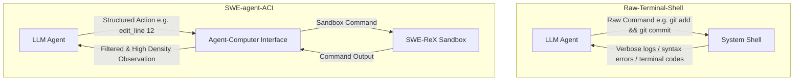
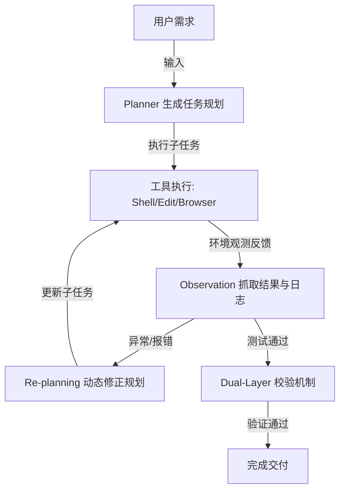
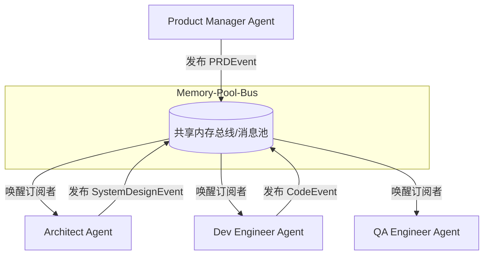
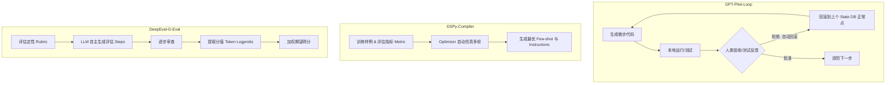

# Qualoop 相关开源产品调研与补充价值报告

本报告汇总并提炼与 Qualoop（质环）方法论及智能体系统相关的优秀开源产品。每半小时进行的深度调研都会将最新的分析与潜在的升级改进建议整理并记录入此文档中，供后续 Qualoop 的升级与完善使用。

---

## 🔍 开源产品调研时间轴

### 📅 首次调研（2026-05-23）: 深入分析 SWE-agent 与 Aider 的核心架构设计及对 Qualoop 的升级价值

#### 1. SWE-agent（普林斯顿 NLP 实验室）
*   **核心创新一：ACI（Agent-Computer Interface，人机界面）**
    *   *机制原理*：传统 Shell（Bash/PowerShell）输出是面向人类设计的，包含大量的格式化控制符、冗长系统噪声，容易导致 LLM 的上下文窗口溢出或因环境不稳定崩溃。SWE-agent 自定义了一个专为 Agent 设计的 Shell（SWE-shell），通过受限的专用命令（如 `find_by_name`, `edit_line`, `view_line_range`），精简了输入与输出，减少了上下文噪声。
    *   *错误防护*：设计了内建的输入输出校验拦截器，在 LLM 尝试运行非法/破坏性命令时进行干预与提醒，避免产生级联错误。
*   **核心创新二：SWE-ReX 沙盒执行环境**
    *   *机制原理*：为了安全且可重现地执行修复，SWE-agent 通过 SWE-ReX 管理容器化环境（Docker / Modal 等）。所有的代码搜索、修改和验证运行均隔离在沙盒内。

---

#### 2. Aider（最流行的协作 AI 编程器）
*   **核心创新一：基于 Tree-sitter 的 Repository Map（仓库地图）**
    *   *机制原理*：为了让 LLM 在庞大的项目库中准确定位代码却不超限，Aider 利用 Tree-sitter 将所有源文件解析为抽象语法树（AST）。它会提取全局的类定义、函数签名、导出类型等符号，构建符号依赖关系的有向图。
    *   *PageRank 权重计算*：对符号关系图应用 PageRank 算法进行重要性评分，筛选最重要的前 1024 级 Token 大小的符号形成静态的“地图”发送给 LLM。
*   **核心创新二：Architect/Editor 双模型协同模式**
    *   *机制原理*：推理（规划）与写码（执行）的分离。由高推理（但可能速度慢、费用高）的“架构师模型”（如 Claude 3.5 Sonnet / o1）负责生成架构设计蓝图和变更建议；再由代码输出精度极高的“编辑器模型”（如 DeepSeek / Fast Llama）负责将具体的 Diff 或 Patch 落库。

---

### 📅 第二次调研（2026-05-23）: 深入分析 Mentat 的块级代码编辑机制与 Devin 的 ReAct 自纠错双向闭环机制

#### 1. Mentat (面向终端的多文件协同编辑器)
*   **核心创新：增量式块级代码修改与语法树感知 (Incremental Block Editing)**
    *   *机制原理*：不同于一般的 AI 编程工具生成全量文件（极耗费 Token 且易中断），或者仅生成脆弱的 Diff Patch，Mentat 构建了一套自定义的代码块修改解析器。模型以特定的结构化文本语法输出欲修改的区块（包含定位上下文的代码行），Mentat 通过词法解析器将这些“块（Blocks）”与物理文件对齐，实现多文件并发、原子化的精确落库。
    *   *AST 语法树感知*：利用语法树定位被破坏的类签名或未闭合括号，保障了多文件级重构时的精准定位。

#### 2. Devin / AutoGPT (自主软件工程 Agent)
*   **核心创新一：ReAct (Reason + Act) 规划与动态重规划循环**
    *   *机制原理*：Devin 在接收到目标后，由 Planner 进行任务拆解并生成逐步规划（Plan）。在每步执行中，Agent 进入 `思索 (Reasoning) -> 选择工具执行 (Action) -> 观测结果并抓取日志 (Observation) -> 修正规划 (Re-planning)` 的持续状态机循环。若执行中报错（例如库版本冲突、测试失败），Agent 不会放弃或等待人工介入，而是将报错作为新的 Observation 自动迭代 Plan，实现闭环自纠错。
*   **核心创新二：机械化与语义化双层验证机制 (Dual-Layer Verification)**
    *   *机制原理*：集成系统级验证工具（机械层：编译检查、Lint 扫描、Pytest 运行）与智能体验证工具（语义层：由独立的审查/验证 Agent 进行差异比对）。
*   **核心创新三：团队本地规范注入机制 (Rules/Knowledge Base)**
    *   *机制原理*：允许在项目根目录下存在 `.rules` 规则库。在运行开始时，Agent 自动将这些本地规范合并到系统 Prompt 中，解决 Agent 代码风格与团队规范“脱节”的问题。

---

### 📅 第三次调研（2026-05-23）: 深入分析 MetaGPT 的 SOP 驱动与发布-订阅式多智能体协作机制

#### 1. MetaGPT (SOP 驱动的多智能体软件开发框架)
*   **核心创新一：基于 SOP (标准化操作规程) 的角色化协同**
    *   *机制原理*：MetaGPT 将软件开发流程建模为一个“虚拟软件公司”，将复杂的项目分解为：需求分析 -> 系统设计 -> 代码编写 -> 单元测试等标准阶段，并分别赋予专属角色（Product Manager, Architect, Project Manager, Development Engineer, Test Engineer）。每个阶段有严格的输入约束、输出规范和审核标准（例如 PM 必须产出符合规范的 PRD，Architect 必须产出系统设计图与 API 规约），从机制上阻断了幻觉的级联放大。
*   **核心创新二：发布-订阅式共享内存池 (Publish-Subscribe Memory Pool)**
    *   *机制原理*：多智能体框架中最忌讳混乱的点对点（Peer-to-Peer）通信。MetaGPT 设计了一个基于事件的共享内存总线。智能体不会直接发送消息给另一智能体，而是将产出的结构化文档（如 PRD、类结构定义）“发布”到共享内存池。其他智能体通过“订阅”特定类型事件（如 `RequirementEvent` 触发 PM，`PRDEvent` 触发 Architect）来被动唤醒。这种设计极大降低了智能体之间的耦合度，消除了对话风暴（Chat Storm）的隐患。

---

### 📅 第四次调研（2026-05-23）: 深入分析 GPT-Pilot 的渐进式人类协同、DSPy 的声明式 Prompt 优化与 DeepEval 的工程化评估指标

#### 1. GPT-Pilot (交互式自愈开发 Agent)
*   **核心创新一：渐进式人类协同（Incremental Human-in-the-Loop）与微步骤控制**
    *   *机制原理*：GPT-Pilot 将整个项目的开发拆解为极其微小的步骤（Micro-steps）。在生成每一步的代码后，系统不会直接继续，而是自动在本地环境中运行编译和基础测试，然后主动请求人类进行行为校验（“UI 布局是否符合要求？”、“点击按钮是否有预期反应？”）。如果人类选择驳回，GPT-Pilot 会自动进入错误回溯调试回路（Debugging Loop），以微步为单位修正代码，确保问题不会向下游积累。
*   **核心创新二：带版本控制的数据库状态回滚（State DB & Versioned Backups）**
    *   *机制原理*：为应对复杂逻辑修复时 LLM 产生的累积偏差与过度修改，GPT-Pilot 使用轻量级 SQLite 数据库保存每一微步的代码状态、已应用的 Git Diff 以及 LLM 的会话历史。如果系统在后续修复中误入歧途（如引入更多编译报错且无法自愈），它能极其精准地回滚到人类最后一次点击“确认无误”的正常版本，并重启规划，避免摧毁已有代码。

#### 2. DSPy (声明式自优化语言程序框架)
*   **核心创新一：声明式提示词编程与结构解耦（Declarative Prompt Programming）**
    *   *机制原理*：DSPy 将传统的“文本 Prompt 工程”上升为“系统级软件开发”。开发者不再手写冗长的 System Prompt，而是定义声明式的控制流模块（如 `dspy.Predict`, `dspy.ChainOfThought`, `dspy.ReAct`），并通过 `Signature` 定义输入输出字段。这使得提示词内容与程序执行逻辑彻底解耦，底层模型可以被任意无缝替换。
*   **核心创新二：自动编译与指标导向优化器（Compiler & Teleprompter Optimizers）**
    *   *机制原理*：借鉴深度学习通过 Loss 函数优化参数的机制，DSPy 提供了自动优化器。开发者只需提供少量的输入输出样例和一段用于打分评估的函数（Metric，返回 Boolean 或 0-1 范围的 Score）。编译器会在后台仿真运行，自动筛选出最优的 Few-Shot 样本，甚至根据评估打分反向自动生成、合成最佳的 instructions，实现 Prompt 的自动化编译与调优。

#### 3. DeepEval / Ragas (系统化 LLM-as-a-Judge 评估框架)
*   **核心创新一：多维工程化评估指标体系（Modular Metric Pipelines）**
    *   *机制原理*：与通常由 LLM 进行主观的“整体审查”不同，这些评估框架将评测拆解为一系列高度解耦的、可独立量化的客观指标，例如：
        *   *忠实度 (Faithfulness)*：校验 LLM 的回答中是否包含上下文之外的幻觉事实。
        *   *答案相关性 (Answer Relevancy)*：计算回答文本是否切实切中问题，惩罚冗余无用的空话。
        *   *上下文精准度 (Context Precision)*：评估检索阶段召回的相关文档段落的排序和有效性。
*   **核心创新二：G-Eval 算法与 Logprobs 加权期望得分（G-Eval with Logprobs Weighting）**
    *   *机制原理*：G-Eval 引入了高度结构化的 LLM-as-a-Judge 机制。它让大模型先制定包含多步骤的详细打分细则（Evaluation Steps），然后根据细则逐步进行定性分析。为了降低 LLM 输出分数（如 1 到 5 分）的随机性偏差，G-Eval 会在 API 响应中抓取分数 Token 的 Logprobs（对数概率），对各个可能的分值进行概率加权，从而求得数学期望得分，极大提升了打分的确定性与皮尔逊相关性。

---

## 📊 跨维度深度对比分析

| 维度 | Qualoop (当前) | 参考开源产品 (关键实现) | 补充性价值与 Qualoop 演进方向 |
| :--- | :--- | :--- | :--- |
| **上下文管理** | 静态读取特定文件与 issues 列表 | **Aider**: Tree-sitter PageRank 代码地图 **Devin**: 动态 Memory + 本地规则库 | **极高**：结合 PageRank 代码地图与本地 `.rules` 规范注入，兼顾框架性能与团队规范。 |
| **执行安全性** | 本地终端直接运行，无沙盒 | **SWE-agent**: Docker 沙盒隔离 (SWE-ReX) **Aider**: Git 自动 Commit/Rollback **GPT-Pilot**: SQLite 状态保存与回滚 | **高**：支持本地虚拟沙盒、临时分支防灾或虚拟机隔离，结合微步 Git 状态回滚机制防范代码丢失。 |
| **命令/交互形式** | 自然语言转 Python 脚本或 CLI | **SWE-agent**: 裁剪的高密 ACI 指令集 **GPT-Pilot**: 交互式微任务人工确认 | **高**：设计 `qualoop-shell` 和受限 ACI 工具，结合人机交互接管机制，避免盲目写码。 |
| **自愈与控制链** | 一次性执行修复，失败则退出 | **Devin**: ReAct 自主规划与 3 次重规划循环 **GPT-Pilot**: 编译/测试失败自动触发 Debug 流 | **极高**：为 Executor 引入有界自纠错循环状态机，当 Verifier 失败时自动重规划。 |
| **评估打分机制** | 单一的 LLM 打分（五维定性量表） | **DSPy**: 指标引导的 Compiler 自动调优 **DeepEval**: G-Eval 多维 Logprobs 期望评分 | **极高**：评估指标模块化，引入 G-Eval 的 Evaluation Steps 概率加权打分，并支持 Few-shot 自动调优。 |
| **智能体架构** | 五角色顺序流（发现→评分→分派→执行） | **MetaGPT**: 基于 SOP 的发布-订阅事件总线 **Aider**: 双模型 (Architect/Editor) 协同 | **极高**：引入事件总线解耦角色，添加双模型（策划与编辑器）协同与 SOP 智能体互审闸门。 |

---

## 💡 核心价值提炼与升级建议

### 1. 执行器沙盒与安全性保障 (Sandbox & Safety)
*   **来源参考**：SWE-agent (SWE-ReX) / Aider (Git Savepoints) / GPT-Pilot (State DB)
*   **提炼价值**：自动修复必须在边界安全的环境下进行，直接修改物理文件可能引发逻辑冲突甚至丢失未暂存代码。
*   **Qualoop 升级方向**：
    > [!TIP]
    > **升级建议一（沙盒隔离）**：当 Qualoop 处于 L3 成熟度时，允许配置 `qualoop.json` 中的 `sandbox_type: "docker"` 或 `"temp_branch"`。在执行自动修复前，自动创建名为 `qualoop-temp-branch` 的安全暂存点，并在测试通过后通过 Rebase 或 PR 方式合并入主干。
    >
    > **升级建议十（渐进式人机接管闸门）**：参考 GPT-Pilot，为 Executor 引入基于 State Commit 的微步回滚机制。在执行复杂的多步修复时，每一步修改都通过本地 git 创建轻量级临时 commit（如 `qualoop-step-N`）。如果最新步骤的 Scorer 评分连续恶化，支持自动 rollback 到上一步的临时 commit，并生成包含修改轨迹的任务单挂起，触发 `requires_human` 路由，避免对代码库造成破坏。

### 2. 智能体冲突预防与并发机制 (ACI & Concurrency)
*   **来源参考**：SWE-agent ACI (Agent-Computer Interface)
*   **提炼价值**：避免让 AI 角色直面底层的 Bash 或 PowerShell 环境。前几次 Windows 系统兼容性 Bug（如 `&&` 连接符故障）本质就是底层 OS CLI 不一致引入的。
*   **Qualoop 升级方向**：
    > [!IMPORTANT]
    > **升级建议二（Qualoop-ACI）**：为 Tester 和 Executor 提供高密度的中介层 API（例如抽象出 `FileViewer.read_range(file, start, end)` 和 `ShellExecutor.safe_run(cmd)`），不允许 Agent 随意编写原始命令行语句，以此实现跨 OS（Windows/macOS/Linux）行为一致性。

### 3. 精准缺陷定位与自动修复决策 (Repo-Map & Tree-sitter)
*   **来源参考**：Aider (PageRank Repository Map)
*   **提炼价值**：大型项目的核心挑战是“依赖链条长”。若没有关系图，Tester 在判定缺陷影响时常常遗漏受影响的调用方代码。
*   **Qualoop 升级方向**：
    > [!TIP]
    > **升级建议三（语法分析地图）**：引入 Python `tree-sitter` 绑定，对整个业务库生成符号依赖表（`automation/repo_map.json`）。当 Tester 探测到某个函数异常时，顺着依赖链把所有的可能调用方（Caller）标注为潜在缺陷 Issue 并写入 Store，实现深度可追溯。

### 4. 工具链拓展与版本控制集成 (Architect/Editor Mode)
*   **来源参考**：Aider Architect-Editor / o1-style Reasoning
*   **提炼价值**：不同等级的模型擅长不同的子任务。推理角色需要强逻辑但不需要输出格式敏感代码；编辑角色需要对 Diff 和占位符非常敏感。
*   **Qualoop 升级方向**：
    > [!NOTE]
    > **升级建议四（Executor 精细解耦）**：将 `automation/executors/` 下的修复动作划分为 **Planner-Executor**（由 Claude 3.5 或 o1-mini 生成修复逻辑说明）和 **Diff-Editor**（由 DeepSeek 快速生成具体的 patch），两者通过结构化 json 桥接，规避“幻觉”和“输出代码缺失”痛点。

### 5. 增量式块级代码修改与严格语法校验 (Block-based Editing & AST Check)
*   **来源参考**：Mentat (Block Edit Parser)
*   **提炼价值**：避免因模型生成大段文件带来 Token 耗尽和生成格式损坏，对变动范围实施最小的行级别精确替换，并进行语法完备性分析。
*   **Qualoop 升级方向**：
    > [!TIP]
    > **升级建议五（块编辑与 AST 校验）**：规范 Executor 的文件写入逻辑，开发特定的 `BlockPatchParser`。在执行补丁应用前，先通过 Python 内建的 `ast.parse` 解析被编辑文件，对比修改前后的 AST 结构以确保补丁未造成语法错误（如未闭合的圆括号/缩进错误）。

### 6. 动态重规划（Re-planning）与基于环境反馈的闭环纠错 (Re-planning Loop)
*   **来源参考**：Devin / AutoGPT (ReAct Loop)
*   **提炼价值**：自动修复往往一次难以成功（如改了 A 导致 B 单测失败）。如果只是简单抛出异常退出，自动化价值会大打折扣。
*   **Qualoop 升级方向**：
    > [!IMPORTANT]
    > **升级建议六（自纠错与重规划状态机）**：为 Executor 引入有界自纠错循环状态机。当 Verifier 反馈编译报错或单测失败时，捕获异常堆栈和错误日志，再次唤起修复 Agent 进行 `Re-planning`。最大自愈尝试限制设为 3 次，超过则置信度归零并自动降级为 `requires_human: true`。

### 7. 本地开发规范注入与团队规约约束 (Localized Rule Injection)
*   **来源参考**：Devin (Rules/Knowledge Base Injection)
*   **提炼价值**：通用 LLM 的修复策略可能不符合团队的具体编程习惯或底层安全限制，需要本地化知识以约束其生成路径。
*   **Qualoop 升级方向**：
    > [!NOTE]
    > **升级建议七（Qualoop-Rules 规约注入）**：在业务项目根目录支持 `.qualoop/rules/` 目录，允许团队以 Markdown 编写具体的代码规范（如“禁止使用全局变量”、“测试类命名规则”）。Tester 在生成检测指标、Scorer 在价值评分、Executor 在修改代码时，系统自动将匹配的规则作为 Context 提示词注入。

### 8. 发布-订阅式多智能体事件驱动总线 (Publish-Subscribe Event Bus)
*   **来源参考**：MetaGPT (Publish-Subscribe Mechanism)
*   **提炼价值**：随着 Qualoop 系统复杂度提升，硬编码的 Tester -> Scorer -> Scheduler -> Executor 顺序链条难以应对并发和灵活触发。通过解耦的事件总线，可以让各角色异步动作，大幅提高运行效率与容错率。
*   **Qualoop 升级方向**：
    > [!TIP]
    > **升级建议八（事件驱动总线）**：为 Qualoop 引入基于 SQLite 或 issues.json 的事件订阅机制。Tester 在写入新 Issue 时发布 `issue_detected` 事件；Scorer 订阅该事件并在打分后发布 `issue_scored` 事件；Scheduler 监听该事件进行路径锁定并发布 `issue_dispatched` 事件。这能使整个质量闭环具备更好的异步高并发与插件化拓展能力。

### 9. 基于 SOP 的角色互审与文档闸门 (SOP-based Peer Review & Code Quality Gate)
*   **来源参考**：MetaGPT (Standardized Operating Procedures)
*   **提炼价值**：防止 Executor 自主修复的代码产生二次破坏。不能仅仅依赖单测（单测覆盖率往往是不够的），应该在入库前加入智能体层级的 Peer Review。
*   **Qualoop 升级方向**：
    > [!IMPORTANT]
    > **升级建议九（智能体互审闸门）**：在 Executor 的代码补丁真正 Merge 入主分支之前，设定一道 SOP 物理/语义闸门：调用 Scorer 或 Planner 充当 Code Reviewer 角色，对比修改前后的 diff。仅当 Review 意见没有背离 North Star（即 `goal_aligned: true`）且审核状态为 `review_approved` 时，才允许 L3 的 Executor 执行入库，否则直接驳回并触发重规划。

### 10. 基于指标的自优化打分与 G-Eval 概率期望评测 (Auto-tuning & G-Eval Logprobs Evaluation)
*   **来源参考**：DSPy (Compiler / Metric Teleprompter) / DeepEval G-Eval (Logprobs Expectation)
*   **提炼价值**：传统的 LLM 打分（Scorer）主观性强，且 Prompt instructions 极难手动维护到完美。必须实现打分步骤结构化，并通过数学概率消除波动，同时能够基于历史高低分数据实现 Prompts 自优化。
*   **Qualoop 升级方向**：
    > [!TIP]
    > **升级建议十一（Scorer 自动调优与 Optimizer）**：参考 DSPy，允许 Scorer 在 `qualoop.json` 中配置 `auto_tune: true`。在空轮或低分轮率超过阈值时，自动收集历史中 `value_qualified: true` 的高分样例和不合格的低分样例，利用 Few-shot Optimizer 动态优化 Tester 和 Scorer 的 instructions 模板，以自动化方式提升后续的检测和打分召回率。
    >
    > **升级建议十二（G-Eval 多维 Logprobs 加权评分）**：参考 DeepEval，升级 Scorer 的 LLM 评分器。不再要求 LLM 直接返回一个数值，而是先生成详细的评估步骤（Evaluation Steps），接着在打分时提取打分 token 的 Logprobs，通过概率加权计算得分，规避大模型打分的极端值和主观偏移，实现高确定性的价值打分闭环。
