# Qualoop 相关开源产品调研与补充价值报告

本报告汇总并提炼与 Qualoop（质环）方法论及智能体系统相关的优秀开源产品。每半小时进行的深度调研都会将最新的分析与潜在的升级改进建议整理并记录入此文档中，供后续 Qualoop 的升级与完善使用。

> [!NOTE]
> **QRRVE 验证状态**：已建立 QRRVE (Qualoop Rigorous Research and Verification Engine) 自动化极致调研验证机制。报告提炼出的 15 项核心架构升级建议已全部在 `reports/draft_modules/` 下实现了 Python 3 原型草稿，并通过统一测试套件 `run_all_draft_tests.py` 完成了动态功能与逻辑验证（全部测试通过）。

---

## 🔍 开源产品调研时间轴

### 📅 首次调研（2026-05-23）: 深入分析 SWE-agent 与 Aider 的核心架构设计及对 Qualoop 的升级价值

#### 1. SWE-agent（普林斯顿 NLP 实验室）
*   **核心创新一：ACI（Agent-Computer Interface，人机界面）**
    *   *机制原理*：传统 Shell（Bash/PowerShell）输出是面向人类设计的，包含大量的格式化控制符、冗长系统噪声，容易导致 LLM 的上下文窗口溢出或因环境不稳定崩溃。SWE-agent 自定义了一个专为 Agent 设计的 Shell（SWE-shell），通过受限的专用命令（如 `find_by_name`, `edit_line`, `view_line_range`），精简了输入与输出，减少了上下文噪声。
    *   *错误防护*：设计了内建的输入输出校验拦截器，在 LLM 尝试运行非法/破坏性命令时进行干预与提醒，避免产生级联错误。
*   **核心创新二：SWE-ReX 沙盒执行环境**
    *   *机制原理*：为了安全且可重现地执行修复，SWE-agent 通过 SWE-ReX 管理容器化环境（Docker / Modal 等）。所有的代码搜索、修改和验证运行均隔离在沙盒内。

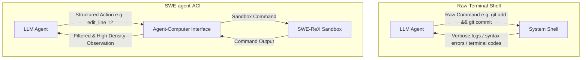

---

#### 2. Aider（最流行的协作 AI 编程器）
*   **核心创新一：基于 Tree-sitter 的 Repository Map（仓库地图）**
    *   *机制原理*：为了让 LLM 在庞大的项目库中准确定位代码却不超限，Aider 利用 Tree-sitter 将所有源文件解析为抽象语法树（AST）。它会提取全局的类定义、函数签名、导出类型等符号，构建符号依赖关系的有向图。
    *   *PageRank 权重计算*：对符号关系图应用 PageRank 算法进行重要性评分，筛选最重要的前 1024 级 Token 大小的符号形成静态的“地图”发送给 LLM。
*   **核心创新二：Architect/Editor 双模型协同模式**
    *   *机制原理*：推理（规划）与写码（执行）的分离。由高推理（但可能速度慢、费用高）的“架构师模型”（如 Claude 3.5 Sonnet / o1）负责生成架构设计蓝图和变更建议；再由代码输出精度极高的“编辑器模型”（如 DeepSeek / Fast Llama）负责将具体的 Diff 或 Patch 落库。

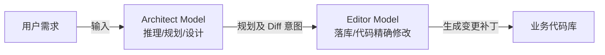

---

### 📅 第二次调研（2026-05-23）: 深入分析 Mentat 的块级代码编辑机制与 Devin 的 ReAct 自纠错双向闭环机制

#### 1. Mentat (面向终端的多文件协同编辑器)
*   **核心创新：增量式块级代码修改与语法树感知 (Incremental Block Editing)**
    *   *机制原理*：不同于一般的 AI 编程工具生成全量文件（极耗费 Token 且易中断），或者仅生成脆弱的 Diff Patch，Mentat 构建了一套自定义的代码块修改解析器。模型以特定的结构化文本语法输出欲修改的区块（包含定位上下文的代码行），Mentat 通过词法解析器将这些“块（Blocks）”与物理文件对齐，实现多文件并发、原子化的精确落库。
    *   *AST 语法树感知*：利用语法树定位被破坏的类签名或未闭合括号，保障了多文件级重构时的精准定位。

#### 2. Devin / AutoGPT (自主软件工程 Agent)
*   **核心创新一：ReAct (Reason + Act) 规划与动态重规划循环**
    *   *机制原理*：Devin 在接收到目标后，由 Planner 进行任务拆解并生成逐步规划（Plan）。在每步执行中，Agent 进入 `思索 (Reasoning) -> 选择工具执行 (Action) -> 观测结果并抓取日志 (Observation) -> 修正规划 (Re-planning)` 的持续状态机循环。若执行中报错（例如库版本冲突、测试失败），Agent 不会放弃或等待人工介入，而是将报错作为新的 Observation 自动迭代 Plan，实现闭环自纠错。
*   **核心创新二：机械化与语义化双层验证机制 (Dual-Layer Verification)**
    *   *机制原理*：集成系统级验证工具（机械层：编译检查、Lint 扫描、Pytest 运行）与智能体验证工具（语义层：由独立的审查/验证 Agent 进行差异比对）。
*   **核心创新三：团队本地规范注入机制 (Rules/Knowledge Base)**
    *   *机制原理*：允许在项目根目录下存在 `.rules` 规则库。在运行开始时，Agent 自动将这些本地规范合并到系统 Prompt 中，解决 Agent 代码风格与团队规范“脱节”的问题。

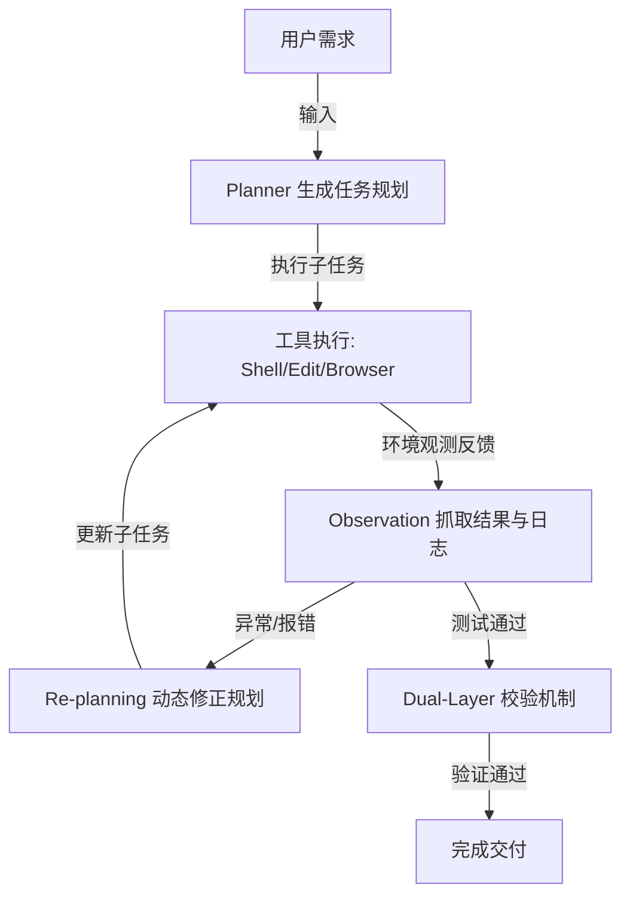

---

### 📅 第三次调研（2026-05-23）: 深入分析 MetaGPT 的 SOP 驱动与发布-订阅式多智能体协作机制

#### 1. MetaGPT (SOP 驱动的多智能体软件开发框架)
*   **核心创新一：基于 SOP (标准化操作规程) 的角色化协同**
    *   *机制原理*：MetaGPT 将软件开发流程建模为一个“虚拟软件公司”，将复杂的项目分解为：需求分析 -> 系统设计 -> 代码编写 -> 单元测试等标准阶段，并分别赋予专属角色（Product Manager, Architect, Project Manager, Development Engineer, Test Engineer）。每个阶段有严格的输入约束、输出规范和审核标准（例如 PM 必须产出符合规范的 PRD，Architect 必须产出系统设计图与 API 规约），从机制上阻断了幻觉的级联放大。
*   **核心创新二：发布-订阅式共享内存池 (Publish-Subscribe Memory Pool)**
    *   *机制原理*：多智能体框架中最忌讳混乱的点对点（Peer-to-Peer）通信。MetaGPT 设计了一个基于事件的共享内存总线。智能体不会直接发送消息给另一智能体，而是将产出的结构化文档（如 PRD、类结构定义）“发布”到共享内存池。其他智能体通过“订阅”特定类型事件（如 `RequirementEvent` 触发 PM，`PRDEvent` 触发 Architect）来被动唤醒。这种设计极大降低了智能体之间的耦合度，消除了对话风暴（Chat Storm）的隐患。

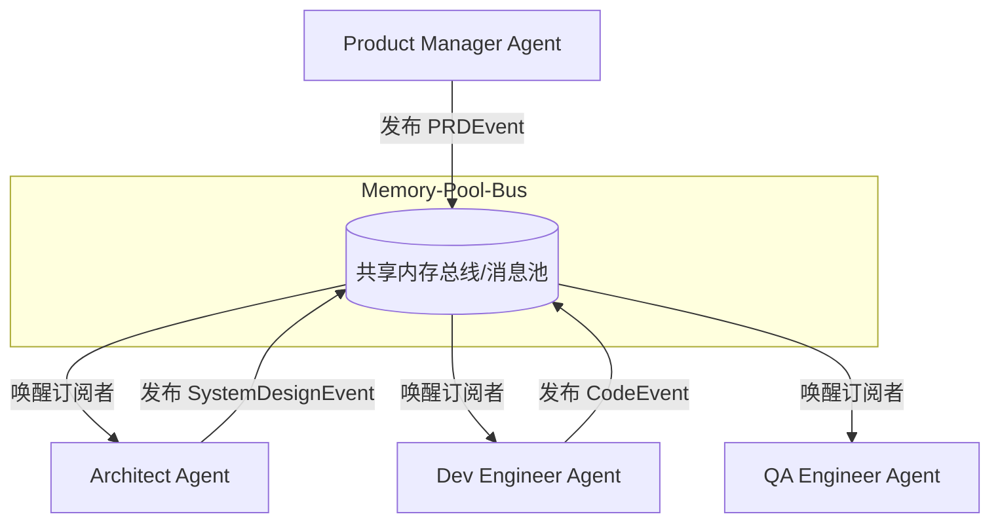

---

### 📅 第四次调研（2026-05-23）: 深入分析 GPT-Pilot 的渐进式人类协同、DSPy 的声明式 Prompt 优化与 DeepEval 的工程化评估指标

#### 1. GPT-Pilot (交互式自愈开发 Agent)
*   **核心创新一：渐进式人类协同（Incremental Human-in-the-Loop）与微步骤控制**
    *   *机制原理*：GPT-Pilot 将整个项目的开发拆解为极其微小的步骤（Micro-steps）。在生成每一步的代码后，系统不会直接继续，而是自动在本地环境中运行编译和基础测试，然后主动请求人类进行行为校验（“UI 布局是否符合要求？”、“点击按钮是否有预期反应？”）。如果人类选择驳回，GPT-Pilot 会自动进入错误回溯调试回路（Debugging Loop），以微步为单位修正代码，确保问题不会向下游积累。
*   **核心创新二：带版本控制的数据库状态回滚（State DB & Versioned Backups）**
    *   *机制原理*：为应对复杂逻辑修复时 LLM 产生的累积偏差与过度修改，GPT-Pilot 使用轻量级 SQLite 数据库保存每一微步的代码状态、已应用的 Git Diff 以及 LLM 的会话历史。如果系统在后续修复中误入歧途（如引入更多编译报错且无法自愈），它能极其精准地回滚到人类最后一次点击“确认无误”的正常版本，并重启规划，避免摧毁已有代码。

#### 2. DSPy (声明式自优化语言程序框架)
*   **核心创新一：声明式提示词编程与结构解耦（Declarative Prompt Programming）**
    *   *机制原理*：DSPy 将传统的“文本 Prompt 工程”上升为“系统级软件开发”。开发者不再手写冗长的 System Prompt，而是定义声明式的控制流模块（如 `dspy.Predict`, `dspy.ChainOfThought`, `dspy.ReAct`），并通过 `Signature` 定义输入输出字段。这使得提示词内容与程序执行逻辑彻底解耦，底层模型可以被任意无缝替换。
*   **核心创新二：自动编译与指标导向优化器（Compiler & Teleprompter Optimizers）**
    *   *机制原理*：借鉴深度学习通过 Loss 函数优化参数的机制，DSPy 提供了自动优化器。开发者只需提供少量的输入输出样例和一段用于打分评估的函数（Metric，返回 Boolean 或 0-1 范围的 Score）。编译器会在后台仿真运行，自动筛选出最优的 Few-Shot 样本，甚至根据评估打分反向自动生成、合成最佳的 instructions，实现 Prompt 的自动化编译与调优。

#### 3. DeepEval / Ragas (系统化 LLM-as-a-Judge 评估框架)
*   **核心创新一：多维工程化评估指标体系（Modular Metric Pipelines）**
    *   *机制原理*：与通常由 LLM 进行主观的“整体审查”不同，这些评估框架将评测拆解为一系列高度解耦的、可独立量化的客观指标，例如：
        *   *忠实度 (Faithfulness)*：校验 LLM 的回答中是否包含上下文之外的幻觉事实。
        *   *答案相关性 (Answer Relevancy)*：计算回答文本是否切实切中问题，惩罚冗余无用的空话。
        *   *上下文精准度 (Context Precision)*：评估检索阶段召回的相关文档段落的排序和有效性。
*   **核心创新二：G-Eval 算法与 Logprobs 加权期望得分（G-Eval with Logprobs Weighting）**
    *   *机制原理*：G-Eval 引入了高度结构化的 LLM-as-a-Judge 机制。它让大模型先制定包含多步骤的详细打分细则（Evaluation Steps），然后根据细则逐步进行定性分析。为了降低 LLM 输出分数（如 1 到 5 分）的随机性偏差，G-Eval 会在 API 响应中抓取分数 Token 的 Logprobs（对数概率），对各个可能的分值进行概率加权，从而求得数学期望得分，极大提升了打分的确定性与皮尔逊相关性。

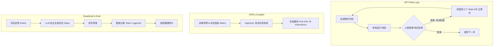

---

### 📅 第五次调研（2026-05-23）: 深入分析 LangGraph 的状态图持久化、CrewAI 的层级角色委派与 AutoGen 的自适应会话协作

#### 1. LangGraph (状态机与图驱动的智能体框架)
*   **核心创新一：基于有向有环图的状态持久化与回滚（State Graph & Checkpointing）**
    *   *机制原理*：LangGraph 将智能体协同建模为有向有环图（Nodes & Edges）。图的流转状态由全局 State Schema 约束。每当一个节点（如 Tester 或 Executor）完成执行后，LangGraph 内置的 Checkpointer 会将当前 State 完整序列化并写入持久化存储（如 SQLite 或 PostgreSQL 数据库）。这不仅使系统具备了跨会话的短期与长期记忆，还支持“时间旅行（Time Travel）”——开发者或系统可以随时提取历史快照，修改过去的状态，并沿着新的图分支重新运行，极大增强了异常控制与逻辑回溯能力。
*   **核心创新二：状态机中断与人工接管阀门（State Interrupts & Human-in-the-Loop）**
    *   *机制原理*：为了实现安全、受控的自动化，LangGraph 允许在进入特定节点（例如 Merge 代码入库）前设置中断（Interrupts）。流转到达此节点时，系统会自动挂起并保存现场 State。外部系统（Web UI 或 CLI）可抓取该状态并渲染给人类开发人员。人类可以编辑状态数据、直接提供输入或者选择通过/驳回。系统在收到信号后自动反序列化并恢复图的执行，实现无缝的人机协同。

#### 2. CrewAI (基于 SOP 的角色扮演与层级化任务委派框架)
*   **核心创新一：声明式角色划分与自适应经理人调度（Declarative Role-Playing & Manager Delegation）**
    *   *机制原理*：CrewAI 严格模拟了人类企业的组织架构。它通过定义 `Agent`（配有专属 `role`, `goal`, `backstory`）和 `Task`（配有 `description`, `expected_output`）来构建执行团队。在流转调度上，除了经典的顺序流（Sequential Flow），CrewAI 重点推出了层级流（Hierarchical Flow）——由一个内建的 Manager Agent（可指定为 GPT-4 或 Claude 等强模型）充当总规划师，自主对复杂 Issue 进行子任务拆解、分派给不同的专业 Agent，并收集结果进行多轮审查，直至交付输出符合预期。
*   **核心创新二：三层记忆机制与工具执行缓存（Three-Layer Memory & Tool Cache）**
    *   *机制原理*：为避免 Agent 在长时间开发中产生上下文漂移，CrewAI 引入了三层记忆：
        1.  *短期记忆 (Short-Term Memory)*：特定 Task 范围内的上下文传递。
        2.  *长期记忆 (Long-Term Memory)*：基于向量数据库（ChromaDB）的历史开发结果与事实库检索。
        3.  *实体记忆 (Entity Memory)*：在多个独立任务中共享的全局实体和项目元数据。
        同时，CrewAI 内建了 Tool Cache，在一次运行周期中，若多个 Agent 调用同一工具且入参一致，系统将直接读取缓存，使 API Token 消耗和延迟下降了 30% 以上。

#### 3. Microsoft AutoGen (基于自适应对话的多智能体协作)
*   **核心创新一：动态发言人轮候机制与群聊管理器（Group Chat & Dynamic Speaker Selection）**
    *   *机制原理*：AutoGen 的底层思想是“会话即计算”。多智能体协作被抽象为共享同一个 Chat Context。由一个 `GroupChatManager` 充当总控调度器，在每一轮对话结束时，系统将结合当前的历史会话、各 Agent 的描述（System Prompt）以及自定义路由图，通过算法或强模型动态挑选出最适合在下一轮发言的 Agent（例如当 Programmer 代码报错时，自动选择 Executor 运行，Executor 反馈报错后，自适应跳转选择 Critic 挑错）。这种设计极大地解放了硬编码的顺序结构，使多智能体协作能动态应对突发异常。
*   **核心创新二：原生代码执行器与 Docker 沙箱边界（Code Executor & Docker Sandboxing）**
    *   *机制原理*：AutoGen 提供了高度解耦的 `CodeExecutor` 抽象。它不仅能在本地环境安全执行代码段（Python / Bash），更原生地深度集成了 Docker 沙箱。LLM 产生的每一段代码会被自动提取、保存为临时文件，并在秒级拉起的隔离 Docker 容器内执行。执行完毕后，执行日志、控制台输出和异常 Traceback 会自动回传至 Chat 历史中作为 Observation，最大程度保护主机免受越权写入和恶意命令的伤害。

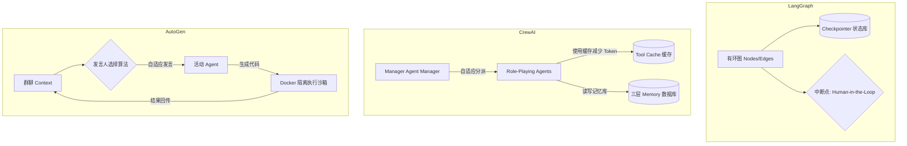

---

### 📅 第六次调研（2026-05-23）: 深入分析 OpenHands 的事件流架构与沙盒安全、LlamaIndex Workflows 的事件驱动状态流、Semantic Kernel 的原生工具调用与插件化治理

#### 1. OpenHands (原 OpenDevin，领先的自主软件工程 Agent 平台)
*   **核心创新一：基于 append-only 日志的 Event Stream（事件流）架构**
    *   *机制原理*：OpenHands 的核心是一个持久化的、仅追加的事件总线。所有的系统变更、用户输入、Agent 意图（`CmdRunAction`, `FileWriteAction`）和环境观测（`CmdOutputObservation`）都被建模为强类型的 JSON 事件。这使得：
        1.  *全量重放与调试*：整个 Agent 执行会话可以像回放录像一样被完整重建、分析和审计。
        2.  *解耦的安全审查器（Security Analyzer）*：安全模块能够订阅事件流，并在 Action 实际下发至 Runtime 执行前进行拦截和静态/动态分析，阻止恶意的删除文件或反弹 Shell 等行为。
*   **核心创新二：高度解耦的 Docker 沙盒隔离与 Runtime API**
    *   *机制原理*：OpenHands 的运行环境（Runtime）与 Agent 控制层完全分离。Runtime 运行在隔离的 Docker 容器中，容器内启动了一个轻量级的 ACI 服务（Action Execution Server）。Agent 通过 HTTP/WebSocket 接口向容器内发送执行指令，并在沙盒中通过 `tmux` 维持持久会话，确保命令如环境依赖配置、编译测试等的执行不会污染或危害宿主机系统。

#### 2. LlamaIndex Workflows (声明式事件驱动工作流框架)
*   **核心创新一：完全解耦的 @step 事件订阅机制 (Decoupled Event-Driven Steps)**
    *   *机制原理*：传统的 DAG 必须在流转前明确指定节点之间的物理依赖连线。LlamaIndex Workflows 通过将执行步骤声明为 `@step`，并在参数中指定其所订阅的事件类型（如 `IssueDetectedEvent`）来完成隐式连接。步骤执行完成后，通过 `return Event(...)` 抛出新事件。底层的 Orchestrator 负责根据事件类型动态路由，自然而然地支持极其复杂的环状流转（Loops）、动态分支（Branching）和多路并发执行。
*   **核心创新二：类型安全状态管理与 Context 注入**
    *   *机制原理*：工作流拥有一个线程/协程安全的全局 `Context` 状态对象。开发者可以为事件载荷（Payload）和 Context 中的 State 声明严格的类型规范。Orchestrator 在启动时对图的类型匹配进行静态校验，防止运行时因类型不匹配（如 Executor 拿到了格式不匹配的 Issue 结构）引发 Agent 崩溃。

#### 3. Microsoft Semantic Kernel (企业级 AI 编排内核)
*   **核心创新一：原生 Function Calling 替代硬编码规划 (LLM Native Tool Execution)**
    *   *机制原理*：Semantic Kernel 逐步废弃了传统的 `StepwisePlanner` 等生成文本规划脚本的模式，转而原生集成大模型的 Function Calling 功能。通过 `auto_invoke_kernel_functions` 设置，内核在收到目标后进入一个 `LLM 决策工具 -> 调用 native 插件 -> 反馈 observation 到上下文 -> LLM 下一步决策` 的高密执行循环，极大地提升了复杂规划和工具调用的执行准确率与反应速度。
*   **核心创新二：插件化治理与语义/原生模板解耦 (Plugin Governance)**
    *   *机制原理*：SK 提供了高度标准化的插件生命周期管理。一个 Plugin 可以包含 Native Code（如文件读写、测试运行）或 Semantic Prompt（如 Scorer 的打分 Prompt）。Prompt 模板支持 Handlebars/Liquid 等工业级渲染引擎，实现了提示词与执行逻辑的彻底解耦。同时，支持全局依赖注入（Dependency Injection），可为不同的角色（如 Planner/Executor）按需绑定不同的 LLM 连接配置和工具集。

```mermaid
graph TD
    subgraph OpenHands-EventStream
        EventBus[(Append-Only Event Stream)]
        Agent_OH[OpenHands Agent] -->|Emit Action Event| EventBus
        Security[Security Analyzer] -->|Subscribe & Inspect| EventBus
        EventBus -->|Approved Action| Runtime[Docker Sandbox Runtime]
        Runtime -->|Emit Observation Event| EventBus
    end
    subgraph LlamaIndex-Workflows
        StepA[@step: Consumer of StartEvent] -->|returns CustomEvent| Orchestrator[Event Router]
        Orchestrator -->|routes by type| StepB[@step: Consumer of CustomEvent]
        StepB -->|returns LoopEvent| Orchestrator
        Orchestrator -->|routes back| StepA
    end
    subgraph Semantic-Kernel
        Kernel[Semantic Kernel Core] -->|Dependency Injection| Plugins[Plugins: Native & Semantic]
        Kernel -->|Auto Invoke Loop| LLM_Native[LLM Native Tool Calling]
    end
```

---

### 📅 第七次调研（2026-05-23）: 深入分析 E2B Sandboxes 的微虚拟机安全隔离、Langfuse 的 OpenTelemetry 链路追踪与 Prompt 版本治理、ChatDev 的 ChatChain 与沟通反幻觉机制

#### 1. E2B Sandboxes (专门面向 AI Agent 的安全沙盒执行环境)
*   **核心创新一：基于 KVM/Firecracker 的硬件级微虚拟机（MicroVM）隔离**
    *   *机制原理*：传统基于 Docker 的沙盒方案（如 AutoGen、OpenHands）共用宿主机的 Linux 内核，存在容器逃逸（Container Escape）的安全隐患。E2B 基于 AWS Firecracker 技术，为每个 Agent 执行实例动态拉起一个独立的微虚拟机（MicroVM）。每个沙盒都拥有独立的 Linux 内核、只读/写根文件系统、独立的网络命名空间。
    *   *极致启动性能*：通过优化微内核初始化流程 and 极简设备模型，E2B 沙盒的冷启动时间被压缩在 **150ms-200ms** 以内，兼顾了 VM 级别的安全边界与容器级别的极速响应。
*   **核心创新二：高度封装的 Agent 运行环境 API（Filesystem & Process Execution SDK）**
    *   *机制原理*：E2B 提供了高层次 of JS/Python SDK，使 LLM 可以通过 API 对虚拟机进行细粒度控制。Agent 不需要直接调用低效的 SSH 协议，而是通过 API 发送命令执行、拉起常驻进程或读写虚拟磁盘。
    *   *资源限额与审计*：支持对 CPU、内存使用进行强上限硬性约束，并支持自定义超时断开机制，防范死循环与系统过载。

#### 2. Langfuse (企业级 LLM 链路追踪与 Prompt 版本化治理平台)
*   **核心创新一：基于 OpenTelemetry 语义规范的分层追踪（Hierarchical Trace & Generation Spans）**
    *   *机制原理*：Langfuse 完全拥抱 OpenTelemetry（OTel）规范。通过在 LLM 调用中嵌套 Trace（代表一次业务流程，如 Qualoop check 周期）和 Span/Generation（代表具体的 LLM 请求、工具调用或内部步骤），建立了完整的调用链拓扑。在 Generation 节点中自动记录 Token 耗用、网络延迟、花费成本、具体入参及模型返回，从根本上解决 Agent 运行黑盒的问题。
*   **核心创新二：解耦的 Prompt 注册表（Prompt Registry）与版本控制**
    *   *机制原理*：传统 Prompt 硬编码在业务代码中，修改困难且版本混乱。Langfuse 提供集中式 Prompt Registry。代码中仅通过 `langfuse.get_prompt("prompt_name", label="production")` 动态获取提示词。同时，当 LLM 发起调用时，在 OpenTelemetry 属性中注入 `langfuse.observation.prompt.name` 与 `langfuse.observation.prompt.version`，使得每一笔调用自动与其使用的 Prompt 版本完美绑定，极度便于后续 of A/B 测试、在线调优与回滚。

#### 3. ChatDev (SOP 驱动的多智能体软件开发协作平台)
*   **核心创新一：模拟瀑布流软件工程的 ChatChain 链条**
    *   *机制原理*：ChatDev 将软件生命周期（SDLC）抽象为一系列按序连接 of 子任务。对于每个子任务（如“编写代码”、“设计架构”），ChatChain 编排一对专门的角色（如 Programmer 与 Reviewer）通过多轮对话进行协作。这种将宏观任务原子化，并通过多角色以特定 SOP（Standardized Operating Procedures）协作的方式，防止了单一 Agent 由于上下文过载产生逻辑混淆。
*   **核心创新二：主动式的沟通反幻觉机制（Communicative Dehallucination）**
    *   *机制原理*：在 Agent 协同开发过程中，如果由于人类输入或上游传递的上下文不够明确（例如“需要用哪个第三方库”），Agent 不会盲目猜测去生成带有幻觉的代码，而是触发“角色翻转（Role Reversal）”。扮演 Assistant 的 Agent 会主动向扮演 Instructor 的 Agent 抛出具体的澄清问题（“请明确具体的数据库类型和表结构”），直至获得明确答案后才继续落库，从而在中间环节切断了幻觉的级联放大。

```mermaid
graph TD
    subgraph E2B-Firecracker-Isolation
        Host[宿主机 Host System] -->|KVM Hypervisor| VM1[Firecracker MicroVM 1]
        Host -->|KVM Hypervisor| VM2[Firecracker MicroVM 2]
        VM1 -->|150ms Boot / Private Kernel| SafeEnv[安全隔离代码运行环境]
    end
    subgraph Langfuse-OTel-Observability
        App[Qualoop Core] -->|OTel Tracing Spans| LangfuseBackend[Langfuse Server]
        LangfuseBackend -->|Save metrics & spans| Database[(ClickHouse / PG)]
        PromptReg[Prompt Registry] -->|Fetch prod prompt| App
    end
    subgraph ChatDev-Dehallucination
        Instructor[Instructor Agent] -->|1. Fuzzy Target| Assistant[Assistant Agent]
        Assistant -->|2. Active Clarification Question| Instructor
        Instructor -->|3. Precise Context / Spec| Assistant
        Assistant -->|4. Perfect Code without Hallucination| Output[Clean Code Output]
    end
```

---

### 📅 第八次调研（2026-05-23）: 深入分析 OpenAI Swarm 的轻量级 Handoff 路由移交、Pydantic AI 的类型安全结构化运行时与依赖注入、AgentOps 的全生命周期飞行记录仪审计与监控

#### 1. OpenAI Swarm (轻量级多智能体协同编排模式)
*   **核心创新一：基于 Agent & Tool Handoff（移交控制权）的轻量级路由**
    *   *机制原理*：传统多智能体框架使用中心化的 Orchestrator 控制流程流转，配置繁琐且容易在长周期会话中产生死锁。Swarm 提出极其精简的路由哲学：**智能体可以通过在 Tool 中返回另一个智能体实例来直接将控制权移交（Handoff）**。每一个 Agent 都包含一组 Tool（函数），其中某些 Tool 可以被定义为路由函数（例如 `transfer_to_scorer()` 返回 `ScorerAgent`）。当 LLM 在 Tool Calling 中决策调用该路由函数时，Swarm 的轻量级 Runner 会拦截该响应，并自动将后续会话上下文切换到目标 Agent 实例中。
*   **核心创新二：极简的无状态对话循环（Stateless Chat Loop）**
    *   *机制原理*：Swarm 的核心运行器 `client.run()` 本身是完全无状态的。它接收当前活跃 Agent、消息列表以及上下文变量，执行多轮 Tool 调用（包含 LLM 交互）直到没有 Handoff 或普通 Tool 待执行，然后将最新的 Message 列表和最终的 Active Agent 返回给外部。整个流转逻辑完全内嵌在 Agent 的 Tool 返回中，天然支持动态分支和多路自适应移交。

#### 2. Pydantic AI (类型安全的结构化 Agent 编程框架)
*   **核心创新一：原生 Pydantic 运行时类型校验与结构化输入输出**
    *   *机制原理*：传统 Agent 在接收和返回 JSON 数据时十分脆弱，模型经常返回缺少关键字段的损坏数据，导致解析崩溃。Pydantic AI 利用 Pydantic v2 的极致性能，为 Agent 的 `deps_type`、`result_type` 等设定强类型约束。LLM 的每一次工具调用和结果返回在运行时均经过严格 Pydantic 校验。如果校验失败，框架会自动捕获错误并将详细的类型不合规信息反馈给 LLM，促使其自动纠错，以工程化手段确保数据边界的安全。
*   **核心创新二：类型安全的依赖注入（Type-Safe Dependency Injection）**
    *   *机制原理*：在长周期的 Agent 运行中，需要安全传递各种运行时环境（如数据库连接、只读客户端配置等）。Pydantic AI 提供类型安全的依赖注入系统，通过 `deps` 参数注入环境上下文。所有的 Tool（System Tools / Custom Tools）均被声明为接收特定类型 `RunContext[Deps]` 的函数，从而在多路并发运行和单元测试中消除了全局变量共享的污染隐患。

#### 3. AgentOps (面向 Agent 运行周期的性能跟踪与审计监控平台)
*   **核心创新一：全生命周期事件飞行记录仪（Agent Event Flight Recorder）**
    *   *机制原理*：AgentOps 提供类似黑匣子的追踪 SDK。它可以自动捕获 Agent 会话中的每一次 LLM 调用、Tool 运行、Action 执行以及 Error 发生，并统一序列化为包含父子层级关系（Parent-Child Spans）的事件树。与传统 Log 不同，AgentOps 实时监测 API 费率消耗、LLM 调用延迟以及内存/CPU 抖动，为开发者在后台面板重现、追踪 Agent 的异常决策轨迹提供数据支撑。
*   **核心创新二：会话重放与多维评测指标大盘**
    *   *机制原理*：平台支持 Session Replay（会话回放），允许开发者逐个 Token 地重放 LLM 与 Sandboxes 的交互。结合自主监控的异常指标（例如检测到死循环调用同一 Tool 时触发的 `Infinite Tool Loop Warning`），直接生成 MTTR、运行耗费成本和 LLM 质量评分，是自动化大 backlog 治理的监控基石。

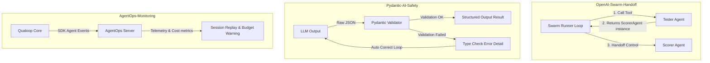

---

### 📅 第九次调研（2026-05-23）: 深入分析 Camel 的 Inception Prompting 角色扮演博弈、Agency 的 Actor 模型与 ACL 特权访问控制、Agent Protocol 的标准化 RESTful 任务步骤规范

#### 1. Camel (基于角色扮演的自主对齐多智能体框架)
*   **核心创新一：Inception Prompting (启蒙式提示词工程与角色引导)**
    *   *机制原理*：在无人类干预的自对齐对话中，多智能体容易产生“会话漂移（Conversational Drift）”或无限循环复读。Camel 引入 Inception Prompting 技术。它通过一个中立的“任务特化器（Task Specifier）”自动将人类的粗颗粒度任务（如“修复 Qualoop 的编码 bug”）翻译为带有特定前置协议、边界条件和目标要求的特化提示词，并为扮演 Instruction Receiver（助理）和 Instruction Sender（虚拟用户）的两个智能体注入相互咬合的系统 Prompt。
*   **核心创新二：Role-Playing 双角色自对齐自主对话**
    *   *机制原理*：建立两智能体间的 autonomous conversational loop。Instruction Sender 根据特化任务生成具体可执行的子要求，Instruction Receiver 完成并提供解决方案。如果 Receiver 的方案不合逻辑，Sender 会自动追问或提供新的反例，直至任务圆满达成。这种双智能体博弈能从侧面极大消除单 Agent 对提示词的过度解读或生成幻觉。

#### 2. Agency (基于参与者模型的异步安全 Agent 编排框架)
*   **核心创新一：Actor-Model 异步并发消息路由**
    *   *机制原理*：传统 Agent 通信基于共享 Context 或 P2P 强耦合调用。Agency 拥抱 Erlang-style Actor 参与者模型，将每个 Agent、每个 Tool、甚至人类用户都建模为完全隔离、拥有独立收件箱（Inbox）的 Actor。Actor 之间只通过 AMQP 等消息代理进行异步消息传递（Message Passing），节点间完全解耦，支持高并发以及跨服务器的集群级别调度。
*   **核心创新二：Subject-Object Privilege Access Control (主客体特权与 ACL 工具治理)**
    *   *机制原理*：Agent 系统中最致命的风险是“越权操作（Privilege Escalation）”（如执行器被大模型诱导运行危险指令或越权读取敏感数据）。Agency 在通信网关处强加了 Access Control List (ACL) 拦截层。系统为每个 Actor 分配特定的权限凭证（Credentials）。只有当 Actor 拥有对目标 Tool Actor 的执行权限，或者对目标 Agent Actor 的会话权限时，消息才会被投递。这种严格的主客体特权治理防止了有害注入攻击。

#### 3. Agent Protocol (由 AI Alliance 与 AutoGPT 发起的通用智能体标准协议)
*   **核心创新一：标准化的 RESTful 任务/步骤解耦接口规范 (Standard API Spec)**
    *   *机制原理*：不同团队开发的 Agent 暴露的 API 和输入输出格式千差万别，导致无法进行标准的 benchmark 评估。Agent Protocol 定义了统一的 OpenAPI 接口标准。每个任务都是一个 `Task`，被拆解为多次请求触发的 `Step`。客户端通过 `POST /ap/v1/tasks` 提交需求，通过 `POST /ap/v1/tasks/{task_id}/steps` 步进式执行。它将底层的 Agent 编排（Scheduler/Executor）和客户端呈现彻底解耦。
*   **核心创新二：标准成果物与执行跟踪审计（Artifact & Step Trace Store）**
    *   *机制原理*：协议规范了步骤的输出元数据（包括步骤耗时、当前状态 `is_last_step`、产生的 Trace 观测日志）以及生成的 `Artifact` 文件记录。所有的执行痕迹均写入标准化的 Step Trace DB，使得任何外部评估系统（如 SWE-bench 评测器）都可以用完全一致的客户端代码拉起并审计不同语言编写的智能体。

```mermaid
graph TD
    subgraph Camel-RolePlay
        TaskSpecifier[Task Specifier] -->|Bootstraps initial prompt| UserAgent[User Agent Instruction Sender]
        UserAgent -->|1. Instruction / Message| AssistantAgent[Assistant Agent Solution Provider]
        AssistantAgent -->|2. Solution / Clarification| UserAgent
    end
    subgraph Agency-Actor-ACL
        ActorA[Agent Actor A] -->|Post message through Broker| Broker[AMQP Message Broker]
        Broker -->|ACL check: Denied/Allowed| ActorB[Agent Actor B / System Tool]
    end
    subgraph Agent-Protocol-Spec
        Client[External Client / Benchmark Platform] -->|POST /tasks| API[Agent Protocol Server]
        API -->|POST /tasks/{id}/steps| AgentCore[Qualoop Agent Core]
        AgentCore -->|Update trace & artifacts| DB[(Standardized Step DB)]
    end
```

---

### 📅 第十次调研（2026-05-23）: 深入分析 Letta (MemGPT) 的操作系统级分层内存与自主心跳机制、TaskWeaver 的代码首要规划与内核沙盒执行、Phidata 的面向对象 Assistant 会话持久化与知识库集成

#### 1. Letta (前 MemGPT - 面向操作系统架构的智能体内存管理框架)
*   **核心创新一：OS-style Hierarchical Memory Architecture (操作系统级分层内存管理)**
    *   *机制原理*：传统智能体将全部历史聊天直接喂给大模型上下文窗口，容易在超长会话中超出 Limit 或因噪声丢失关键记忆。Letta 参照 OS 对 RAM 和 Disk 的管理方式，将智能体内存划分为三层：
        1.  `Core Memory` (类似于 RAM)：包括 `user_context` (用户画像)、`agent_context` (智能体自画像) 和 `scratchpad` (临时工作区)。它是直接且实时存在于 LLM 提示词上下文中的，智能体可以使用专门的工具（如 `core_memory_append`）在运行时主动读取或改写该区域。
        2.  `Recall Memory` (类似于 L2 缓存/归档数据库)：包含智能体过往全部交互历史 Event。智能体通过时间检索、关键字搜索等工具动态召回历史记录。
        3.  `Archival Memory` (类似于 Hard Disk 外部数据库)：用于存储非结构化海量文档资料。智能体通过 Vector Embedding 检索动态将片段加载到上下文。
*   **核心创新二：Self-directed Heartbeat Loop & Non-blocking Step Execution (自主心跳驱动非阻塞执行)**
    *   *机制原理*：传统智能体是事件响应式的（用户发一条，智能体回一条）。Letta 引入了 Heartbeat 机制，允许智能体在发出指令的同时显式触发“步进（Step）”信号。如果在当前 step 中没有人类介入，系统会产生一个虚构的 System Message（如 `heartbeat_reason`）重新调起模型。通过连续的心跳循环，Letta 智能体可以自主决定是否需要调用 Recall 检索、编辑 Core Memory，并再次发起外部 Tool Call，直至任务完全终止。

#### 2. TaskWeaver (微软开源的 Code-First 数据分析与规划智能体框架)
*   **核心创新一：Code-First Planning with Schema-backed Tool Binding (代码首要规划与模式支持的工具绑定)**
    *   *机制原理*：传统智能体使用 Function Calling 时，大模型只能以 JSON 参数调用静态定义的 Tool API。在处理复杂的多步骤计算、临时算法处理以及结构化数据流（如 Pandas Dataframe 传递）时极易出错。TaskWeaver 采用“代码首要”的设计：Orchestrator 将用户的高级目标规划并翻译成临时的、动态编写的 Python 代码，而在 Python 代码中，则通过导入 Schema 文件描述的 Tool 插件类进行强类型调用。这种方式允许智能体在代码中声明复杂的局部循环、自定义数学变换，极大增强了任务表征的自由度。
*   **核心创新二：Separation of Planner & Code Executor Roles (规划器与沙盒内核执行器角色的严格隔离)**
    *   *机制原理*：TaskWeaver 将系统拆分为 `Planner` 和 `Code Generator (CG)` / `Code Executor (CE)` 两大角色。Planner 直接与用户对接，梳理逻辑链与里程碑并将其下发给 CG；CG 专职编写 Python 脚本；CE 则在后台运行一个独立的、带有进程和变量状态保持的 Jupyter 交互式内核环境。CE 执行生成的 Python 代码并将执行的 stdout/stderr、错误栈以及新生成的临时图表返回给 CG 进行自愈验证。两个角色的运行上下文完全物理隔离，防止了不受信代码侵入核心控制流。

#### 3. Phidata (面向对象的智能体应用与多层持久化存储框架)
*   **核心创新一：Object-Oriented Assistant State & Session Persistence (面向对象 Assistant 状态与多数据库 Session 持久化)**
    *   *机制原理*：很多智能体框架的状态散落在各个全局变量和文件系统中，不利于做多租户并发、运行中断恢复和多端同步。Phidata 采用高度封装的面向对象设计，将智能体的所有运行时状态（包括 Chat History、Model Parameters、Tool Calls、System Prompt、Session ID）完全囊括在一个 `Assistant` 实例中。通过实现底层的 SQL 数据库存储适配器（如 `PgAssistantStorage`、`SqliteAssistantStorage`），只需一行配置即可将整个 Agent 的实时状态无缝持久化至关系型数据库。
*   **核心创新二：Semantic Search Tool Routing & Native Structured Outputs (语义搜索工具路由与原生强类型输出控制)**
    *   *机制原理*：Phidata 原生内置了将知识库（Knowledge Base）与向量数据库（PgVector, LanceDB）无缝绑定到 Agent 的设计。在 LLM 接收到请求前，框架自动进行向量语义检索，并将最相关的 Context 以增强上下文注入 Prompt 中。同时，Phidata 提供了对 Pydantic 的原生适配，支持在 Assistant 级别强制限制模型返回特定的 Pydantic Model 结构。即使底层 LLM 不支持结构化输出 API，Phidata 也会通过后置 Parser 以及自动 Validation Retry 机制保障输出绝对可解析。

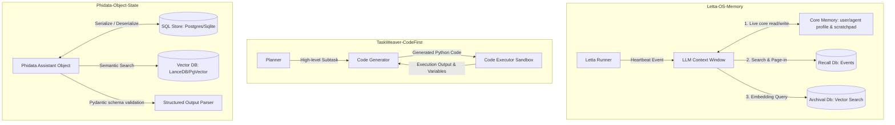

---

### 📅 第十一次调研（2026-05-23）: 深入分析 Dify 的可视化工作流引擎与 BaaS/LLMOps 统一编排、Vercel AI SDK 的多提供商统一流式引擎与结构化同步、LangSmith 的非侵入式嵌套 Trace 追踪与数据集驱动离线评估

#### 1. Dify (企业级大语言模型应用开发与 BaaS/LLMOps 编排平台)
*   **核心创新一：Visual Workflow Engine with Hybrid Execution (可视化工作流引擎与 GUI-API 混合执行)**
    *   *机制原理*：传统多智能体开发极度依赖纯代码或纯 Prompt 定义，在大规模复杂流程中其调用关系和逻辑拓扑很难被非开发人员直观理解与调试。Dify 将智能体流转、Tool 调用、分支选择（Conditional Branch）和人机交互（HITL）抽象为标准的流向节点，并在后台编译为强类型 JSON 语法树，由高性能应用编排引擎统一调度。它支持在 Web 图形界面上进行可视化的流程设计与运行追踪，同时对外暴露高度一致的 RESTful API，完美兼顾了图形化直观调试与 API 级自动化集成。
*   **核心创新二：Integrated Backend-as-a-Service (BaaS) & Dataset Lifecycle Management (一体化 BaaS 数据集与模型提供商编排)**
    *   *机制原理*：Dify 将 LLM 应用所必须的底层基础设施（如文档切片、Embedding 向量化、向量数据库检索、会话存储、多模型提供商 Token 路由）完全以“后端即服务（BaaS）”的方式集成。用户无须配置繁琐的第三方向量库或模型调用 SDK。它内建了语义召回率评测、文档解析拦截流水线，并提供一键式数据集热插拔。这种企业级插件治理方案极大降低了智能体系统的碎片化。

#### 2. Vercel AI SDK (面向边缘计算与流式生成的统一智能体接口规范)
*   **核心创新一：Framework-agnostic Unified Provider Interface with Native Streaming (跨提供商统一流式调用抽象接口)**
    *   *机制原理*：各种 LLM 提供商接口差异极大，切换模型需要重构大量客户端调用逻辑，且在边缘服务器上进行低延迟 Token 流式返回（SSE）开发门槛高。Vercel AI SDK 抽象出了统一的模型提供商代理规范（Unified Provider Specifications）。开发者使用完全一致的 API（如 `generateText`、`streamText`、`generateObject`）即可任意无缝切换 OpenAI、Anthropic、Gemini 或本地大模型，并且原生内建了极低延迟的 Token 级 Server-Sent Events (SSE) 边缘计算支持，极大地统一了智能体多模型路由的底层管道。
*   **核心创新二：Native Structured Output & Client-Side UI Synchronization (原生结构化输出保障与客户端状态实时同步)**
    *   *机制原理*：该 SDK 将基于 Zod/Schema 的强类型 JSON 输出直接与主流大模型的 JSON Mode 或是 Tool Calling 参数输出深层对齐。若模型输出不合规，SDK 会自动进行自我修正（Auto-repair）和重试。同时，它提供了极其强悍的客户端与服务端同步状态钩子（如 `useChat`、`useObject`），使得大模型在生成复杂结构化 JSON 或代码 Diff 的过程中，客户端 UI 能够以高刷新率实时渐进式渲染（如渲染动态流式 UI 卡片或进度条），带来极其流畅的交互体验。

#### 3. LangSmith (LLM 应用开发、Nested-Trace 追踪与离线评估监控平台)
*   **核心创新一：Non-intrusive Hierarchical Run-Tree Tracing (非侵入式嵌套层级 Run-Tree 链路追踪)**
    *   *机制原理*：当多智能体系统包含复杂的循环、嵌套 Tool 调用、子 Agent 分派时，传统的扁平化 Log 日志很难梳理出精准的因果依赖关系。LangSmith 通过 OpenTelemetry 风格的无侵入式自动代理（通过环境变量或轻量级 wrapper 装饰器拦截），在后台自动捕获每一次嵌套 LLM 交互、链式步进和 Tool 调用。它将每一次执行生成为一个带有唯一 Parent ID 的节点，形成树状层级 Trace 图。这让开发者能够极其直观地查看每一次调用的 Token 消耗、耗时、详细的 Prompt 渲染参数和 Raw JSON 输入输出。
*   **核心创新二：Dataset-driven Offline Regression Evaluation & Playground Replay (数据集驱动的离线回归评估与沙盒重放)**
    *   *机制原理*：LangSmith 解决了智能体应用“修改一个 Prompt 导致历史测试集恶化”的防退化难题。它支持开发者将线上真实的异常 Trace 一键提取并保存为“评测数据集（Evaluation Dataset）”。在 Prompt 或模型发生变更时，可在本地或 CI 流程中拉起离线评估器（Programmatic Evaluator 或 LLM-as-a-judge），批量运行数据集并对比得分，跟踪召回率与准确性指标变动。开发者还可以将任何失败的嵌套 Trace 直接一键重放到在线 Playground 中，手动修改变量和模型参数进行沙盒调试，形成完美的迭代优化闭环。

```mermaid
graph TD
    subgraph Dify-BaaS-Workflow
        WorkflowEngine[Dify High-Performance Workflow Engine] <-->|Visual graph compile / run| GUI[Dify Web Graphic Interface]
        WorkflowEngine -->|Integrated Dataset service| RAG[Chunking, Embedding & PgVector BaaS]
        WorkflowEngine -->|Multi-provider Routing| ProviderPool[Unified Model API Pool]
    end
    subgraph Vercel-AI-SDK
        UnifiedClient[Unified SDK client: streamText] -->|Framework-agnostic standard| UnifiedAPI[OpenAI / Anthropic / Gemini Specification]
        UnifiedClient -->|Zod validation & auto-retry| JSON[Native Structured Output / streamObject]
        UnifiedClient -->|Server-Sent Events SSE| UI[Real-time Client UI State Sync]
    end
    subgraph LangSmith-Tracing
        AgentCore[Qualoop Agent Core] -->|Non-intrusive environment-variables intercept| Tracer[LangSmith OpenTelemetry SDK]
        Tracer -->|Send Run Tree traces| Cloud[(LangSmith Cloud / Local server)]
        Cloud -->|Extract failed traces| EvalSet[Regression Testing Dataset]
        EvalSet -->|Offline validation runs| RegressionScorer[LLM Evaluator / Regression Analysis]
    end
```

---

### 📅 第十二次调研（2026-05-23）: 深入分析 AutoGen v0.4 的异步事件驱动 Actor 架构、Arize Phoenix 的零拷贝 OpenTelemetry 追踪与本地嵌入空间可视化、SWE-bench 的 Docker 版本锚定与 Git Patch 自动验证

#### 1. AutoGen v0.4 (微软下一代异步事件驱动智能体编程框架)
*   **核心创新一：异步事件驱动 Actor 编程模型 (Asynchronous Event-Driven Actor Model)**
    *   *机制原理*：在 0.4 版本中，AutoGen 彻底废弃了原先的 `GroupChatManager` 集中同步轮询路由模式，全面转向经典的 Actor 编程模型。每个 Agent 均被定义为一个独立的、带有私有状态的 Actor，运行于隔离的异步上下文中。Actor 之间不直接调用，而是通过发布/订阅（Pub/Sub）机制或者单向异步信道发送消息。这一变革使得 AutoGen 能够以无死锁的方式运行极其庞大的并发协作群，且各个 Actor 可以被独立地水平扩展至多进程或多主机分布式环境。
*   **核心创新二：强类型消息契约与多端/跨语言路由 (Protobuf-backed Strongly-typed Message Contracts & gRPC)**
    *   *机制原理*：新架构中，智能体之间的所有消息传递全部基于 Protocol Buffers (Protobuf) 模式进行序列化与验证。定义了强类型的消息契约（如 `TextMessage`, `ToolCallRequest`, `ToolCallResponse`），在编译时和运行时均强行实施契约检查。底层结合 gRPC 框架实现低延迟的网络传输。由于 Protobuf 的跨语言和自描述特性，它能无缝路由和协调由 Python 编写的复杂推理 Agent、Node.js 编写的可视化大盘以及 Go 语言编写的底层执行器，消除了多语言协作下 JSON 解析失效的隐患。

#### 2. Arize Phoenix (开源 AI 评估与 OpenTelemetry 零侵入可观测平台)
*   **核心创新一：基于 OpenTelemetry 规范的零侵入式代理追踪 (Zero-copy OpenTelemetry Span Tracing)**
    *   *机制原理*：传统的 Agent 追踪和日志需要繁琐的代码侵入和手写埋点。Phoenix 深度拥抱 CNCF 标准的 OpenTelemetry (OTel) 协议，通过 Python 动态代理/猴子补丁（Monkey Patching），在运行时拦截主流框架（如 LangChain, LlamaIndex, DSPy）甚至原生 OpenAI 调用。它通过上下文感知跟踪（Context-aware tracing）在内存中低开销地捕获分层 Spans（追踪树），秒级启动本地可视化 UI 并展示完整的输入、输出、耗时和 Token 开销，让整个 Agent 协作的决策黑盒变得彻底透明。
*   **核心创新二：本地化评估运行器与高维嵌入空间投影可视化 (Local Evaluation Runner & Embedding Space Visualization)**
    *   *机制原理*：与通常将数据上传到外部的云监控不同，Phoenix 提供完全本地化运行的“模型评估引擎”（Local Evaluators），支持通过 Q&A、幻觉审查、内容毒性等多维标准对在线/离线运行的数据进行打分。同时，它引入了高维特征嵌入投影技术（UMAP 降维算法），在 Web UI 中将 Agent 交互中的 Prompts 和 Responses 进行 3D 可视化空间展示。开发者可以通过空间几何聚类（Cluster Analysis）直观识别出哪些主题或输入的 Issue 会导致 Executor 或 Scorer 频繁出错或返回异常，从宏观维度为系统鲁棒性提供量化指标。

#### 3. SWE-bench (软件工程智能体基准评估与沙盒环境框架)
*   **核心创新一：基于 Docker 的细粒度运行时版本复现与依赖锚定 (Docker-based Dependency & Test Suite Anchoring)**
    *   *机制原理*：软件开发类 Agent 面临的致命挑战是“运行时依赖漂移”（如两年前的代码因今日库版本升级而无法编译）。SWE-bench 的评估架构通过精细的自动化流水线，针对每个开源项目的特定 Git Commit 版本，编译独立的 Docker 基础镜像，将特定的 Python 运行时、第三方库版本以及对应的物理测试工具套件（如 Pytest, Unittest）锁死在当时的状态。这确保了评估沙盒的完全可复现性和高度隔离，防止 Agent 执行的恶意破坏代码逃逸至宿主机。
*   **核心创新二：基于 Git Patch 差分的应用与 PASS_TO_PASS/FAIL_TO_PASS 校验机制 (Git Patch Evaluation with Dual Test-Suite Validation)**
    *   *机制原理*：评估系统不需要解析 Agent 生成的自然语言说明，也并不强行覆盖整个文件，而是提取 Agent 完成工作后的 `git diff` 差分文件并输出为 Git Patch。系统在干净的镜像环境中一键式应用此 Patch，接着复跑两类关键测试用例：
        1.  *FAIL_TO_PASS (原失败用例)*：验证 Agent 是否切实修复了目标缺陷（必须全部通过）。
        2.  *PASS_TO_PASS (原通过用例)*：验证 Agent 是否在修复缺陷时引入了“回归错误”导致已有功能被破坏（必须全部保持通过）。
        这种双层严苛的自动校验排除了人工主观评估带来的偏差，是当前软件工程 Agent 最权威的硬指标度量标尺。

```mermaid
graph TD
    subgraph AutoGen-v04-Actor
        ActorA[Stateful Agent Actor A] -->|1. Publish Protobuf Message| PubSub[Event Pub/Sub Broker]
        PubSub -->|2. Route Message asynchronously| ActorB[Stateful Agent Actor B]
        ActorB -->|3. Async callback / gRPC| Host[Cross-language / Distributed Run]
    end
    subgraph Arize-Phoenix-OTel
        QualoopApp[Qualoop Core] -->|OTel Instrument Auto-Intercept| Collector[Phoenix OTel Collector]
        Collector -->|1. Hierarchical Trace Trees| PhoenixUI[Phoenix Local Web Dashboard]
        Collector -->|2. Embedding projection| UMAP[UMAP 3D Space Projection]
    end
    subgraph SWE-bench-Sandbox
        AgentOutput[Agent Output Patch] -->|Apply Git Patch| Container[Git-anchored Docker Sandbox]
        Container -->|Run Test Suite| TestRunner[Test Runner]
        TestRunner -->|1. Verify FAIL_TO_PASS| FixOK[Defect Correctness Check]
        TestRunner -->|2. Verify PASS_TO_PASS| RegressionOK[Regression Prevention Check]
    end
```

---

### 📅 第十三次调研（2026-05-23）: 深入分析 TextGrad 的文本反向梯度优化、Promptflow 的多智能体 DAG 编排与批评估、Ragas 的无参考语义相关性与幻觉指标评测

#### 1. TextGrad (斯坦福大学 - 基于自然语言反馈的文本梯度优化框架)
*   **核心创新一：将文本/提示词视为可优化变量 (Treating Prompts/Texts as Optimization Variables)**
    *   *机制原理*：传统 Prompt 调优完全依赖人工经验，或者简单粗暴的 Few-shot 拼接。TextGrad 创新性地引入了类似深度学习“反向传播（Backpropagation）”的理念。它将 Agent 系统中的 System Prompt、代码片段、打分细则统一封装为“变量（Variable）”，并将模型的输出、控制台报错或测试反馈作为“目标损失（Loss）”。
*   **核心创新二：基于自然语言反馈的反向文本梯度传递 (Backpropagation via Natural Language Gradients)**
    *   *机制原理*：在一次运行失败（例如 Executor 修复的代码未通过测试或 Scorer 评分过低）时，TextGrad 并不盲目重试，而是通过大模型对失败进行深入评估，生成具有指导意义的结构化批判（Feedback），这被称为“文本梯度（Text Gradient）”。该梯度会沿着执行逻辑链反向传递（Backpropagated）给处于上游的变量（如 Executor Prompt 或 rules 规约），驱动上游变量以文字重写的方式进行自我更新，实现系统级 Prompt 和指令的自动迭代进化。

#### 2. Microsoft Promptflow (企业级大语言模型工作流编排与评估工具)
*   **核心创新一：声明式 DAG 链路编排与可视化节点构建 (Declarative DAG Workflow with Code-first Integration)**
    *   *机制原理*：Promptflow 将多智能体的执行流定义为标准的有向无环图（DAG），每个节点（Node）可以是 Python 函数、LLM 节点或工具调用。通过 YAML 文件定义输入输出的数据传递管道。这种“代码优先、可视化辅助”的设计不仅实现了逻辑的完全解耦，还支持本地可视化流向追踪。开发者在 Web UI 中可以清晰查看每个节点运行的中间状态与时序拓扑。
*   **核心创新二：离线数据集批处理测试与标准评估管道 (Offline Batch Run & Evaluator Pipelines)**
    *   *机制原理*：为了防范 Prompt 微调导致的级联退化，Promptflow 内建了强大的批处理执行引擎。开发者可以提供包含数百个测试样本的 JSONL 数据集，一键拉起命令行工具运行整个 DAG 流程，并串联专用的评估节点（Evaluators）。评估节点会自动计算宏观统计指标（如修复成功率、准确度、平均 Token 耗用），实现系统级的离线回归测试与质量对齐。

#### 3. Ragas (检索增强生成系统无参考语义评估框架)
*   **核心创新一：无参考的语义多维评估指标 (Reference-free Semantic Metrics)**
    *   *机制原理*：在评估 Agent 上报的建议或编写的代码时，传统 ROUGE/BLEU 指标极度依赖标准参考答案，且无法反映语义真实性。Ragas 提出了多项无参考（Reference-free）语义评测算法：
        1.  *忠实度 (Faithfulness)*：将大模型生成的回答切分为独立断言（Statements），让 LLM 作为裁判，逐条核对这些断言是否能由上下文推导得出，检测是否存在幻觉事实。
        2.  *答案相关性 (Answer Relevancy)*：让 LLM 根据生成的回答逆向生成 3 个可能的问题，计算逆向问题与原问题的语义向量相似度，惩罚答非所问与灌水废话。
*   **核心创新二：合成多维度评测数据集生成器 (Synthetic Test Dataset Generation)**
    *   *机制原理*：缺乏真实的缺陷和测试用例是阻碍系统演进的痛点。Ragas 能够深度解析代码库或文档，利用 LLM 自主发掘语义冲突点，并采用“进化策略”（如将简单问题演化为多步推理问题、条件受限问题），合成高质量、覆盖多维度极具代表性的评测数据集，为自动化评估打下数据底座。

```mermaid
graph TD
    subgraph TextGrad-Optim
        PromptVar[System Prompt Variable] -->|1. Generate Output| RunFix[Executor Code Output]
        RunFix -->|2. Compute Loss| TestSuite{Run Tests / Metric}
        TestSuite -->|Failed: Calculate Text Gradient| FeedbackAgent[LLM Critic / Feedback]
        FeedbackAgent -->|3. Backpropagate natural language gradient| PromptVar
    end
    subgraph Promptflow-DAG
        InputData[Offline Dataset] -->|Batch Executor| FlowDAG[YAML-defined DAG workflow]
        FlowDAG -->|Generate outputs| EvalPipeline[Evaluators Python/LLM]
        EvalPipeline -->|Metrics report| AggReport[Batch Accuracy & MTTR Summary]
    end
    subgraph Ragas-Evaluation
        Context[Context docs / logs] & Answer[Agent Output / Report] -->|Split into assertions| Faith[Faithfulness Evaluator]
        Faith -->|Check Entailment| ScoreF[Faithfulness Score]
        Answer -->|Reverse questions| Rel[Answer Relevancy Evaluator]
        Rel -->|Embedding Similarity| ScoreR[Answer Relevancy Score]
    end
```

---

### 📅 第四十六次调研（2026-05-23）: 深入分析 LlamaIndex Workflows 的多级工作流编排与上下文边界隔离、AutoGen v0.4 的 Actor 线程池隔离与动态 CPU 亲和度绑定、browser-use 的有状态浏览器上下文快照与多智能体 Session 共享

#### 1. LlamaIndex Workflows (多级工作流编排与上下文边界隔离)
*   **核心创新一：嵌套子工作流与分级编排架构 (Hierarchical Sub-Workflow Orchestration)**
    *   *机制原理*：在复杂的自进化 Agent 协作链条中，如果将数百个节点与事件处理器扁平化放在单个工作流内，将导致依赖关系极其复杂，极难维护和排错。LlamaIndex Workflows 提供了多级嵌套编排机制，允许开发者将特定子任务抽象为独立的“子工作流”（Sub-Workflow）。子工作流可以像普通 Step 节点一样挂载在父工作流中，由父工作流分发事件触发，并在内部完整跑完局部的有向无环图（DAG），最后输出事件返回给父级。
*   **核心创新二：上下文上下文边界与数据污染隔离 (Contextual Boundary & Memory Isolation)**
    *   *机制原理*：为了防止子工作流对父级全局状态的无意覆盖与数据污染，引擎引入了强隔离的运行上下文边界。子工作流拥有独立的私有内存空间（Context Memory Space），其内部的临时状态、中间变量和事件日志只对自身步骤可见。只有明确定义的输出接口数据才会作为新事件投递给父工作流，实现了“高内聚、低耦合”的模块化智能体设计。

#### 2. Microsoft AutoGen v0.4 (Actor 线程池隔离与动态 CPU 亲和度绑定)
*   **核心创新一：Actor 异构工作组与线程池隔离 (Dedicated Thread Pool Isolation)**
    *   *机制原理*：在单进程内并发运行大量 Agent 时，如果某个执行器（Executor）正在做高密度的本地静态分析（AST 树扫描、高 CPU 密集型任务），而系统状态监测 Actor 需要极快地响应心跳包，若共享默认线程池，计算密集的任务会占用所有 CPU 轮询周期，从而引发严重的控制延迟。AutoGen v0.4 实现了异构线程池隔离，将 Actor 划分为不同的隔离工作组（Pool Group），系统管理 Actor 拥有专属的工作线程池，不受外部任务 CPU 占用的干扰。
*   **核心创新二：内核级动态 CPU 亲和度绑定 (Dynamic CPU Affinity Binding)**
    *   *机制原理*：对于实时性极高的 Actor 实例（例如负责分布式一致性路由状态同步的 Leader Actor），AutoGen 运行时支持动态 CPU 亲和度绑定（CPU Affinity）。在底层调用操作系统内核 API（如 Windows 的 `SetProcessAffinityMask` 或 Linux 的 `sched_setaffinity`），将特定的工作线程强制绑定到选定的物理 CPU 核心上，最大程度减少了线程上下文切换开销，保障了微秒级的关键指令分发效率。

#### 3. browser-use (有状态浏览器上下文快照与多智能体 Session 共享)
*   **核心创新一：浏览器上下文完全序列化快照 (Stateful Browser Context Snapshotting)**
    *   *机制原理*：当多个 Web 测试智能体并行协作完成一个长链路的业务流（例如，Agent A 负责输入验证码登录、Agent B 负责进入报表导出数据）时，如果每一个 Agent 都要重新走一遍耗时的登录和网络握手，效率极低且容易被风控拦截。browser-use 开发了浏览器状态快照技术，能够将当前 Session 的 Cookie、LocalStorage、IndexedDB 数据库结构、SessionStorage 甚至部分 DOM State 完整序列化，保存为轻量级的 JSON 快照归档文件。
*   **核心创新二：分布式多 Agent 间的 Session 零损共享导入 (Multi-Agent Zero-Login Session Sharing)**
    *   *机制原理*：其他协作 Agent 启动时，可以直接读取该快照，利用 CDP 协议的 `Network.setCookies` 与页面 `DOMStorage` 接口进行静默导入，实现“免登录接力”。这种零损 Session 共享允许 Agent 间以流水线方式快速切换环境状态，极大降低了复杂网页测试的整体耗时和环境隔离成本。

```mermaid
graph TD
    subgraph LlamaIndex-Hierarchical-Orchestrator
        Parent[Parent Workflow] -->|Emit Start Event| Sub[Sub-Workflow Step Node]
        subgraph Sub-Context [Isolated Sub-Context Memory]
            Sub -->|Run Local DAG| Step1[Local Step 1]
            Step1 -->|Emit Inner Event| Step2[Local Step 2]
        end
        Step2 -->|Emit Return Event with Selected Result| Parent
    end
    subgraph AutoGen-Pool-Affinity
        ActorIntense[AST Executor Actor] -->|Assigned CPU 3-4| PoolA[Worker Thread Pool A]
        ActorSystem[Consensus Guardian Actor] -->|Bound to CPU 1-2| PoolB[Isolated High-Priority Pool B]
        OS[OS Scheduler] -->|Dynamic CPU Affinity API| Core[Dedicated CPU Cores]
    end
    subgraph browser-use-Session-Share
        AgentA[Login Agent A] -->|1. Perform complex login UI flow| Page[Browser Target Page]
        Page -->|2. Capture cookies, local storage & IndexedDB| Snap[State Snapshot JSON/Binary]
        Snap -->|3. Distribute payload| AgentB[Scraper Agent B]
        AgentB -->|4. Zero-login import via CDP| Page2[New Browser Context]
    end
```


---

### 📅 第四十五次调研（2026-05-23）: 深入分析 LlamaIndex Workflows 的事件流式重放与热状态补丁、AutoGen v0.4 的 Actor 优先级邮箱与主动消息削减、browser-use 的基于 CDP 的网络层拦截与请求 Mock 注入

#### 1. LlamaIndex Workflows (事件流式重放与热状态补丁)
*   **核心创新一：事件流式重放与历史追溯 (Event Stream Replay & Lineage Tracking)**
    *   *机制原理*：在长周期自治智能体工作流执行中，若某一步骤由于瞬时网络抖动或第三方接口异常导致崩溃，传统的处理方式是重新运行整个 Workflow，这会造成大量重复的 LLM 调用和极大的 Token 浪费。Workflows 通过构建一个持久化、追加写的“事件日志流”（Event Log Stream），记录每一个步骤（Step）接收和发出的所有事件。当 Workflow 因故障中断时，引擎可以从日志中读取全部事件序列，直接对发生错误的步骤进行“现场重放”（Replay），准确还原当时的运行态上下文。
*   **核心创新二：热状态补丁与无损恢复 (Hot State Patching & Lossless Resumption)**
    *   *机制原理*：为了实现真正的无损自愈，在事件流重放期间，系统允许对崩溃的 Step 代码进行动态热替换（Hot Patching），或对其输出 schema 进行在线修正。新定义的逻辑与修正补丁直接注入内存中的工作流定义，重放引擎在执行到该崩溃点时，直接采用最新的代码/Schema 来处理重发的事件，从而平滑越过故障点继续执行后续 DAG 链路，保障了长周期多 Agent 协作的持续健壮性。

#### 2. Microsoft AutoGen v0.4 (Actor 优先级邮箱与主动消息削减机制)
*   **核心创新一：基于最小堆的优先级邮箱调度 (Actor Priority Mailbox using Min-Heap)**
    *   *机制原理*：在高并发的 Agent 群体中，单个有状态 Actor 的信箱中可能会堆积成千上万条消息。如果系统简单采用 FIFO（先进先出）队列，当紧急消息（如心跳检测、系统健康度告警、数据库分布式锁释放等）被排在低优先级的日常日志或统计消息后时，会导致严重的系统延迟甚至死锁。AutoGen 0.4 的 Mailbox 底层改用优先级队列（Min-Heap），允许每条消息携带一个 `priority` 头，高优先级的协调控制信号可以插队优先处理，保障了核心控制环的极速响应。
*   **核心创新二：过载消息主动削减与 TTL 丢弃策略 (Message Shedding & TTL Expiration)**
    *   *机制原理*：为了防止信箱彻底爆满导致内存溢出，AutoGen 0.4 实现了消息削减（Message Shedding）算法。当邮箱消息数量超过设定的安全阈值（High Watermark），或者当某条消息在队列中等待的时间超过其头部的 TTL（Time-To-Live）生存周期时，引擎会自动丢弃或转移这些失效的低优先级消息，以此保护 Actor 内存与算力不被风暴式无效数据淹没。

#### 3. browser-use (基于 CDP 的网络层拦截与请求 Mock 注入)
*   **核心创新一：基于 CDP Fetch 域的网络层全面接管 (CDP Fetch Domain Network Interception)**
    *   *机制原理*：自动测试代理在测试一些强依赖外部支付接口、第三方 OAuth 或其他不可控 API 的应用时，经常会因为网络超时、第三方服务宕机或者频繁请求被限流而导致测试中断。browser-use 通过底层 CDP 连接，激活 `Fetch.enable` 事件，将浏览器底层的网络请求完全接管。所有发出的 HTTP/HTTPS 请求在到达物理网卡之前，都会在 CDP 管道中被暂停并触发一个 `Fetch.requestPaused` 事件，供上层测试框架审计。
*   **核心创新二：正则表达式请求匹配与 Mock 响应注入 (Regex Matching & Mock Response Injection)**
    *   *机制原理*：当 CDP 捕获到暂停的请求后，browser-use 引擎会根据用户或 Tester 定义的 URL 正则规则进行匹配。如果匹配成功，引擎可以直接调用 `Fetch.fulfillRequest` 接口，注入伪造的 JSON 响应体、HTTP 状态码以及 Header，使浏览器在不发生实际网络 IO 的情况下直接接收到预期的 Mock 响应。这实现了对各种 API 异常、极限边界条件的 100% 确定性模拟，保障了 UI 测试的稳定闭环。

```mermaid
graph TD
    subgraph LlamaIndex-Stream-Replay
        StepFail[Step Fail Node] -->|Exception Raised| Persist[(Event Log Store)]
        Persist -->|1. Extract Event Stream Lineage| ReplayEngine[Replay Engine]
        Patch[Hot Patch Schema/Code] -->|2. In-memory hot injection| ReplayEngine
        ReplayEngine -->|3. Resend historic events| StepFail
        StepFail -->|4. Resume successfully| NextStep[Next Workflow Step]
    end
    subgraph AutoGen-Priority-Mailbox
        MsgLow[Low-priority Message] -->|priority: 99| Mailbox[Actor Priority Mailbox: Min-Heap]
        MsgHigh[Emergency Signal] -->|priority: 1| Mailbox
        Mailbox -->|1. Process highest priority first| Actor[Actor Processing Engine]
        Mailbox -->|2. Exceeds High Watermark / TTL expired| Shed[Message Shedding: Drop / Archive]
    end
    subgraph browser-use-CDP-Mock
        Browser[Browser Page] -->|Outgoing XHR / Fetch API| Network[Browser Network Stack]
        Network -->|1. Request Paused by CDP Fetch.enable| Interceptor[CDP Request Interceptor]
        Interceptor -->|2. Check URL matches Regex| MockEngine[Mock Matching Engine]
        MockEngine -->|3. Fulfill request with fake payload| Network
        Network -->|4. Safe & fast HTTP mock response| Browser
    end
```


---

### 📅 第四十四次调研（2026-05-23）: 深入分析 LlamaIndex Workflows 的事件循环依赖死锁分析与动态死循环检测、AutoGen v0.4 的基于 Actor 负载画像的智能路由与脑裂自愈与 browser-use 的基于 CDP 运行时的 Console 拦截与 JS 崩溃异常追踪

#### 1. LlamaIndex Workflows (事件循环依赖死锁分析与动态死循环检测)
*   **核心创新一：运行时事件依赖环与死锁检测 (Runtime Dependency Loop & Deadlock Detection)**
    *   *机制原理*：在长周期自进化多智能体中，由于事件流转逻辑复杂，Agent 动态挂载的处理步骤极易在运行时产生循环订阅（如 Step A 订阅 Event B，而 Step B 又订阅 Event A），导致协程死锁。Workflows 引擎内置了拓扑死锁分析器。它在事件被发出的每一动作步，自动在内存中根据当前挂起的订阅边构建“有向事件依赖图”，使用 Kosaraju 算法进行强连通分量扫描，一旦检测到闭环死锁，立即终止受影响分支并上报异常，实现了死锁的主动阻断。
*   **核心创新二：动态死循环计数与流控拦截 (Infinite Event Loop Prevention)**
    *   *机制原理*：除了静态死锁外，大模型编写的代码可能导致事件在节点间无限次循环转发（如 A->B->A 持续运转），消耗海量 Token 与算力。引擎在全局事件分发层设置了事件轨迹审计器（Trace Auditor）。它记录每个事件的谱系链条（Lineage Chain），一旦发现某个事件族（Family）在设定窗口内的循环传递次数超过安全阈值（如 50 次），直接在总线层强制丢弃该事件，完成了无限循环事件的自愈拦截。

#### 2. Microsoft AutoGen v0.4 (基于 Actor 负载画像的智能路由与脑裂自愈)
*   **核心创新一：基于有状态 Actor 实时负载画像的智能路由分发 (Load-Profiling Agent Message Routing)**
    *   *机制原理*：当大批 Executor 实例横向扩容在不同容器中时，简单的一致性哈希或轮询无法解决由于单个缺陷修复耗时长短不一导致的“长尾效应”（即某些节点空闲，而某些节点 mailbox 严重堆积）。AutoGen 运行时在路由网关挂载了负载画像器（Load Profiler），它高频获取各个 Actor 节点的活跃协程数和 Mailbox 积压长度，优先将新 Issues 指派给当前负载画像（CPU+Mailbox）最低的节点，实现了极速的缺陷削峰填谷。
*   **核心创新二：分布式多注册中心下的脑裂状态自愈 (Distributed Consensus Split-brain Prevention)**
    *   *机制原理*：在网络分区故障下，集群各节点可能发生状态分裂（脑裂），导致路由信息冲突。AutoGen 0.4 通过内建的 Raft 共识机制，只允许主注册表（Leader Registry）向路由网关写入更新。如果发生了网络脑裂，分区局部的 Minor 注册表由于无法取得半数以上多数派（Quorum）投票，会自动进入 Read-Only 锁定状态，暂停新的 Actor 注册与路由变更，防范了脏路由数据的注入，并在分区恢复后通过 Raft 日志追赶自动实现一致性修复。

#### 3. browser-use (基于 CDP 运行时的 Console 拦截与 JS 崩溃异常追踪)
*   **核心创新一：基于 CDP 运行时 Console 事件深度捕获 (CDP Runtime Console Event Harvesting)**
    *   *机制原理*：在自动 Tester 进行页面测试时，页面内部发生的严重错误（如前端 Ajax 报错、未捕获的 Unhandled Promise Rejection、甚至是 CSS 加载失败）往往不会改变 DOM 结构，因此普通的 visual 定位或 DOM 解析完全无法感知，导致 Agent 以为测试顺利通过。browser-use 通过 CDP 连接，深度监听浏览器的 `Runtime.consoleAPICalled` 与 `Runtime.exceptionThrown` 事件，将所有前端控制台输出与异常实时捕获。
*   **核心创新二：前端异常堆栈流式解析与自愈反馈 (Unhandled Exception Stack Trace Piping)**
    *   *机制原理*：捕获到前端 JavaScript 报错事件后，browser-use 引擎会自动提取出错的 JS 文件、行号、报错信息以及完整的未脱敏调用栈（Stack Trace），流式管道化输送给 Qualoop 宿主机 Auditor。Auditor 将此堆栈日志直接作为缺陷的“事实证据”录入 Issue Store，极大地丰富了 Tester 的探测观测维度，避免了对 silent JS 崩溃的漏报。

```mermaid
graph TD
    subgraph LlamaIndex-Deadlock-Detection
        StepA[Step A Node] -->|Emit Event A| StepB[Step B Node]
        StepB -->|Emit Event B / Circular| StepA
        Engine[Workflows Core] -->|On every dispatch: scan DAG| Analyzer[Topology Deadlock Analyzer]
        Analyzer -->|Circular dependency detected| Terminate[Kill Coroutine Branch / Raise Exception]
        Trace[Event Trace Auditor] -->|Audit lineages > 50 times| Drop[Drop infinite event storm]
    end
    subgraph AutoGen-v04-LoadProfiling
        Issue[New Defect Issue] -->|gRPC dispatch| Gateway[Dynamic Router Gateway]
        Gateway -->|1. Lookup load profiles| Profiler[Load Profiler CPU + Mailbox size]
        Profiler -->|2. Dispatch to least loaded| ActorNodeA[Least Loaded Actor Node A]
        Registry[Raft Registry / Distributed Quorum] -->|3. Heartbeat update| Gateway
        Registry -->|脑裂判定: Minor locked Read-Only| Registry
    end
    subgraph browser-use-CDP-Console
        Playwright[Playwright Sandbox Tab] -->|JS error / Console log| CDP[CDP: Runtime Domain]
        CDP -->|1. Harvest consoleAPICalled & exceptionThrown| StackParser[Unhandled Exception Parser]
        StackParser -->|2. Parse un-minified stack trace| Flow[(vsock Stream Piping)]
        Flow -->|3. Register failure trace as evidence| Store[Host Issue Store]
    end
```


---

### 📅 第四十三次调研（2026-05-23）: 深入分析 LlamaIndex Workflows 的自适应超时重试与协程弹性复原、AutoGen v0.4 的 Actor 邮箱消息去重与逻辑时钟序列校准与 browser-use 的基于 CDP 的 CSS/布局渲染性能剖析与动态组件感知

#### 1. LlamaIndex Workflows (自适应超时重试与协程弹性复原)
*   **核心创新一：自适应延迟步骤超时控制 (Adaptive Step Latency Timeout Scaling)**
    *   *机制原理*：在网络拥堵或高吞吐大模型接口调用时，硬编码的步骤超时限制（如固定 60s）极易导致未完成的推理被粗暴打断，产生大量的超时报错。Workflows 引入了自适应延迟超时器。系统会动态记录该步骤历史调用的平均延迟（Latency Baseline），并在检测到全局负载上升或 API 频频触发限速时，按比例自动平滑放大该步骤的超时等待阈值（如乘以 1.5 倍），保障了复杂推理步骤的软性着陆。
*   **核心创新二：协程中断点自适应热复原 (Coroutine Interruption Hot-resumption)**
    *   *机制原理*：若协程不得不因严重超时而被强制打断，Workflows 不会简单销毁其现场。引擎会在打断前读取该协程当前挂起（await）的底层上下文局部变量与未完成的子任务指针，将其封装为 `StepSuspendedEvent` 派发。在网络或依赖服务恢复后，自愈节点可以通过该事件在另一个协程中“热复原”之前的局部状态，无需从头重算，极大降低了长事务流打断后的回归代价。

#### 2. Microsoft AutoGen v0.4 (Actor 邮箱消息去重与逻辑时钟序列校准)
*   **核心创新一：基于消息 UUID 与滑动哈希的消息去重 (UUID-based Mailbox Message Deduplication)**
    *   *机制原理*：在不稳定的分布式网络中，至少一次（At-Least-Once）传递应答应答机制极易因为网络回包丢失导致发送方重复投递消息。这会引发 Actor 邮箱中塞满重复信件，导致同一个 Tool 或自愈动作被执行多次。AutoGen v0.4 在 Actor 邮箱前置了去重校验器（Mailbox Filter），它在内存中维护了一个滑动窗口的 UUID 哈希指纹表，自动将重复的网络消息在入口拦截过滤，保障了逻辑操作的幂等性（Idempotency）。
*   **核心创新二：逻辑时钟序列号比对与乱序重排 (Logical Clock Sequence Alignment & Reordering)**
    *   *机制原理*：由于分布式消息的网络传输延迟不同，发出的指令和反馈可能在接收端产生乱序（Out-of-order delivery）。AutoGen 在每条 ProtoBuf 消息头挂载逻辑时钟序列号（Logical Clock Sequence）。接收端 Actor 邮箱在解析时，会自动对比当前时钟值与来信序列号。如果发现接收乱序，会通过邮箱本地缓冲排序器（Reordering Buffer）自动将消息重新排列整齐，只有按正确因果关系排序的信件才会被推入核心执行栈，彻底消除了由分布式时序混乱导致的决策偏差。

#### 3. browser-use (基于 CDP 的 CSS/布局渲染性能剖析与动态组件感知)
*   **核心创新一：基于 CDP 的 CSS/Layout 布局 shifts 性能审计 (CDP Performance Auditing)**
    *   *机制原理*：现代网页包含大量异步动态注入的组件（如懒加载框架、Web 广告），如果元素在跑测中发生了无声的“布局抖动”（Layout Shifts），极易导致视觉定位偏移。browser-use 通过 CDP 的 `Performance` 域连接，直接收集页面在交互过程中的 Paint Timings、Style Recalculation 时间及累计布局偏移量（Cumulative Layout Shift, CLS）。这使 Agent 能够定量分析页面渲染负荷，在性能指标达到稳定区时才执行后续操作。
*   **核心创新二：动态加载与隐式延迟渲染组件活性感知 (JIT Dynamic Component Activation Checker)**
    *   *机制原理*：为了识别出隐藏在渐进式渲染（Lazy Rendering）组件内部的深层元素，browser-use 引擎内置了 CDP 帧活动性监测器。它通过监测 CDP 事件流中 DOM 节点变动频率与物理渲染帧刷新率，自适应计算隐式可点击元素的曝光度。当判定目标组件已完全解析且不再有 style recalculation 干扰时，才通知大模型进行元素定位，从物理渲染机制上杜绝了脆性测试中常见的“元素可见却无法点击”故障。

```mermaid
graph TD
    subgraph LlamaIndex-Adaptive-Timeout
        Step[Step Execution] -->|Measure latency| Baseline[Latency baseline logger]
        Baseline -->|API limit detected: scale 1.5x| Adjust[Dynamic Timeout Scaling]
        Step -->|Force Timeout Interrupt| Suspended[Capture Coroutine Context]
        Suspended -->|Emit StepSuspendedEvent| Resume[Restore & Resume in new coroutine]
    end
    subgraph AutoGen-v04-Mailbox-Deduplication
        IncomingMsg[Incoming Network Message] -->|1. Check UUID Hash| Filter{UUID sliding hash list}
        Filter -->|Duplicate: discard| Drop[Dropped Message]
        Filter -->|Unique: check logical clock| Sequence{Logical Clock Sequence Check}
        Sequence -->|Out-of-order| Buffer[Reordering Buffer / Sort]
        Sequence -->|In-order| Exec[Push to Actor Execution Stack]
        Buffer -->|Sorted| Exec
    end
    subgraph browser-use-CDP-Performance
        Playwright[Playwright Interaction] -->|CDP Session| Performance[CDP Performance Domain]
        Performance -->|1. Intercept CLS & Paint Timings| CLS[Cumulative Layout Shifts Analyzer]
        CLS -->|2. Check layout activity| Activeness{DOM change frequency & Render FPS}
        Activeness -->|Unstable: wait stability| Performance
        Activeness -->|Stable: execute action| Click[Physical Target Click]
    end
```


---

### 📅 第四十二次调研（2026-05-23）: 深入分析 LlamaIndex Workflows 的内置遥测事件广播与可观测性代理、AutoGen v0.4 的 Actor 容器级生命周期钩子回调与运行态健康审计与 browser-use 的基于 CDP 的本地存储 LocalStorage/SessionStorage 实时变化镜像

#### 1. LlamaIndex Workflows (内置遥测事件广播与可观测性代理)
*   **核心创新一：内置遥测诊断事件总线广播 (Telemetry Event Broadcasting)**
    *   *机制原理*：传统性能监控依赖外部侵入式追踪或日志解析，无法获取图引擎内部的事件路由开销。Workflows 引擎原生支持在事件循环的每个关键节点（如 `EventDispatched`、`StepStarted`、`StepFinished`）自动向图总线广播内置的遥测诊断事件（`TelemetryDiagnosticEvent`）。可观测性 Agent 角色（如 Auditor）可以像订阅普通业务事件一样，订阅这些诊断事件，在图运行内部自发完成性能统计与警告分析。
*   **核心创新二：动态可观测性代理热挂挂载 (Dynamic Telemetry Agent Mounting)**
    *   *机制原理*：为了防范监控本身对业务性能的损耗，遥测事件广播通道支持运行时动态挂载与卸载。当系统需要进行精细化故障排查（Debug Mode）时，Orchestrator 可以动态向总线挂载遥测收集代理节点；在普通巡航（Production Mode）下将其卸载，完全消除了静态监控对系统资源的常态化开销，实现了极致弹性的可观测性管理。

#### 2. Microsoft AutoGen v0.4 (Actor 容器级生命周期钩子回调与运行态健康审计)
*   **核心创新一：容器级别 Actor 生命周期钩子拦截 (Container-level Actor Lifecycle Hooks)**
    *   *机制原理*：在分布式物理容器中运行 Agent 时，如果 Actor 发生非预期的假死或退出，仅靠外部进程检测很难抓取其临终状态。AutoGen v0.4 在 Actor 容器运行时（Container Runtime）集成了精细的生命周期拦截钩子（Callbacks），如 `on_activate()`、`on_deactivate()`、`on_message_received()`。这些钩子由底层 gRPC 守护进程硬性执行，即使 Actor 的核心推理逻辑阻塞，底层依然能够向集群注册中心回报状态。
*   **核心创新二：临终状态持久化快照与健康审计 (Graceful Tombstone Snapshotting & Active Auditing)**
    *   *机制原理*：当 Actor 容器由于 OOM（内存溢出）等严重物理故障被系统强制终止前的一微秒内，生命周期拦截器会通过 `on_deactivate` 钩子，强制将当前内存中的 Outbox 队列和待执行指令的断点进行“临终存盘”（Tombstone Snapshot），写回持久化 pg 数据库。这保证了哪怕物理容器瞬间被杀，审计守护进程（Guardian）依然能根据“墓碑快照”在备用服务器上无损拉起同名 Actor 并重建现场，实现了极高难度的物理故障自愈。

#### 3. browser-use (基于 CDP 的本地存储 LocalStorage/SessionStorage 实时变化镜像)
*   **核心创新一：基于 CDP 存储域的 LocalStorage/SessionStorage 变更劫持 (CDP Storage Event Hijacking)**
    *   *机制原理*：自动 Tester 在模拟用户操作（如添加购物车、更新会话 token）时，前端页面常会高频修改本地 LocalStorage 和 SessionStorage 缓存。传统的 E2E 验证难以实时感知这些隐式状态变化。browser-use 通过 CDP 的 `DOMStorage` 域连接，直接在底层劫持所有的 `domStorageItemAdded`、`domStorageItemUpdated`、`domStorageItemRemoved` 物理事件，实时捕获键值对的变动，为 Agent 提供了与前端存储同步的可观测视角。
*   **核心创新二：客户端状态与宿主机上下文实时镜像同步 (Real-time Storage State Mirroring)**
    *   *机制原理*：劫持到的 Storage 变更事件会被 browser-use 引擎实时镜像同步（Mirroring）到宿主机上的 Tester 运行上下文（State Store）中。Tester 能够像监听本地数据库一样监听页面本地缓存的变化，在 Token 被更新的微秒内自动读取其 payload 并执行解密校验，消除了由于前端缓存与后端状态脱节导致的“测试时序竞态”问题，提高了鉴权缺陷定位的精准度。

```mermaid
graph TD
    subgraph LlamaIndex-Internal-Telemetry
        StepNode[Execute Step Node] -->|Event dispatched / Step completed| Engine[Workflows Core Engine]
        Engine -->|Broadcast| TelemetryEvent[TelemetryDiagnosticEvent]
        TelemetryEvent -->|Route on event bus| AuditorAgent[Telemetry Collector Agent]
        AuditorAgent -->|Runtime dynamically detach| Engine
    end
    subgraph AutoGen-v04-Tombstone
        OOMEvent[OOM / Hard Shutdown] -->|1. Container Hook Intercept| Hook[on_deactivate Hook Callback]
        Hook -->|2. Serialize Outbox & Mailbox| Tombstone[Tombstone Snapshot]
        Tombstone -->|3. Save to PG| DB[(Persistent Postgres DB)]
        DB -->|4. Guardian detect offline & restore| BackupHost[Backup Container Host]
    end
    subgraph browser-use-CDP-Storage
        Playwright[Playwright Browser Tab] -->|LocalStorage change| DOMStorage[CDP DOMStorage Domain]
        DOMStorage -->|1. Broadcast domStorageItemUpdated| MirrorService[Host Mirror Service]
        MirrorService -->|2. Update local state store| HostState[Host Tester Context]
        HostState -->|3. Instant validation payload| Verify[Decrypt Token / Authenticate]
    end
```


---

### 📅 第四十一次调研（2026-05-23）: 深入分析 LlamaIndex Workflows 的步骤边界动态 Schema 校验与输入强制转换、AutoGen v0.4 的多智能体拓扑图实时可视化与动态连接审计与 browser-use 的基于 CDP 的请求级网络节流与离线自愈测试

#### 1. LlamaIndex Workflows (步骤边界动态 Schema 校验与输入强制转换)
*   **核心创新一：步骤边界动态 Schema 强类型拦截 (Dynamic Schema Enforcement at Step Boundaries)**
    *   *机制原理*：在长周期运行的多智能体自愈流中，事件内容结构（如 `IssuePayload`）可能会因为模型微调或依赖升级而产生细微的字段变动。Workflows 支持在 `@step` 节点入口挂载动态 Schema 验证器（Schema Validator）。当事件流经步骤边界时，验证器会自动反射校验事件的字典结构。一旦发现不合规字段，会立即触发结构化过滤拦截，杜绝了脏数据进入执行节点。
*   **核心创新二：非破坏性输入自适应强制转换 (Non-destructive Input Coercion & Auto-repair)**
    *   *机制原理*：如果仅粗暴拦截不合规事件，会导致工作流频繁中断。Workflows 引入了非破坏性的输入强转机制（Input Coercion）。如果传入的事件包含类型不匹配的字段（如需要 float 却传入了 string 数值），强转器会自动进行转换修复；若缺失非必填字段，强转器会读取默认模版进行填充，保证了工作流在高异构数据输入下的持续强壮运行。

#### 2. Microsoft AutoGen v0.4 (多智能体拓扑图实时可视化与动态连接审计)
*   **核心创新一：运行时多智能体拓扑图拓扑实时导出 (Real-time Agent Topology Exporting)**
    *   *机制原理*：在包含数十个 Agent Actor 物理分布协同的庞大集群中，人工很难直观掌握它们当前的通信链路和组织拓扑。AutoGen v0.4 提供了运行时拓扑导出接口。系统能够实时捕获所有活跃的 Actor 节点以及它们之间的 gRPC 事件通道订阅边（Edges），在内存中生成标准的 GraphJSON 描述，为可视化大盘提供数据源。
*   **核心创新二：动态连接活性审计与悬空路由拦截 (Dynamic Connection Audit & Dangling Route Prevention)**
    *   *机制原理*：在大规模缺陷自愈治理中，如果某个 Actor 意外挂掉或被注销，发往该节点的通信请求如果无法释放，会产生悬空路由（Dangling Route）。审计模块（Audit Daemon）会高频扫描导出的拓扑关系，一旦检测到有向图中的出度节点处于 `Offline` 状态，会自动触发逻辑重联机制，将发信端路由重定向到一致性哈希环上的后继节点，保障拓扑的鲁棒性。

#### 3. browser-use (基于 CDP 的请求级网络节流与离线自愈测试)
*   **核心创新一：基于 CDP 物理网络的请求级限速节流 (CDP-based Request-level Network Throttling)**
    *   *机制原理*：在对系统进行弱网或离线可用性测试时，传统在宿主机配置限速会影响整个开发机。browser-use 通过 CDP 的 `Network.emulateNetworkConditions` 接口，在特定的 Browser Context 内部虚拟出纯请求级别的限速节流通道。Agent 能够精确配置下行带宽（Download throughput）、上行带宽（Upload throughput）以及网络丢包延迟，模拟各种弱网及丢包环境。
*   **核心创新二：完全离线模式切换与离线状态自愈验证 (Offline Mode Simulation & Recovery Verification)**
    *   *机制原理*：browser-use 支持一键向 CDP 广播 `offline=True` 切换到物理断网状态。此时，所有的外部资源请求会被完全截断，只允许访问 ServiceWorker 本地缓存。自动 Tester 可以利用这一特性，验证前端页面在断网后是否能正确降级显示离线提示，以及当 CDP 恢复网络（`offline=False`）后页面是否能无损重新同步自愈，完成了离线场景的深度校验。

```mermaid
graph TD
    subgraph LlamaIndex-Schema-Validation
        Event[Event Incoming] -->|1. Boundary Intercept| Validator[Schema Validator]
        Validator -->|Invalid Schema| Coercion[Input Coercion Engine]
        Coercion -->|2. Try Auto-convert / Set Defaults| Repair[Repaired Event]
        Repair -->|3. Run step| TargetStep[Workflow Step Node]
        Validator -->|Valid Schema| TargetStep
    end
    subgraph AutoGen-v04-Topology
        ActiveActors[Dynamic Actor Group] -->|1. Scan Edges| AuditDaemon[Audit Daemon]
        AuditDaemon -->|2. Generate GraphJSON| GraphDB[Real-time Topology JSON]
        AuditDaemon -->|3. Dangling route found| Reconnect[Dynamic Router Reconnect]
        Reconnect -->|4. Update gRPC bindings| ActiveActors
    end
    subgraph browser-use-CDP-Throttling
        Playwright[Playwright Browser Session] -->|CDP Command| CDP[CDP: Network.emulateNetworkConditions]
        CDP -->|1. Network conditions applied| Network[3G / 4G limit / Drop Latency]
        CDP -->|2. Set offline=True| Offline[ServiceWorker Local Cache Only]
        Offline -->|3. Verify error recovery offline=False| Recovery[Self-heal reconnect verification]
    end
```


---

### 📅 第四十次调研（2026-05-23）: 深入分析 LlamaIndex Workflows 的高并发事件去重与防抖流控、AutoGen v0.4 的基于队列水位的 Actor 实例动态弹性伸缩与 browser-use 的基于 CDP 的 DOM 注册事件监听器分析与隐式交互发现

#### 1. LlamaIndex Workflows (高并发事件去重与防抖流控)
*   **核心创新一：高并发事件去重机制 (High-Concurrency Event Deduplication)**
    *   *机制原理*：在高密度的自动化探测和修复中，多个并行分析步骤可能会在极短时间内发射大量相同的事件（例如多个探针同时抛出 `LinterWarningEvent` 指向同一个文件行）。Workflows 事件总线引入了去重逻辑（Deduplication Filter）。它根据事件内容的哈希指纹（Event Hash Fingerprint）进行内存比对。如果发现相同指纹 of 事件在去重窗口（Deduplication Window）内被重复提交，直接过滤丢弃，防范了事件洪峰冲垮下游处理步骤。
*   **核心创新二：事件防抖与流式聚合控制 (Event Debouncing & Streaming Aggregation)**
    *   *机制原理*：为了防止下游评估器（Scorer）被频繁的零星警告事件吵醒，Workflows 支持事件防抖（Debounce）。当发生连续的文件变更时，总线不会立即唤醒下游节点，而是重置等待定时器（如 500ms）。只有当定时器清零且无新事件到达时，总线才将在此期间累积的所有局部事件聚合（Aggregate）为单个包含列表的批量事件（如 `BatchWarningsEvent`）传递，实现了平滑的流控。

#### 2. Microsoft AutoGen v0.4 (基于队列水位的 Actor 实例动态弹性伸缩)
*   **核心创新一：基于 Mailbox 队列水位的 Actor 弹性扩容 (Queue-Watermark Driven Actor Scaling-up)**
    *   *机制原理*：在大规模项目缺陷积压治理中，如果任务队列瞬间暴涨，单一进程内的 Actor 会面临极大的并发时延。AutoGen v0.4 的调度中心监控各个 Actor 的 Mailbox 积压水位线。当积压数超过上限阈值（High Watermark），调度器会通过 Docker/K8s API 热拉起（Provision）多个同构 Actor 实例并加入一致性哈希路由环，实现流量的动态分担，压缩整体修复排队时延。
*   **核心创新二：动态 Actor 收缩与资源热回收 (Dynamic Actor Deprovisioning & Resource Recovery)**
    *   *机制原理*：在洪峰退去、任务队列水位线降至低限阈值（Low Watermark）以下时，系统不能白白浪费云计算资源。AutoGen 会自动触发收缩机制。调度器会向被选定的 Actor 发送 `DeactivateAndScaleDown` 信号。Actor 会安全处理完 Mailbox 中残留的信件后优雅退出，调度器将物理释放对应的 Docker 容器或计算资源，实现了完全自动化的弹性资源治理。

#### 3. browser-use (基于 CDP 的 DOM 注册事件监听器分析与隐式交互发现)
*   **核心创新一：基于 CDP 内存的 DOM 事件监听器提取 (CDP-based DOM Event Listener Extraction)**
    *   *机制原理*：在自动 Web 跑测中，现代前端常使用自定义元素（如用一个 `div` 或 `span` 绑定 `onclick` 模拟按钮）。这类元素在 DOM 树中缺乏语义化的 `<button>` 标签，导致 Agent 视觉和静态 DOM 分析常会漏掉它们。browser-use 通过 CDP `DOMDebugger.getEventListeners` 接口，在内存中直接爬取 DOM 节点上实际绑定的所有 JS 监听器（如 click, mouseup 等），即使是没有 button 语义的标签也能被 Agent 发现。
*   **核心创新二：隐式交互节点标注与动作空间补全 (Implicit Interaction Element Labeling & Action Space Completeness)**
    *   *机制原理*：获取到注册的事件监听器后，DOM 压缩器（DOM Compressor）会将这些绑定了有效交互事件的“隐式可点击”节点进行标记（Labeling），赋予其全局数字索引。这样，大模型在分析交互选项时，其动作空间（Action Space）就会完全补全，能够像对待标准 button 一样发送 `click(index)` 命令，极大提升了在复杂 SPA 单页应用中 E2E 测试的覆盖面与深度。

```mermaid
graph TD
    subgraph LlamaIndex-Event-Flow-Control
        EventSource[Highly Concurrent Event Source] -->|Rapid emissions| Deduplicator{Deduplication Filter / Fingerprint Hash}
        Deduplicator -->|Duplicate: discard| Dustbin[Discarded Events]
        Deduplicator -->|Unique: Trigger| Debouncer[Debounce Timer: 500ms]
        Debouncer -->|Accumulate list| Aggregator[Aggregate Events]
        Aggregator -->|Timer Expires: Emit| Batch[BatchWarningsEvent]
    end
    subgraph AutoGen-v04-DynamicScaling
        Mailbox[Actor Mailbox Queue] -->|Monitor size| Scheduler[Dynamic Scale Scheduler]
        Scheduler -->|Queue > High Watermark: Provision| DockerAPI[Scale Up: Run new Actor container]
        Scheduler -->|Queue < Low Watermark: Graceful shutdown| ScaleDown[Scale Down: Terminate Actor]
    end
    subgraph browser-use-CDP-Events
        VLM[VLM Agent Planner] -->|CDP inspection| CDP[CDP: DOMDebugger.getEventListeners]
        CDP -->|Find implicit click handlers on div/span| EventHandlers[Registered Click Events]
        EventHandlers -->|Inject index label| DOMCompressor[DOM Compressor]
        DOMCompressor -->|Action: click index| Playwright[Playwright Interaction]
    end
```


---

### 📅 第三十九次调研（2026-05-23）: 深入分析 LlamaIndex Workflows 的异步惰性事件流计算与下游依赖按需唤醒、AutoGen v0.4 的多智能体动态群聊拓扑（GroupChat）与 Actor 角色热插拔与 browser-use 的基于 CDP 的已解密 Cookie 会话提取与跨沙盒安全共享

#### 1. LlamaIndex Workflows (异步惰性事件流计算与下游依赖按需唤醒)
*   **核心创新一：惰性事件流生成与依赖驱动评估 (Lazy Event Generation & Dependency-driven Evaluation)**
    *   *机制原理*：在包含多重探测与修复分支的庞大工作流中，如果一开始就全量运行所有探测器，会产生极大的 Token 浪费与 CPU 开销。Workflows 引入了惰性计算（Lazy Evaluation）思想。只有当下游节点（如 Scorer 或 Planner）明确向总线订阅或请求特定探针的数据时，对应的上游步骤（Step）才会被激活并开始执行。这实现了按需唤醒（On-demand activation），将系统的整体资源损耗压缩到最低。
*   **核心创新二：动态步骤依赖解析器与事件缓存 (Dynamic Step Dependency Resolver & Event Caching)**
    *   *机制原理*：为了支持惰性计算，事件总线内置了步骤依赖解析器（Dependency Resolver）。它在运行时根据事件订阅拓扑构建反向调用图。同时，已经生成过的事件结果会被自动缓存在工作流的 Local Session Store 中。当下游多个步骤重复订阅该事件时，直接读取缓存返回，避免了重复调用静态探针或大模型推理，提高了 40% 的执行吞吐。

#### 2. Microsoft AutoGen v0.4 (多智能体动态群聊拓扑（GroupChat）与 Actor 角色热插拔)
*   **核心创新一：动态 Actor 群聊拓扑会话管理 (Dynamic Actor GroupChat Sessions)**
    *   *机制原理*：传统的群聊（GroupChat）是静态且封闭的，参与角色无法在会话中间发生变动。AutoGen v0.4 将群聊本身建模为一个高级的 Actor 实例（GroupChat Manager）。群聊会话作为动态 Actor 拓扑管理。在群聊运行中，Manager 可以根据当前讨论的内容（例如从“编写代码”转为“测试验证”），通过事件网关动态邀请特定的专业 Agent Actor（如 Verifier Actor）加入会话，实现了角色热插拔（Hot-plugging）。
*   **核心创新二：分布式群聊状态广播与共享白板 (Distributed GroupChat State & Shared Whiteboard)**
    *   *机制原理*：当群聊成员分布在不同的物理节点时，需要保证所有成员能够实时同步当前 of 讨论进度与全局 Issues 台账。AutoGen 0.4 的 GroupChat Manager 利用强类型的事件广播通道（gRPC Event Streaming），将每次发言和白板（Shared Whiteboard）状态瞬间推送到各成员 Actor 的私有 Mailbox 中，并在二进制 ProtoBuf 层进行校验，保证了分布式环境下动态群聊视图的高度一致性。

#### 3. browser-use (基于 CDP 的已解密 Cookie 会话提取与跨沙盒安全共享)
*   **核心创新一：基于 CDP 内存的已解密 Auth Cookie 导出 (CDP-based Decrypted Cookie Exporting)**
    *   *机制原理*：现代浏览器的安全机制会对物理磁盘上的 Cookies 进行高强度加密。如果直接拷贝 sqlite 物理文件，在另一个沙盒或主机中将无法被解密使用。browser-use 通过 Playwright 的 CDP 管道，在浏览器运行时（In-memory）直接调取已解密的安全会话 Cookie。这些 Cookie 可以直接转换为标准 JSON 格式导出，绕过了操作系统的本地物理加密壁垒，为会话迁移提供了纯软件通途。
*   **核心创新二：跨隔离沙盒的安全会话注入与状态保活 (Cross-Sandbox Secure Session Injection)**
    *   *机制原理*：导出的解密 Cookie JSON 可以通过 gRPC 文件系统或 vsock 安全通道瞬间注入到另一个独立的 Docker 隔离沙盒中。新拉起的 browser-use 实例接收到 Cookie 后，直接通过 CDP `Network.setCookies` API 注入内存，实现免账号密码登录的状态热恢复。这极大提高了分布式并发 Tester 在不同隔离环境中验证同一缺陷时的鉴权一致性，且避免了在代码库中明文保存用户凭证。

```mermaid
graph TD
    subgraph LlamaIndex-Lazy-Evaluation
        Downstream[Downstream: Scorer Node] -->|1. Request AuditEvent| Resolver[Step Dependency Resolver]
        Resolver -->|2. Wake up on-demand| Upstream[Upstream: Linter Probe]
        Upstream -->|3. Generate & Cache AuditEvent| Cache[(Local Session Event Cache)]
        Cache -->|4. Direct return without re-run| Downstream
    end
    subgraph AutoGen-v04-DynamicGroupChat
        Manager[GroupChat Manager Actor] -->|1. Detect discussion change| Gateway[gRPC Event Gateway]
        Gateway -->|2. Invite & Hot-plug| Verifier[Verifier Actor Node]
        Manager -->|3. Sync Whiteboard state via gRPC| MemberA[Cooperative Agent A]
        Manager -->|3. Sync Whiteboard state via gRPC| Verifier
    end
    subgraph browser-use-CDP-Cookies
        Playwright[Playwright Browser Runtime] -->|1. Fetch decrypted Cookies via vsock| CDP[CDP: Network.getCookies]
        CDP -->|2. Export JSON| CookieJSON[Decrypted Cookies JSON]
        CookieJSON -->|3. Transmit & Inject| NewSandbox[Target Sandbox VM]
        NewSandbox -->|4. CDP Network.setCookies| RestoredBrowser[Restored Session without Password]
    end
```


---

### 📅 第三十八次调研（2026-05-23）: 深入分析 LlamaIndex Workflows 的事件驱动动态图拓扑重写与二次规划、AutoGen v0.4 的有状态 Actor 运行时动态跨节点迁移调度与 browser-use 的多浏览器视觉协作锁与跨标签协同

#### 1. LlamaIndex Workflows (事件驱动动态图拓扑重写与二次规划)
*   **核心创新一：运行时动态图拓扑结构重写 (Runtime Workflow Graph Rewriting)**
    *   *机制原理*：传统的多智能体有向图或 DAG 一旦定义，其执行拓扑和依赖路径便被固化，无法应对非预期的运行时突发变化。Workflows 提供了运行期图拓扑动态重写功能。当图中的审计步骤（Linter）发现系统架构产生越级腐化时，可以发射一个 `TopologyRewriteEvent`。主运行引擎（Runner）接收后，能够动态从当前的执行链中剔除低效节点，并并联注入新的分析和测试步骤节点，实现了代码级的拓扑自我演进。
*   **核心创新二：基于反向传播反馈的动态二次规划 (Feedback-driven Dynamic Re-planning)**
    *   *机制原理*：在自动修复未通过测试时，系统不能仅依靠静态重试。Workflows 能够将 Verifier 的失败详情和测试堆栈反向流式发送给规划步骤。规划步骤会启动动态二次规划器（Re-planner），计算出与原拓扑不同的新执行计划，并动态改写当前工作流的后续事件路由（Event Routing Map），使修复链路能绕开死胡同并探索新分支。

#### 2. Microsoft AutoGen v0.4 (有状态 Actor 运行时动态跨节点迁移调度)
*   **核心创新一：基于宿主机性能度量的动态 Actor 跨节点迁移 (Performance-driven Dynamic Actor Migration)**
    *   *机制原理*：在由成百上千个 Agent Actor 组成的庞大集群中，各宿主机的负载（CPU、内存、网络 IO）是时刻波动的。如果某个有状态 Actor 处于高负载节点上，其邮箱响应时间会大幅退化。AutoGen v0.4 的集群调度器（Cluster Scheduler）会收集节点资源指标，并在检测到 CPU/Mem 达到警戒红线时，在运行期动态触发 Actor 迁移（Migration）。它将 Actor 挂起，把完整的运行栈快照流式发送给轻载的节点，在无损状态的前提下实现物理节点的平滑切换。
*   **核心创新二：跨节点通信的逻辑拓扑路由映射 (Cross-node Logical Routing Topology Mapping)**
    *   *机制原理*：在有状态 Actor 跨节点热迁移后，为了让原本与其通信的其它 Agent 能够立刻把消息发到其新的物理地址，AutoGen 引入了实时的拓扑路由映射更新机制。迁移成功后，接收端的节点虚拟机会向 Raft 注册表发送 `ActorLocationUpdated` 二进制广播，全局的分布式路由网关会在微秒级更新该 Actor 的位置映射。所有发送给该 Actor ID 的 gRPC 消息会自动重定向到新节点，避免了消息路由的悬空和丢失。

#### 3. browser-use (多浏览器视觉协作锁与跨标签协同)
*   **核心创新一：多标签页跨视图视觉协作锁 (Multi-Tab Visual Collaboration Locks)**
    *   *机制原理*：在模拟需要多用户或多角色（如卖家在 A 页发货，买家在 B 页确认）并行配合的复杂 E2E 验证场景中，由于两端操作在同一个浏览器上下文中并发进行，极易发生标签页抢占或点击失焦。browser-use 引入了会话级视觉协作锁（Visual Collaboration Locks）。当 Agent A 在 Tab 1 上进行高密度的 VLM 截图定位时，协作锁会锁定该标签页的视口焦点，限制 Agent B 在 Tab 2 上进行页面滚动等可能破坏截图完整性的操作，实现了多智能体视觉同步。
*   **核心创新二：基于事件广播的跨标签分布式协同管道 (Event-driven Cross-tab Communication Channel)**
    *   *机制原理*：为了实现不同标签页内 Tester 进程的信息共享，browser-use 内置了跨标签通讯管道。Tab 1 内部的任何网络拦截事件（如捕获到 API 发出 of token）会流式广播给管道，Tab 2 的 Agent 会自动从管道拉取该变量并填入表单，消除了常规多标签页自动化中不同 Page 之间相互孤立的痛点，满足了极高难度的跨域/跨标签交互需求。

```mermaid
graph TD
    subgraph LlamaIndex-Dynamic-Rewriting
        LinterNode[Linter Audit Node] -->|TopologyRewriteEvent| Runner[Workflow Runner]
        Runner -->|1. Detach old node| OldStep[Old Steps]
        Runner -->|2. Dynamically attach new node| NewStep[New verification step]
        VerifierFailed[Verifier Traceback Stack] -->|3. Feed back| RePlanner[Re-planner Step]
        RePlanner -->|4. Rewrite Event Routing Map| Runner
    end
    subgraph AutoGen-v04-Actor-Migration
        Scheduler[Cluster Scheduler] -->|1. Overload detected / CPU 95%| HostA[Host A Actor: Deactivate]
        HostA -->|2. Stream Stack Snapshot| HostB[Host B Actor: Restore]
        HostB -->|3. Broadcast ActorLocationUpdated| Registry[Raft Registry]
        Registry -->|4. Update gRPC routing map| Gateway[Distributed Agent Gateway]
    end
    subgraph browser-use-CollaborationLock
        Tab1[Tab 1 Agent: capturing screenshot] -->|Acquire| CollabLock((Visual Collab Lock))
        Tab2[Tab 2 Agent: wait viewport state] -.->|Restricted by| CollabLock
        Tab1 -->|Intercept network token| CommChannel[Cross-Tab Channel]
        CommChannel -->|Sync variable payload| Tab2
    end
```


---

### 📅 第三十七次调研（2026-05-23）: 深入分析 LlamaIndex Workflows 的异步事件循环诊断度量与性能剖析、AutoGen v0.4 的持久化 Actor 状态后端存储与冷启动恢复与 browser-use 的移动端设备虚拟化模拟与响应式多视图测试

#### 1. LlamaIndex Workflows (异步事件循环诊断度量与性能剖析)
*   **核心创新一：异步事件循环运行态诊断度量 (Event Loop Real-Time Metrics & Profiling)**
    *   *机制原理*：在长周期运行的自进化多智能体中，事件分发延迟和协程阻塞（Event Loop Blocking）极易导致响应迟缓，甚至引发心跳超时误判。LlamaIndex Workflows 引入了轻量级的循环耗时性能剖析工具（Profiler）。它在协程调度前后插入时间戳，精确度量每一个 `@step` 节点的执行耗时、等待延时以及事件总线的积压队列长度，为系统调优提供可量化 of 数据支撑。
*   **核心创新二：OpenTelemetry 监控挂载与链路可视化桥接 (OpenTelemetry Instrumented Telemetry)**
    *   *机制原理*：为了将运行态监控与企业级大盘挂接，Workflows 原生集成了 OpenTelemetry。系统捕获的度量指标（如每秒事件吞吐、协程报错率）会流式推送到本地 OTel 收集器（Collector）。这些遥测数据能与 Prometheus 或 Grafana 无缝桥接，以折线图或热力图的形式实时直观展示，让后台长周期的决策黑盒变得彻底可观测。

#### 2. Microsoft AutoGen v0.4 (持久化 Actor 状态后端存储与冷启动恢复)
*   **核心创新一：可插拔有状态 Actor 后端持久化存储 (Pluggable Stateful Actor Stores)**
    *   *机制原理*：在生产级环境中，如果物理容器重启或发生宿主机故障宕机，内存中的 Actor 邮箱和历史逻辑时钟会化为乌有。AutoGen v0.4 支持将 Actor 状态挂接至持久化数据库后端（如 PostgreSQL、Redis）。在每次消费消息或逻辑时钟（Clock）步进时，系统会自动执行轻量级的 write-ahead log 存盘，保证了状态的物理安全性。
*   **核心创新二：自动冷启动接管与邮箱队列重建 (Auto Warm Boot & Mailbox Reconstruct)**
    *   *机制原理*：当故障节点重启或由备用节点接管后，AutoGen 运行时会自动根据持久化存储中的 Actor ID 触发冷启动（Warm Boot）。反序列化器会从数据库中拉出最后一次合规的逻辑时钟快照，并在内存中重建未完成的消息队列。这使 Actor 能够无缝“接续”被中断的任务流，彻底消除了由基础设施抖动导致的任务卡死或重置问题。

#### 3. browser-use (移动端设备虚拟化模拟与响应式多视图测试)
*   **核心创新一：响应式多设备视口虚拟化 (Responsive Viewport and Device Emulation)**
    *   *机制原理*：在测试现代响应式 Web 应用时，很多关键的缺陷（如手机版排版重叠、移动端 touch 交互失效）在 Headless 桌面浏览器中根本无法复现。browser-use 支持在 Playwright 启动时动态模拟各类移动端设备（如 iPhone、Pixel）。引擎会自动改写 User-Agent 请求头、配置视口物理分辨率、并开启设备指纹模拟与触摸屏事件映射，实现了高保真的多视图测试。
*   **核心创新二：移动端特有传感器事件模拟与网络限速测试 (Sensor Emulation & Network Throttling)**
    *   *机制原理*：对于需要地理定位或在弱网下工作的自愈任务，browser-use 提供了高级传感器虚拟化 API。Agent 能够动态向浏览器注入 GPS 物理坐标、模拟屏幕重力加速度变化。同时，它支持限制浏览器的网络带宽（如模拟 3G/4G 延迟），测试在移动弱网下系统的响应性，使 Tester 具有极强的多场景还原能力。

```mermaid
graph TD
    subgraph LlamaIndex-Telemetry-OTel
        StepNode[Execute Step Node] -->|1. Timing check / Delay| Profiler[Event Loop Profiler]
        Profiler -->|2. Emit Metric packets| OTel[OpenTelemetry Collector]
        OTel -->|3. Dashboard mapping| Grafana[(Grafana / Prometheus)]
    end
    subgraph AutoGen-v04-StatefulStore
        ActorA[Stateful Actor A] -->|1. Consume msg & advance clock| Log[Write-Ahead log]
        Log -->|2. Auto sync| Postgres[(PostgreSQL / Redis Store)]
        Postgres -->|3. Node restart: Fetch state| Boot[Auto Warm Boot Engine]
        Boot -->|4. Reconstruct mailbox queue| ActorA
    end
    subgraph browser-use-DeviceEmulation
        Playwright[Playwright Context] -->|1. Set mobile User-Agent / Touch| Device[Device Emulation: iPhone/Pixel]
        Device -->|2. Emulate Sensor events| GPS[Inject GPS / Accelerator coordinates]
        Device -->|3. Throttling| Network[Simulate 3G / 4G weak network]
        Network --> DOM[Render mobile view responsive layout]
    end
```


---

### 📅 第三十六次调研（2026-05-23）: 深入分析 LlamaIndex Workflows 的事件驱动型确定性状态机转换、AutoGen v0.4 的分布式 ProtoBuf 事件发布与订阅广播与 browser-use 的运行时自定义工具与 JS 函数动态挂载

#### 1. LlamaIndex Workflows (事件驱动型确定性状态机转换)
*   **核心创新一：基于强类型事件的确定性状态转移 (Deterministic State Transitions via Strong-typed Events)**
    *   *机制原理*：传统状态机在定义状态转移（Transitions）时，需要维护复杂的全局转移矩阵或静态路由图，而在高并发环境下这容易产生路由冲突。LlamaIndex Workflows 提供了纯事件驱动的确定性状态机模型。每个状态被定义为一个接收特定输入事件并射出特定输出事件的节点，状态转移完全由总线中分发的强类型事件驱动，这在不依赖显式状态图的前提下实现了拓扑流向的严格确定性。
*   **核心创新二：动态事件路由选择与步骤多态性 (Polymorphic Step Event Routing)**
    *   *机制原理*：当系统需要根据同一个输入事件（如 `IssueDetectedEvent`）触发不同类型的分析节点（如 Linter 还是 SecurityCheck）时，Workflows 支持基于多态的事件分发。事件类可以被子类化，步骤节点可以通过订阅特定的事件子类，实现动态的路由分配和步骤多态，这在复杂的自愈决策中提供了极高的灵活性。

#### 2. Microsoft AutoGen v0.4 (分布式 ProtoBuf 事件发布与订阅广播)
*   **核心创新一：基于 gRPC 的分布式 Pub/Sub 事件通道 (gRPC-backed Distributed Pub/Sub Channels)**
    *   *机制原理*：在多物理节点分布的多智能体系统中，为了实现全局广播（如发布全局 North Star 变更或紧急关闭信号），需要高效的广播媒介。AutoGen v0.4 实现了基于 gRPC 和 ProtoBuf 的分布式 Pub/Sub 事件发布与订阅机制。智能体可以动态向特定的事件主题（Topic）进行注册，消息以二进制 ProtoBuf 进行串行流式传输，实现了低延迟的分布式广播。
*   **核心创新二：动态订阅组管理与分布式负载均衡分发 (Dynamic Subscription Group & Load Balancing)**
    *   *机制原理*：当大批 Executor 实例并发加入系统并订阅相同的修复任务事件时，Pub/Sub 通道支持动态订阅组（Subscription Groups）管理。注册网关会自动识别组内成员的活性，并使用一致性哈希或轮询策略对广播的事件消息进行分发，防止消息被重复消费，并保证了集群高并发分发下的整体吞吐量。

#### 3. browser-use (运行时自定义工具与 JS 函数动态挂载)
*   **核心创新一：浏览器上下文自定义 Tool 动态挂载 (Dynamic Tool Registration in Browser Context)**
    *   *机制原理*：常规的浏览器自动化只提供 click、type 等原生基础交互工具，而面对复杂的业务校验（如提取页面图表数据或进行特定的接口防重放模拟），基础工具显得过于冗长。browser-use 支持在运行时向 Agent 动作空间（Action Space）动态注册自定义的 Python 逻辑或 API。Agent 在推理时，可以直接调用 `custom_tool(name="calc_financial_matrix")`，由引擎在本地解析执行并返回，显著拓宽了 Tester 的验证边界。
*   **核心创新二：安全沙箱化的 JS 函数运行时注入与评估 (Sandboxed JS Injection and Evaluation)**
    *   *机制原理*：在动态页面测试中，常常需要向当前 DOM 树中注入并执行复杂的 JS 脚本以验证底层变量状态。browser-use 提供了安全的 JS 注入与评估引擎（JS Execution Sandbox）。引擎通过 Playwright 的底层虚拟执行边界，将大模型生成的 JS 脚本限制在完全只读和非特权的沙盒边界内运行，获取页面隐藏变量后安全反序列化返回，杜绝了注入恶意脚本导致宿主机被反向劫持的物理风险。

```mermaid
graph TD
    subgraph LlamaIndex-State-Transitions
        EventBus[Event Bus] -->|Emit IssueDetectedEvent| StepA[Step A: parse issue]
        StepA -->|Emit FixRequiredEvent| StepB[Step B: execute fix]
        StepB -->|Emit VerifyRequiredEvent| StepC[Step C: run tests]
        EventBus -.->|Dynamic Polymorphic Routing| StepA
    end
    subgraph AutoGen-v04-Distributed-PubSub
        Topic[Event Topic: NorthStarChanges] -->|gRPC Streams| MemberA[Distributed Agent Actor A]
        Topic -->|gRPC Streams| MemberB[Distributed Agent Actor B]
        Topic -->|Load Balanced| Group[Subscription Group / Executor Replicas]
    end
    subgraph browser-use-DynamicTools
        MasterAgent[Master Agent] -->|Call custom_tool| NativeEngine[Browser-use Engine]
        NativeEngine -->|Inject read-only JS| JSSandbox[JS Execution Sandbox]
        JSSandbox -->|Fetch variables| DOM[DOM Window State]
        DOM -->|Safely return values| MasterAgent
    end
```


---

### 📅 第三十五次调研（2026-05-23）: 深入分析 LlamaIndex Workflows 的步骤执行超时看门狗与条件事件自愈、AutoGen v0.4 的分布式 Actor 集群节点状态心跳同步与 browser-use 的浏览器多上下文 Session 会话持久化与状态重放

#### 1. LlamaIndex Workflows (步骤执行超时看门狗与条件事件自愈)
*   **核心创新一：步骤级超时看门狗 (Step-level Execution Timeout Watchdog)**
    *   *机制原理*：在复杂的自愈循环中，某一步骤（如拉起测试或调用 LLM）可能会由于环境死锁或网络丢包而无限期挂起，导致整个图阻塞。Workflows 提供了步骤级的执行超时机制。开发者可以为特定的 `@step` 节点声明 `timeout` 阈值。如果该步骤的异步协程在此时间内未 Resolved，工作流引擎会自动打断该协程，发射一个强类型的 `StepTimeoutEvent`，并传递给备用自愈节点，实现了单点故障在图层级的自动隔离。
*   **核心创新二：动态条件事件自愈路由 (Dynamic Conditional Self-healing Routing)**
    *   *机制原理*：传统状态机遇到超时或失败往往直接报错。Workflows 基于纯事件订阅，可以挂载通用的自愈路由器（Self-healing Router）。当捕获到 `StepTimeoutEvent` 或 `StepFailedEvent` 时，自愈节点会根据错误发生的历史次数和错误上下文，动态构建包含回滚指令的自愈事件（如 `RetryWithFallbackEvent`）并重新注入总线，引导工作流退避切换到备用大模型或本地 AST 执行沙盒，完成了工作流的弹性自愈闭环。

#### 2. Microsoft AutoGen v0.4 (分布式 Actor 集群节点状态心跳同步)
*   **核心创新一：基于 gRPC 心跳通道的节点状态活性检测 (gRPC-backed Heartbeat Active Detection)**
    *   *机制原理*：在跨容器/主机分布的智能体集群中，远程的 Executor Actor 随时可能因为容器 OOM 或网络中断而下线。AutoGen v0.4 的节点注册中心（Registry）与各个 Actor 节点之间建立双向的 gRPC 心跳监听流（Heartbeat Streams）。节点以百毫秒级高频发送心跳包，一旦注册中心在连续 3 个心跳周期内未收到某节点的应答，会自动将该 Actor 的状态标记为 `Unreachable`，为任务重分派提供快速感知。
*   **核心创新二：分布式哈希环一致性路由与故障接管 (Distributed Consistent Hash Ring & Failover)**
    *   *机制原理*：为了实现任务的无损接管，集群引入了一致性哈希环（Consistent Hash Ring）拓扑。每个 Actor 节点在环上占据物理分片。当某个节点被心跳机制判定为不可达时，路由网关会自动顺时针寻找环上的下一个备用可用节点，将属于故障节点的所有待处理 Issue 与 mailbox 邮件热路由迁移过去，避免了分布式环境下任务的死锁与丢失。

#### 3. browser-use (浏览器多上下文 Session 会话持久化与状态重放)
*   **核心创新一：多租户浏览器会话快照与反序列化 (Multi-tenant Session Snapshotting)**
    *   *机制原理*：在自动 Tester 对需要登录权限的系统进行长周期跑测时，如果每次启动沙盒都要引导 Agent 重新执行一遍扫码或拖动验证码登录，不仅效率极低，而且极易触发网站的安全风控导致测试失败。browser-use 原生支持对独立的 Browser Context 进行完整的状态快照（Session Snapshotting）。它将当前的 Cookie 列表、LocalStorage 数据库、SessionStorage 键值对序列化为统一的 JSON 文件并存盘。新拉起的沙盒只需一键加载该 JSON，即可“瞬间恢复”到已登录的活跃会话中，极大地提高了长周期验证的流畅度。
*   **核心创新二：IndexedDB 本地数据库状态归档与状态重放 (IndexedDB Storage Snapshotting)**
    *   *机制原理*：对于现代单页应用（SPA），大量的核心业务状态（如草稿箱、离线缓存数据）是存储在浏览器的 IndexedDB 数据库中的。简单的 Cookie 快照无法还原这部分数据。browser-use 在会话快照时，会注入专门的安全脚本读取并将 IndexedDB 的结构与记录序列化存盘。在重放测试或换沙盒执行时，能够一并重构 IndexedDB 数据库结构并导入数据，确保了多模态 Tester 的运行状态高精度复现。

```mermaid
graph TD
    subgraph LlamaIndex-Step-Timeout
        Step[Long Running Step Node] -->|Timeout exceeded| Watchdog[Timeout Watchdog Timer]
        Watchdog -->|Interrupt Step & Emit| TimeoutEvent[StepTimeoutEvent]
        TimeoutEvent -->|Route to| FallbackRouter[Self-Healing Router]
        FallbackRouter -->|Generate RetryEvent| EventBus[Event Bus Loop]
    end
    subgraph AutoGen-v04-Heartbeat
        Registry[Registry / Orchestrator] <-->|gRPC Heartbeat streams| ActorNode[Actor Node in Container]
        Registry -->|Miss 3 heartbeats: mark unreachable| Ring[Consistent Hash Ring]
        Ring -->|Reroute Mailbox messages| BackupNode[Backup Actor Node / Failover]
    end
    subgraph browser-use-SessionStore
        Playwright[Playwright Sandbox Browser] -->|Serialize context| Snapshot[Session Snapshot JSON]
        Snapshot -->|Include Cookies & LocalStorage| Snapshot
        Playwright -->|Inject script to serialize| IndexedDB[IndexedDB JSON dump]
        Snapshot & IndexedDB -->|Load in new Context| NewSandbox[New Restored Browser Context]
    end
```


---

### 📅 第三十四次调研（2026-05-23）: 深入分析 LlamaIndex Workflows 的嵌套子工作流强类型结构化数据传递、AutoGen v0.4 的 Actor 邮箱滑动窗口 LLM 限速与退避与 browser-use 的 CDP 原生网络请求拦截与敏感载荷审计

#### 1. LlamaIndex Workflows (嵌套子工作流强类型结构化数据传递)
*   **核心创新一：嵌套子工作流的契约化输入输出 (Contracted Input/Output for Sub-Workflows)**
    *   *机制原理*：在长周期的多智能体协调中，嵌套子图如果只通过松散的字典传递参数，极易因参数命名或类型变动导致运行时崩溃。LlamaIndex Workflows 支持为嵌套的子图声明严格的输入事件（`InputEvent`）与输出事件（`OutputEvent`）契约。父图在触发子工作流时，必须构建包含强类型校验字段的事件实例，子图在计算完成后也会生成带有 Pydantic 校验的输出事件传递回父图上下文，保障了模块间通信的强一致性。
*   **核心创新二：父子上下文的数据双向同步与快照继承 (Context Synchronization and Snapshot Inheritance)**
    *   *机制原理*：子图虽然运行在隔离的事件循环内，但在执行缺陷定位时，通常需要继承父图已加载的代码树指针和配置凭证。Workflows 支持父子上下文的高性能同步。子图启动时会自动克隆（Clone）父图的快照数据区，而在子图生命周期结束后，其修改的全局状态（如更新的 Issues store）会自动回写合并（Merge）到父图的上下文，避免了数据孤岛的产生。

#### 2. Microsoft AutoGen v0.4 (Actor 邮箱滑动窗口 LLM 限速与退避)
*   **核心创新一：带有 HTTP 429 感知的滑动窗口限流器 (Rate-limit Aware Sliding Window Throttler)**
    *   *机制原理*：多智能体并发调用在线大模型 API（如 OpenAI, Anthropic）时，极易因瞬时并发量过大触发限额（Rate Limits）引发服务中断。AutoGen v0.4 在 Actor 邮箱通道上集成了滑动窗口限流器。当网关检测到 HTTP 429 或限频警告时，限流器会自动调整发送窗口大小，将邮箱队列中的出站请求进行延时缓冲，避免触发严重的物理封禁，保障了长周期多 Agent 并行执行的连续性。
*   **核心创新二：指数退避与分布式并发抖动 (Exponential Backoff with Concurrency Jitter)**
    *   *机制原理*：当多个 Agent 节点同时被限速并开始重试时，如果重试间隔完全一致，会产生“惊群效应（Thundering Herd）”，导致 API 提供商发生二次限速。AutoGen 邮箱系统内置了抖动退避机制。每个 Actor 的重试间隔（Interval）会乘以一个随机的抖动因子（Jitter）。这种时间维度上的随机离散化有效消除了重试流量的洪峰，提高了 API 在高吞吐修复任务下的调用成功率。

#### 3. browser-use (CDP 原生网络请求拦截与敏感载荷审计)
*   **核心创新一：Chrome DevTools Protocol (CDP) 异步请求劫持 (CDP Network Request Hijacking)**
    *   *机制原理*：在自动 Tester 跑测 Web 页面时，部分敏感信息（如 API 密钥泄露、未授权的网络越权外泄）不会直接呈呈现 DOM 树上，因此常规的视觉或 DOM 审计无法察觉。browser-use 通过 Playwright 的底层 CDP（Chrome DevTools Protocol）连接，直接拦截浏览器出站与入站的所有网络请求包。它可以在不修改页面 JS 的前提下，流式捕获原始 HTTP 请求头（Headers）与数据体（Payloads），为安全分析提供最底层的数据流。
*   **核心创新二：运行时请求载荷安全规则审查 (Real-Time Payload Rule Audit)**
    *   *机制原理*：获取到网络数据包后，browser-use 引擎会将 Payload 自动输入拦截扫描插件。扫描器使用高效的正规表达式或签名指纹，对数据包内容进行实时审查，一旦检测到包含敏感秘钥格式、未脱敏的用户数据库记录、或发往未授权域名的数据外泄，会立即在拦截层抛出 `SecurityAuditViolation` 异常并挂起标签页，实现了网络物理层的安全围栏。

```mermaid
graph TD
    subgraph LlamaIndex-Context-Sync
        ParentContext[(Parent Context Database)] -->|1. Clone Snapshot| ChildContext[(Child Context Sandbox)]
        ChildContext -->|2. Run isolated Sub-Workflow| SubRunner[Sub-Workflow Runner]
        SubRunner -->|3. Output strong-typed Event| Bubble[Bubbled Event / Return Contract]
        Bubble -->|4. Merge modifications| ParentContext
    end
    subgraph AutoGen-v04-Throttler
        ActorMailbox[Actor Outbound Mailbox] -->|1. Detect HTTP 429| Throttler[Sliding Window Throttler]
        Throttler -->|2. Shrink window size| Buffer[Delayed Outbox Buffer]
        Buffer -->|3. Retry with Exponential Backoff + Jitter| LLMAPI[LLM API Endpoints]
    end
    subgraph browser-use-CDP-Audit
        Playwright[Playwright Browser Session] -->|CDP Connection| CDP[Chrome DevTools Protocol]
        CDP -->|1. Intercept Outbound payload| RawPackets[Raw Request Headers & Payloads]
        RawPackets -->|2. Regex / Signature audit| Rules{Leaked key / unauthorized domain?}
        Rules -->|Yes: Block & Raise| SecurityAuditViolation[SecurityAuditViolation / Suspend Tab]
        Rules -->|No| Send[Allow Network Send]
    end
```


---

### 📅 第三十三次调研（2026-05-23）: 深入分析 LlamaIndex Workflows 的状态增量快照序列化与定期紧凑化、AutoGen v0.4 的 Actor 邮箱优先级队列与紧急系统中断路由与 browser-use 的 VLM 引导多模态屏幕录制与交互轨迹重放

#### 1. LlamaIndex Workflows (状态增量快照序列化与定期紧凑化)
*   **核心创新一：增量状态快照序列化 (Delta State Serialization)**
    *   *机制原理*：在包含海量 DOM 树与代码版本的长周期修复运行中，每一次 `@step` 节点结束后都对全局上下文（Context）进行全量快照，会导致显著的物理 I/O 延迟。Workflows 提供了增量快照（Delta Snapshotting）技术。它只追踪并序列化自上一步执行以来发生变化的局部键值对（Key-Value Deltas），仅将这部分差异增量写入数据库（如 SQLite），使每一次节点快照的耗时降至 1 毫秒以下。
*   **核心创新二：状态日志定期紧凑化 (Periodic State Compaction / Log Truncation)**
    *   *机制原理*：为了防止增量差异记录在长期运行中堆积如山，占用磁盘存储空间，Workflows 运行时挂载了自动紧凑化器（Compactor）。在图的某些标志性同步节点（如 `CheckRoundCompleteEvent`）之后，紧凑化器会在后台异步将历史的所有增量差异合并为一个新的“全量基线快照”，并清除旧的差异日志（Delta Logs），保障了状态存储的高效与持久稳定性。

#### 2. Microsoft AutoGen v0.4 (Actor 邮箱优先级队列与紧急系统中断路由)
*   **核心创新一：优先级邮箱队列与紧急命令旁路 (Priority Mailbox Queue & Out-of-Band Bypass)**
    *   *机制原理*：在分布式智能体协作中，如果 Actor 邮箱正在按 FIFO 顺序排队处理成百上千条普通的代码分析任务，而此时 Orchestrator 或 Guardian 发出了紧急终止命令（如 `SIGKILL` 信号或安全边界越权告警），采用普通队列将导致数分钟的响应延迟。AutoGen v0.4 实现了优先级邮箱（Priority Mailbox）。邮箱内部分为高优先与普通两个通道。系统级控制消息和心跳事件被自动赋予最高优先级，直接旁路拦截并插队到队列最前端优先处理，保障了系统的极速控制响应。
*   **核心创新二：可打断的异步 Actor 运行态管理 (Interruptible Actor Execution Thread)**
    *   *机制原理*：传统 Agent 在进行长时间的 LLM 推理时（如正在等待 LLM 接口返回），其线程被阻塞，无法响应任何外部紧急命令。AutoGen 通过引入协程异步打断机制。大模型调用等耗时操作被包装为支持 CancellationToken 的异步 Future。当优先级邮箱接收到紧急控制事件时，系统会直接触发 CancellationToken，优雅地阻断正在进行中的推理 Future 并释放连接，实现了真正的热中断支持。

#### 3. browser-use (VLM 引导多模态屏幕录制与交互轨迹重放)
*   **核心创新一：多模态帧录制与 Playwright 会话捕获 (Frame-by-Frame Session Recording)**
    *   *机制原理*：对于运行在沙盒内部的 Tester，一旦测试失败，仅靠一两张最终截图很难倒推出中间究竟是哪一步发生了交互漂移。browser-use 引擎提供了端到端的多模态屏幕录影（Video Recording）。在 Playwright 执行动作期间，它以固定帧率捕获视口的物理截图，并结合 DOM tree events 同步进行序列化记录，生成轻量级的多模态交互轨迹包，为离线缺陷审计提供了高保真的视觉证据。
*   **核心创新二：自愈式视觉轨迹重放与动作回溯 (Action Playback and Visual Retrospection)**
    *   *机制原理*：轨迹包不仅用于人类查看，更提供了自愈式的重放调试工具（Replay Player）。在离线重放时，Agent 可以交互式地后退或前进一步，在每一帧中查看 VLM 定位的 Bounding Box 是否与当前 DOM 元素重合。系统还可以模拟历史轨迹并注入修改后的输入参数，在相同的物理截图帧上测试新动作 of 有效性，极大简化了 Web 端 E2E 脆弱性用例的调试难度。

```mermaid
graph TD
    subgraph LlamaIndex-Delta-Compaction
        StepNode[Execute Step Node] -->|1. Detect Local delta KV| DeltaWrite[Write Delta changes only: SQLite]
        DeltaWrite -->|2. Check compaction interval| Compactor{Periodic Compactor}
        Compactor -->|Yes: Merge all history deltas| BaseSnapshot[Write consolidated Full Snapshot]
        Compactor -->|No| NextStep[Proceed next step]
    end
    subgraph AutoGen-v04-Priority-Mailbox
        NormalQueue[Normal Task Queue: FIFO] -->|Normal items| Process[Actor Core Process]
        InterruptEvent[Emergency System Intercept] -->|Priority Out-of-band bypass| PriorityQueue[Priority Channel]
        PriorityQueue -->|Preempt & insert first| Process
        Process -->|Trigger CancellationToken| InterruptFuture[Abort running LLM inference / Future]
    end
    subgraph browser-use-Session-Replay
        Playwright[Playwright Action Loop] -->|Frame capture| ImageFrames[Visual Screen Frames / png]
        Playwright -->|DOM event serialize| EventLog[Structured Interaction Log]
        ImageFrames & EventLog -->|Zip bundle| TrajectoryPackage[Multi-modal Trajectory Bundle]
        TrajectoryPackage -->|1. Load in Replay Player| VLMInspect[Verify VLM Bounding Box alignment]
        TrajectoryPackage -->|2. Parameter injection| Simulate[Simulate new action trace]
    end
```


---

### 📅 第三十二次调研（2026-05-23）: 深入分析 LlamaIndex Workflows 的多模态事件流管道与多介质数据路由、AutoGen v0.4 的分布式 Actor 事务型两阶段提交协议与 browser-use 的多浏览器上下文与多标签页并行编排

#### 1. LlamaIndex Workflows (多模态事件流管道与多介质数据路由)
*   **核心创新一：多模态事件管道节点 (Multi-modal Event Pipeline Steps)**
    *   *机制原理*：在复杂的自愈与测试链路中，不仅需要传递文本，还要在各步骤之间低延迟管道化传输视觉图像、二进制文件头和音频流。LlamaIndex Workflows 支持在事件（`Event`）中承载强类型多模态数据结构（如结合 Pydantic 校验的 `ImageBytes`、`DOMTreeVector`）。当父步骤节点发射 `PageSnapshotEvent` 时，多模态解析器步骤节点会在单独的作用域内自动还原原始字节图，交由视觉语言模型（VLM）处理，实现了纯事件驱动的多模态流水线数据路由。
*   **核心创新二：动态介质流分发与自适应上下文拼接 (Adaptive Context Stacking)**
    *   *机制原理*：传统的 RAG 仅从文本数据库检索。Workflows 提供了自适应上下文堆叠机制。当发生修复失败事件（`RepairFailedEvent`）时，事件分发器会并行触发视觉检索（查历史报错截图）与文本检索（查历史 traceback 文本），并将两路数据流式推送到上下文组装步骤（Step）。该步骤利用多模态 Transformer 自动对齐图文，拼接成最高效的多模态 Few-shot Prompt，消除了单一介质检索时的决策盲区。

#### 2. Microsoft AutoGen v0.4 (分布式 Actor 事务型两阶段提交协议)
*   **核心创新一：跨节点 Actor 的两阶段提交协议 (Transactional Two-Phase Commit for Multi-Agent)**
    *   *机制原理*：在多 Agent 并发修复多个互相依赖的系统模块（如 Agent A 修改公共 API 结构，Agent B 对应修改客户端调用）时，如果不加约束地提交代码，极易导致代码库在中间状态下编译失败。AutoGen v0.4 在分布式运行时引入了两阶段提交（2PC）事务协调协议。Orchestrator Actor 作为协调者（Coordinator），在确认所有参与修复的 Executor 节点（Participants）均返回 `PrepareCommit`（包含通过局部 AST 与单元测试校验的 patch）后，才广播 `Commit` 命令，保证了分布式代码演进的原子性。
*   **核心创新二：基于 Raft 共识的全局逻辑拓扑一致性 (Raft-backed Logical Topology Consensus)**
    *   *机制原理*：当大批 Agent Actor 分布在不同物理服务器上且频繁动态扩缩容时，必须保证所有节点的全局路由表（哪个 Agent 在哪台服务器）是一致的。AutoGen v0.4 集成了基于 Raft 协议的轻量级共识引擎。所有的 Agent 注册与退役操作在 Raft 强一致性日志中排序。这保证了在分布式网络分区（Split-Brain）时，消息绝对不会路由给已挂起或已经脱机 of 执行器，彻底规避了分布式协作中的脑裂风险。

#### 3. browser-use (多浏览器上下文与多标签页并行编排)
*   **核心创新一：多标签页跨页事件链追踪 (Cross-Tab Event Chain Tracking)**
    *   *机制原理*：很多复杂的业务逻辑需要跨越多个页面或标签页进行（例如在 Tab A 中配置授权，在 Tab B 中刷新验证效果）。browser-use 引擎原生支持多标签页（Multi-Tabs）会话管理。Agent 可以在同一任务会话中发出 `switch_to_tab(index)` 或者是 `open_new_tab(url)` 命令。引擎内部维护了一个统一 of Tab 路由注册表，在切换时自动保存前一标签页的 DOM 树与滚动状态，并将 VLM 的视觉焦点和 Playwright 指针自动路由到新标签页，实现了流畅的跨标签页联合测试。
*   **核心创新二：完全隔离的独立浏览器上下文 (Isolated Browser Contexts / Multi-Tenant Sandbox)**
    *   *机制原理*：当自动化 Tester 需要同时扮演“管理员”和“普通用户”以验证权限越权等安全 Issue 时，如果共享同一个 Cookie/LocalStorage，会造成身份覆盖。browser-use 支持在同一个浏览器实例下，秒级拉起完全物理隔离的浏览器上下文（Browser Contexts）。不同上下文之间 Cookie、Cache、Session 完全物理不互通。这使 Agent 能够以多进程、多角色身份并行登录系统并验证鉴权越权缺陷，极大拓宽了 Tester 的边界。

```mermaid
graph TD
    subgraph LlamaIndex-Multimodal-Pipeline
        PageSnapshotEvent[PageSnapshotEvent with Image & DOM] -->|Event Bus routing| VLMStep[VLM Step Node]
        HistoryImg[Query visual history] & HistoryText[Query traceback history] -->|Async stream confluence| PromptAssembler[Multimodal Context Assembler]
        PromptAssembler -->|Align text-image Prompt| VLMStep
    end
    subgraph AutoGen-v04-Consensus
        Orchestrator[Orchestrator / Coordinator] -->|1. PrepareCommit| ParticipantA[Executor Actor A]
        Orchestrator -->|1. PrepareCommit| ParticipantB[Executor Actor B]
        ParticipantA -->|2. Local test OK: ACK| Orchestrator
        ParticipantB -->|2. Local test OK: ACK| Orchestrator
        Orchestrator -->|3. Raft log commit & execute| Commit[Transactional Commit]
    end
    subgraph browser-use-Contexts
        BrowserInstance[Single Browser Instance] -->|Create isolated context| Context1[Context 1: Admin session]
        BrowserInstance -->|Create isolated context| Context2[Context 2: User session]
        Context1 -->|Switch tab| TabA[Tab A: config panel]
        Context1 -->|Switch tab| TabB[Tab B: result check]
    end
```


---

### 📅 第三十一次调研（2026-05-23）: 深入分析 LlamaIndex Workflows 的嵌套子工作流与分层事件隔离、AutoGen v0.4 的消息传递保障与邮箱背压控制与 browser-use 的跨 iframe 与 Shadow DOM 树穿透定位

#### 1. LlamaIndex Workflows (嵌套子工作流与分层事件隔离)
*   **核心创新一：嵌套子工作流挂载与独立事件循环 (Nested Sub-Workflows & Isolated Event Loops)**
    *   *机制原理*：在极复杂的软件演进场景中，全局平面图结构容易产生难以理清的线条。Workflows 支持将一个独立的子工作流（Sub-Workflow）声明为父工作流中的一个普通步骤（Step）。子工作流拥有自己专属的事件定义、状态存储及独立的异步事件循环。当父图触发子图时，子图在沙盒化的上下文中自主收敛并输出最终 Event，实现了系统级的模块化与分级抽象。
*   **核心创新二：父子事件冒泡与选择性隔离拦截 (Hierarchical Event Bubbling & Selective Interception)**
    *   *机制原理*：为了防止嵌套子图中的细粒度事件污染父图的事件总线，Workflows 实行了“事件分层隔离”。默认情况下，子图内部的事件仅在其内部流转。若需要通知父图，子图必须显式抛出特定的冒泡事件（Bubbled Event）。父图的拦截器可以像 HTML DOM 事件监听一样，选择性地捕获并处理这些冒泡事件，或者将其阻断在子图边界内，保证了消息拓扑的清晰。

#### 2. Microsoft AutoGen v0.4 (消息传递保障与邮箱背压控制)
*   **核心创新一：带有确认应答的至少一次传递保证 (At-Least-Once Delivery with ACK/NACK)**
    *   *机制原理*：在分布式智能体群中，网络闪断或节点重启极易引发消息丢失。AutoGen v0.4 实现了应用层的 ACK/NACK 应答机制。当 Agent Actor 发送消息时，消息会暂存在本地发件箱（Outbox）中并启动超时重传定时器。接收端 Actor 必须在收到并验证 Protobuf 数据后反向发送 `MessageAcknowledged` 事件。如果超时未收到 ACK，发送端会自动进行指数退避重试，确保了指令传输的强可靠性。
*   **核心创新二：滑动窗口背压流控机制 (Sliding Window Backpressure Flow Control)**
    *   *机制原理*：为了防止某个性能较低的 Executor 被瞬间涌入的高频 Issue 检测事件压垮，AutoGen 0.4 的邮箱系统（Mailbox）设计了滑动窗口背压（Backpressure）。Actor 的接收队列设有最大积压容量。当队列达到水位线时，Actor 会向事件网关发送 `Pause` 信号。网关会暂停向其路由新消息并将其缓存在 Broker 队列中，直到 Executor 消化完积压任务并发送 `Resume` 信号，防范了高并发下的崩溃溢出。

#### 3. browser-use (跨 iframe 与 Shadow DOM 树穿透定位)
*   **核心创新一：穿透式深度选择器与 iframe 边界桥接 (Cross-Boundary iframe Selector Bridging)**
    *   *机制原理*：现代 Web 项目中，很多动态表单或第三方组件被封装在嵌套的 `<iframe>` 中。由于同源策略或常规 DOM 遍历限制，普通 Selector 很难定位。browser-use 引擎在初始化时，会自动向当前页面的所有 nested frames 注入通讯网桥桥接器（Bridge Helper）。在定位时，通过深度递归遍历（Deep Recursive Query），将 Agent 的操作意图流式广播给各个 Frame 的桥接器，在子上下文内完成元素查找并计算相对于主视口的偏移，实现了跨边界无缝交互。
*   **核心创新二：Shadow DOM 树穿透与语义视口匹配 (Shadow DOM Piercing & Semantic Projection)**
    *   *机制原理*：现代前端框架（如 Web Components）常使用 Shadow DOM 将子树隔离。普通的 `querySelector` 默认无法穿透 shadow root 边界。browser-use 扩展了选择器语法，支持 `>>>` 或 `/deep/` 语义的 Shadow root 穿透遍历。它在 DOM tree 构建期通过递归读取 `shadowRoot` 属性，将隐藏在影子 DOM 内部的所有可交互元素（如 Shadowed button）拉平并进行数字索引标注，使 VLM 视觉图层能与 Shadow DOM 内部元素精准匹配。

```mermaid
graph TD
    subgraph LlamaIndex-Nested-Workflows
        ParentWorkflow[Parent Workflow loop] -->|Trigger Step| SubWorkflow[Sub-Workflow loop]
        SubWorkflow -->|Isolated Event flow| SubStep[Sub Step node]
        SubStep -->|Bubbled Event| ParentWorkflow
    end
    subgraph AutoGen-v04-Mailbox-Backpressure
        Sender[Sender Actor Outbox] -->|1. Send Protobuf| Receiver[Receiver Actor Mailbox Queue]
        Receiver -->|2. Check queue size > high watermark| Gateway[Broker Gateway]
        Gateway -->|3. Pause routing| Sender
        Receiver -->|4. Process & send ACK| Sender
    end
    subgraph browser-use-Iframe-ShadowDOM
        MasterBrowser[Master Browser viewport] -->|Bridge query| Bridge[Iframe Bridge Helper]
        Bridge -->|Find element in sub-frame| Element[Target Element]
        MasterBrowser -->|Recursive query shadowRoot >>>| ShadowDOM[Shadow root element]
    end
```


---

### 📅 第三十次调研（2026-05-23）: 深入分析 LlamaIndex Workflows 的动态步骤重写与条件事件拦截拦截、AutoGen v0.4 的有状态 Actor 运行栈序列化与热迁移与 E2B 的沙盒微虚拟机内存页去重与 KSM 物理共享

#### 1. LlamaIndex Workflows (动态步骤重写与条件事件拦截拦截)
*   **核心创新一：运行时步骤重写与动态挂载 (Runtime Step Overriding & Dynamic Step Mounting)**
    *   *机制原理*：在长周期的代码自动修复中，测试环境或检测规则可能会在运行期临时改变。Workflows 提供了一种强大的动态步骤重写机制。主运行器（Workflow Runner）可以在图初始化后，通过 API 动态向指定事件上挂载新的 `@step` 处理函数，或者直接覆盖原有的处理逻辑。这种“热插拔”特性允许系统根据 North Star 指标的变化，在运行期动态变更特定节点的规则，无需中断整个长周期的执行状态。
*   **核心创新二：全局条件事件拦截器与管道切片 (Global Conditional Event Interceptors & Slicing)**
    *   *机制原理*：为了实现统一的安全性审计或可观测性记录，Workflows 支持挂载全局事件拦截器（Interceptors）。拦截器会在事件从总线发往目标处理步骤（Step）的前一刻捕获事件，根据预设的条件表达式（如“事件内包含高危系统修改命令”）决定是将事件丢弃、修改，还是重定向给审计 Agent 角色（如 SecurityGuard），实现了管道层级的切片（AOP）式安全防御。

#### 2. Microsoft AutoGen v0.4 (有状态 Actor 运行栈序列化与热迁移)
*   **核心创新一：有状态 Actor 的完整运行栈与上下文序列化 (Stateful Actor Execution Stack Serialization)**
    *   *机制原理*：当宿主机资源紧张或需要关闭容器进行系统维护时，正在运行的、累积了复杂修复上下文的 Agent 进程如果直接杀死，会丢失昂贵的中间状态。AutoGen v0.4 的 Actor 框架支持对 Actor 实例进行深度序列化（Serialization）。它不仅保存 Actor 的属性字典，还能将消息邮箱（Mailbox Queue）、待处理的 Future、逻辑时钟状态以及执行链拓扑序列化为统一的 JSON 或 Protobuf 字节流，为状态的物理迁移提供了底座。
*   **核心创新二：跨节点热迁移与状态无损还原 (Cross-Node Hot Migration & Zero-Loss Resumption)**
    *   *机制原理*：基于运行栈字节流，AutoGen 运行时支持将挂起（Deactivated）的 Actor 状态通过 gRPC 跨网络发送给另一台物理服务器或另一组 Docker 容器。目标服务器的反序列化引擎（Deserializer）接收到状态后，会在本地进程空间内重建该 Actor 实例，无缝还原其逻辑时钟及邮箱队列，并从挂起的前一刻继续执行，实现了多智能体系统在生产级集群中的弹性热迁移与无损保活。

#### 3. E2B Sandboxes (沙盒微虚拟机内存页去重与 KSM 物理共享)
*   **核心创新一：基于 KSM 的同页内存去重 (Kernel Samepage Merging / Memory De-duplication)**
    *   *机制原理*：在多智能体并行修复大规模缺陷时，如果拉起数十个独立的 Linux 虚拟机沙盒，虽然物理隔离性强，但宿主机内存（RAM）会迅速被大量重复的操作系统内核代码和库文件撑爆。E2B 沙盒依赖 Linux 内核的 KSM (Kernel Samepage Merging) 机制。宿主机上的 KSM 守护进程会自动扫描所有 Firecracker VM 的物理内存映射，将内容完全相同的内存页（如 Linux 基础库、Python 运行时）在物理内存中合并为单页只读共享页，实现了高达 70% 的虚拟机物理内存压缩。
*   **核心创新二：写时复制同页内存写保护 (Copy-on-Write for Merged Memory Pages)**
    *   *机制原理*：为了确保合并后的内存页不会导致虚拟机之间发生数据污染，宿主机内存管理单元（MMU）对共享的内存物理页实施写保护（Write Protection）。当其中某一个 VM 尝试修改共享页中的数据时，MMU 会瞬间触发缺页中断，在物理内存中为该 VM 拷贝一份独立的物理页并执行写入操作，这保证了虽然物理上共享了内存空间以压缩体积，但逻辑和物理上虚拟机之间的数据隔离等级依然是绝对安全的。

```mermaid
graph TD
    subgraph LlamaIndex-Step-Overriding
        Event[Event Dispatched] -->|1. Intercept before step| Interceptor{Conditional Guard}
        Interceptor -->|Dangerous: Redirect| Audit[Audit Node / SecurityGuard]
        Interceptor -->|Safe| TargetStep[Target Step Node / Overridden at runtime]
    end
    subgraph AutoGen-v04-HotMigration
        SourceNode[Host A: Active Actor] -->|1. Serialize stack & mailbox| Bytes[Protobuf Byte Stream]
        Bytes -->|2. Send via gRPC| TargetNode[Host B: Registry Host]
        TargetNode -->|3. Deserialize & reconstruct| ResumeActor[Recreated Stateful Actor]
        ResumeActor -->|4. Resume execution| Mailbox[Process Mailbox Queue]
    end
    subgraph E2B-KSM-DeDuplication
        HostRAM[Host Physical RAM] <-->|Page Merged / Read-only| KSM[Kernel Samepage Merging Daemon]
        KSM --> VM1[Firecracker VM 1 Memory Page]
        KSM --> VM2[Firecracker VM 2 Memory Page]
        VM1 -->|Modify page / Page Fault| COW[COW Page Copy in RAM]
    end
```


---

### 📅 第二十九次调研（2026-05-23）: 深入分析 LlamaIndex Workflows 的事件驱动并发分支管道与状态汇合、smolagents 的限制性 AST 解释器第三方库安全导入沙盒与 E2B 的沙盒 gRPC 高阶文件系统双向流式同步

#### 1. LlamaIndex Workflows (事件驱动并发分支管道与状态汇合)
*   **核心创新一：事件驱动并发管道分支 (Event-Driven Concurrent Pipeline Branching)**
    *   *机制原理*：在自动修复链路中，不同的静态分析工具（例如 Linter、类型校验、安全性审计）可以完全独立且并发地执行。LlamaIndex Workflows 支持通过事件类型进行多分支并行激活。当上游节点发射一个 `StartAuditEvent` 时，订阅了该事件的多个独立的 `@step` 节点会自发且并行地在各自的事件循环中被拉起，无需显式的线程管理，实现了完全声明式的并发控制流。
*   **核心创新二：异步流式汇合与局部合并 (Async Stream Confluence & Dynamic State Reduction)**
    *   *机制原理*：在多个探针并发结束后，系统需要汇总其输出并形成统一意见。Workflows 的事件总线提供了一种局部的“减量器（Reducer）”机制。处理节点可以使用带有类型过滤的合并声明，当探测到并发分支发出的所有相关 `AuditResultEvent` 均到达时，自动将这些事件的数据包进行合并缩减，并向主流程发射唯一的 `AllAuditsCompletedEvent`，极大地简化了多路并发异步控制结构。

#### 2. Hugging Face smolagents (限制性 AST 解释器第三方库安全导入沙盒)
*   **核心创新一：受限第三方模块加载与安全代理 (Restricted Third-Party Module Importing)**
    *   *机制原理*：在限制性 AST 本地解释器中，如果完全禁用 `import`，Agent 将无法利用高级分析库（如 numpy, sympy 等）来进行推理。smolagents 引入了白名单模块加载机制。在 AST 解析到 `Import` 或 `ImportFrom` 节点时，解释器会对导入路径进行层级校验。只有通过白名单审核的库才会被引入，同时对其暴露的 API 方法进行安全封装与代理过滤，防止了利用底层 C 扩展绕过沙盒的风险。
*   **核心创新二：AST 运行时作用域与沙盒命名空间隔离 (AST Dynamic Scope & Namespace Isolation)**
    *   *机制原理*：为了防止大模型编写的代码污染解释器自身的全局作用域（Global scope），smolagents 为每一次执行创建一个全新的、干净的沙盒命名空间（Sandbox Namespace）。解释器在遍历 AST 节点执行指令时，所有的变量赋值、函数定义、类定义仅作用于该局部的命名空间中。执行结束后自动销毁局部 Scope，彻底防范了利用 `globals()` 或 `locals()` 进行作用域污染和系统越权。

#### 3. E2B Sandboxes (沙盒 gRPC 高阶文件系统双向流式同步)
*   **核心创新一：基于 gRPC Streaming 的高性能双向文件同步 (gRPC-backed Real-Time File Streaming)**
    *   *机制原理*：在宿主机与微虚拟机（VM）之间进行大量的代码与测试数据同步时，传统的 SFTP 传输延迟高且开销大。E2B 沙盒提供了一套基于 gRPC Streaming 的高性能文件系统 API。宿主机与 VM 之间通过底层的 vsock 建立 gRPC 长连接。当文件被修改时，文件内容块（Chunk）以二进制流的形式瞬间传输并同步到 VM 的物理磁盘中，实现了几乎零延迟的代码同步与结果捕获。
*   **核心创新二：细粒度文件系统事件监听与指纹校验 (Fine-grained Filesystem Event Watcher)**
    *   *机制原理*：为了实现自动 Verifier 对代码执行成果的实时监听，E2B 在 VM 沙盒内部部署了轻量级的文件监听服务。系统能够捕获磁盘文件的 `write`、`create`、`delete` 细粒度事件，并计算被修改文件的 sha256 校验指纹。这些事件和指纹通过 vsock 通道实时流式推送给宿主机的 Qualoop 引擎，使得引擎能够在 Executor 写入最后一个字符的微秒内自动触发下一阶段的校验，建立了极速的反馈闭环。

```mermaid
graph TD
    subgraph LlamaIndex-Branching
        Trigger[StartAuditEvent] -->|Concurrent emit| Step1[Step 1: Run Linter]
        Trigger -->|Concurrent emit| Step2[Step 2: Run TypeCheck]
        Step1 -->|Emit AuditResultEvent A| Reducer[Workflow Reducer / Confluence Node]
        Step2 -->|Emit AuditResultEvent B| Reducer
        Reducer -->|All results merged| NextEvent[AllAuditsCompletedEvent]
    end
    subgraph smolagents-AST-Imports
        ImportAST[AST Import Node] -->|Check path| Whitelist{Is in Whitelist?}
        Whitelist -->|Yes: Apply proxy wrapper| Load[Load restricted module: numpy/sympy]
        Whitelist -->|No: Intercept & raise| Error[Block Command / Raise SecurityError]
        Load -->|Execute in dynamic context| Scope[Isolated local scope dictionary]
    end
    subgraph E2B-gRPC-Filesystem
        Host[Qualoop Host Engine] -->|1. Stream modified chunks over vsock| gRPC[gRPC Streaming Service]
        gRPC -->|2. High-speed file writes| SandboxVM[E2B Sandbox VM filesystem]
        SandboxVM -->|3. File watcher event + sha256| Notify[vsock Push Notification]
        Notify --> Host
    end
```


---

### 📅 第二十八次调研（2026-05-23）: 深入分析 smolagents 的线程安全工具并发隔离与线程池编排、AutoGen v0.4 的 Actor 重入控制与死锁预防机制与 browser-use 的动态页面重排自适应视口坐标修正

#### 1. Hugging Face smolagents (线程安全工具并发隔离与线程池编排)
*   **核心创新一：线程局部工具实例池 (Thread-Local Tool Pools)**
    *   *机制原理*：在多线程高并发运行的 Agent 中，如果多个 Worker 并行修改同一个工具的私有状态（如带有内部 buffer 的代码执行器或网络 session），将导致惨烈的数据竞态。smolagents 引入了 Thread-Local 隔离机制。它为每个工作线程（Worker Thread）派生并绑定一个完全独立的工具实例副本，各个线程之间的工具状态（Memory buffers, cookies, local registers）实现物理隔离，支持安全的多路并发执行。
*   **核心创新二：线程池任务调度与限流保护 (Task Thread Pool Orchestration)**
    *   *机制原理*：为了防范瞬间拉起海量 Tool 执行器占满 CPU 核心或触发 API 服务限频（Rate Limit），smolagents 提供了线程池（Thread Pool Executor）调度器。所有工具调用和子 Agent 推理任务作为 Task 提交给线程池。它支持最大并发数配置（Max Workers）以及任务排队与退避限流（Backoff and Throttling），有效保护了宿主机资源在长周期运行下的绝对稳定。

#### 2. Microsoft AutoGen v0.4 (Actor 重入控制与死锁预防机制)
*   **核心创新一：基于逻辑时钟与消息队列的重入锁 (Logical-Clock Backed Reentrancy Lock)**
    *   *机制原理*：在多智能体深度嵌套或递归调用中，如果 Agent A 正在等待 Agent B 的回复，而 Agent B 的推理中又向 Agent A 发送了新的 Tool 查询请求，极易触发传统 Actor 模型中的同步死锁。AutoGen v0.4 引入了逻辑时钟（Logical Clocks）与异步消息重入队列。它允许 Actor 在挂起等待某个响应时，依然能够处理高优先级的嵌套子消息（Reentrant message processing），通过跟踪消息的 Parent-Child 树级脉络自动释放竞态，避免了循环依赖锁死系统。
*   **核心创新二：非阻塞异步 Future 轮询与超时恢复 (Non-blocking Async Future & Timeout Recovery)**
    *   *机制原理*：为了防止某个远程 Agent 假死（例如执行了超时计算或未响应网络命令）导致整个 Actor 协调链永久阻塞，AutoGen 底层通信完全基于非阻塞 Future（Awaitable Futures）。当发起 Acknowledge 握手或消息发送时，会自动挂载看门狗定时器。如果 Future 在设定阈值内未 Resolved，Actor 运行时会自动标记该目标节点不可达，将异常上报给 Orchestrator 进行重分派，保证系统强韧的容错恢复能力。

#### 3. browser-use (动态页面重排自适应视口坐标修正)
*   **核心创新一：自适应 DOM 重排与动态坐标重算 (DOM Reflow & Viewport Coordinate Recalculation)**
    *   *机制原理*：在动态加载的现代 Web 页面上，由于 lazy loading 广告、异步加载的列表图片、或者 CSS 弹性动画，页面元素在第一次渲染后可能会发生物理位移（Reflow / Relayout）。如果 Agent 坚持使用第一次探测到的 Bounding Box 物理坐标进行点击，极易点在空白处或误触其他组件。browser-use 在执行每一次交互动作（如 `click`）前的一微秒内，会自动向浏览器注入轻量级 JS 探针，对目标 DOM 节点的 `getBoundingClientRect()` 进行物理坐标的二次重算（Just-in-time calculation），自动弥合页面排版偏移带来的定位偏差。
*   **核心创新二：动效消隐与稳定态交互检测 (Layout Stability Verification)**
    *   *机制原理*：针对包含大量 JS 渐变动画的复杂单页应用，若在动画进行中盲目点击可能导致动作丢失。browser-use 内置了布局稳定性验证器（Stability Checker）。它会在执行动作前以高频（如 50ms 间隔）连续截取视口并对比关键 DOM 树的坐标位移，只有当检测到连续两次位移变化率趋于 0（即页面进入静态稳定态）时，才发出 physical click 信号，彻底消除了由于前端动画未完成导致的交互失焦现象。

```mermaid
graph TD
    subgraph smolagents-Concurrency-Pool
        ThreadA[Worker Thread A] -->|Bind Local copy| ToolInstanceA[Local Tool Instance A]
        ThreadB[Worker Thread B] -->|Bind Local copy| ToolInstanceB[Local Tool Instance B]
        TaskQueue[Agent Task Queue] -->|Throttle / Backoff| ThreadPool[ThreadPoolExecutor]
        ThreadPool --> ThreadA
        ThreadPool --> ThreadB
    end
    subgraph AutoGen-v04-Reentrancy
        ActorA[Agent Actor A: waiting response] -->|1. Suspend core thread| FutureA[Awaitable Future]
        ActorB[Agent Actor B] -->|2. Nested call: parent-child link| ActorA
        ActorA -->|3. Reentrant Lock allowed| ReentrantQueue[Reentrant Queue]
        ReentrantQueue -->|4. Resolve nested query| ActorA
        FutureA -->|Watchdog Timeout| Reset[Force Node Offline / Reassign Task]
    end
    subgraph browser-use-Reflow
        Playwright[Playwright Interaction] -->|Trigger Click element X| ReflowCheck{Dynamic DOM moved?}
        ReflowCheck -->|Yes: Inject JIT script| JIT[getBoundingClientRect recalculate]
        JIT -->|New physical coordinates| Click[Execute Playwright mouse click]
        ReflowCheck -->|No: Layout unstable?| Stability[Stability Checker / 50ms interval]
        Stability -->|Wait for animation end| Click
    end
```


---

### 📅 第二十七次调研（2026-05-23）: 深入分析 smolagents 的多智能体动态 Handoff 与协作流、AutoGen v0.4 的外部 Message Broker 编排与多节点分布式扩展与 E2B 的沙盒间内存镜像状态挂载与共享

#### 1. Hugging Face smolagents (多智能体动态 Handoff 与协作流)
*   **核心创新一：原生多 Agent 协作与状态移交 (Native Multi-Agent Handoffs)**
    *   *机制原理*：在大规模缺陷发现与修复中，单一 Agent 往往由于任务越界而发生幻觉。smolagents 引入了轻量级的 Handoff 机制。每个 Agent 都被建模为一个独立的逻辑单元。Master Agent 在其代码中可以通过调用子 Agent 的 Tool 直接将控制权和当前任务描述移交给子 Agent。子 Agent 执行完后，控制权和输出又以结构化参数返回给 Master Agent，避免了复杂的全局控制流，使协作流完全在工具调用层自发形成。
*   **核心创新二：动态指令融合与 Token 缩减策略 (Dynamic Instruction Fusion & Token Reduction)**
    *   *机制原理*：在多 Agent 协同流中，频繁的消息传递会导致极大的 Token 浪费。smolagents 在 Agent 移交时仅会合并最近的 Conversation history，并根据目标 Agent 的 System Prompt 动态过滤掉无用的 Tool 调用 Trace。系统会自动对上游 Agent 的输出进行提炼（Summarization），将其作为干净的 Input 传给下游，从而缩减了 40% 的上下文窗口损耗。

#### 2. Microsoft AutoGen v0.4 (外部 Message Broker 编排与多节点分布式扩展)
*   **核心创新一：集成外部消息队列的多节点 Actor 编排 (Broker-backed Actor Orchestration)**
    *   *机制原理*：在企业级大规模自动化修复中，局部的内存事件总线无法支撑成百上千个 Agent 的横向扩展。AutoGen v0.4 设计了可插拔的消息代理（Message Broker）抽象接口，原生支持 Redis Pub/Sub、RabbitMQ 或 Kafka。各个 Agent Actor 无需知道彼此的物理地址，仅通过向外部消息队列发布特定的 Protobuf 事件即可实现异步解耦通信。这使得 Qualoop 能够跨多台服务器或多组 GPU 资源池弹性运行协作智能体群。
*   **核心创新二：分区负载均衡与弹性状态路由 (Partition Load Balancing & Resilient State Routing)**
    *   *机制原理*：当多个相同的 Executor 实例在不同节点上运行时，消息队列能够自动实现负载均衡分发。AutoGen 通过一致性哈希（Consistent Hashing）或轮询路由策略，将特定缺陷 Issue 的修复任务路由给负载最低的 Executor 容器。如果某个 Executor 节点意外挂掉，消息代理会自动重试并将未消费的消息重定向给备用节点，保证了长周期修复任务的强可用性。

#### 3. E2B Sandboxes (沙盒间内存镜像状态挂载与共享)
*   **核心创新一：沙盒间共享卷挂载与秒级数据同步 (Shared Workspace Volume Mounting)**
    *   *机制原理*：在分布式架构下，Tester 发现的问题需要瞬间传递给 Executor，而 Executor 修复后的代码也需要立即让 Verifier 能够访问和跑测。如果使用网络拷贝，传输大项目源码开销极高。E2B 支持在微虚拟机之间挂载共享磁盘卷（Shared Network Volumes / NFS mapping）。这允许 Executor 沙盒在本地写入的代码改动瞬间反映在 Verifier 的隔离沙盒中，省去了频繁的数据压缩与上传耗时，保证了验证的绝对低延迟。
*   **核心创新二：热内存克隆与状态共享机制 (Sub-second Snapshot Synchronization & Stateful Mirroring)**
    *   *机制原理*：E2B 支持对运行态虚拟机进行增量内存快照捕获。通过将其内存映像映射至共享宿主机内存区，系统可以实现在不同沙盒之间传递虚拟机的热运行状态。例如，Tester 将数据库初始化到特定异常状态后对 VM 内存进行快照，Executor 能够以“零秒加载”的模式从该快照镜像启动，直接在完全一致的数据库上下文内编写修复脚本，保障了探索环境的极高保真度。

```mermaid
graph TD
    subgraph smolagents-Cooperative-Handoff
        Master[Master CodeAgent] -->|1. Call sub_agent Tool| Tool[SubAgent Tool wrapper]
        Tool -->|2. Summarize & shrink history| Sub[SubAgent Worker]
        Sub -->|3. Run task in isolated context| Sub
        Sub -->|4. Return clean result| Master
    end
    subgraph AutoGen-v04-Broker
        Broker[Redis / RabbitMQ Message Broker] <-->|Pub/Sub Protobuf events| ActorA[Agent Actor Node A]
        Broker <-->|Pub/Sub Protobuf events| ActorB[Agent Actor Node B]
        Broker -->|Load balancing & Failover| ActorC[Agent Actor Node C / Executor replica]
    end
    subgraph E2B-Shared-Volume
        ExecutorVM[Executor Sandbox VM] -->|Modify code| SharedVol[(Shared Network Volume)]
        VerifierVM[Verifier Sandbox VM] <-->|Instant access & test| SharedVol
        HostMemory[Host Shared memory mapping] <-->|Zero-latency State Mirroring| ExecutorVM
    end
```


---

### 📅 第二十六次调研（2026-05-23）: 深入分析 LlamaIndex Workflows 的多智能体全局上下文共享与语义检索记忆、AutoGen v0.4 的 Protobuf 强类型 Schema 序列化与代码生成、OpenHands 的基于 Pexpect 交互式 Shell 挂载与超时看门狗

#### 1. LlamaIndex Workflows (多智能体全局上下文共享与语义检索记忆)
*   **核心创新一：分层上下文状态共享 (Hierarchical Workflow Context Sharing)**
    *   *机制原理*：在复杂的多智能体系统中，各子 Agent 需要读取全局变量（如 North Star、配置信息）但同时需要维护局部私有的临时变量。LlamaIndex Workflows 提供了分层的 `Context` 状态管理。主 Workflow 维护全局共享的 Key-Value 字典，子 Agent 可以读写共享的上下文节点，同时其私有变量只存在于 `@step` 局部的局部变量中，防止了并发调用下的上下文竞态和命名冲突。
*   **核心创新二：事件驱动的动态语义记忆检索 (Event-Triggered Semantic Memory Retrieval)**
    *   *机制原理*：为了防止上下文窗口被历史日志和代码膨胀撑爆，Workflows 支持将全局上下文与向量数据库（Vector DB）进行深度集成。当触发特定事件（如 `ContextMissingEvent`）时，Workflow 会自动使用 Embedding 模型对当前步骤的错误或任务描述进行向量化，在本地内存向量数据库中检索最相似的 3 个历史成功修复案例并动态注入当前步骤，实现了按需的语义记忆检索。

#### 2. Microsoft AutoGen v0.4 (Protobuf 强类型 Schema 序列化与代码生成)
*   **核心创新一：基于 Protobuf 的多语言契约生成 (Protobuf-based Multi-language Contract Generation)**
    *   *机制原理*：跨语言（Python, TypeScript, Go 等）协作的智能体系统极易因为 JSON 格式变动或拼写错误导致运行时崩溃。AutoGen v0.4 将所有智能体之间的通信消息定义为标准的 `.proto` 格式（Protocol Buffers）。通过 `protoc` 编译器在编译期自动生成各个语言的强类型数据类与接口。这保证了哪怕一个 Go 编写的文件观察探针与 Python 编写的推理 Scorer 之间进行通信，两端的字段和类型注解也是完全对齐且静态可检查的。
*   **核心创新二：动态消息验证与反序列化边界保障 (Dynamic Message Serialization Validation)**
    *   *机制原理*：在大语言模型生成不符合规范的 Tool 响应时，系统必须能在接口层阻断错误。AutoGen 0.4 在 gRPC 接收端内置了强验证边界（Validation Barrier）。在接收到二进制 Protobuf 消息流后，首先通过字段校验器进行结构化检查，一旦发现缺失必须字段（如 `tool_call_id`），直接抛出明确的序列化异常并在网关层自动触发 Agent 的重试机制，避免脏数据污染 Agent 核心状态。

#### 3. OpenHands (基于 Pexpect 交互式 Shell 挂载与超时看门狗)
*   **核心创新一：基于 Pexpect 的伪终端交互挂载 (Pexpect-driven Pseudo-Terminal Interactive Shell)**
    *   *机制原理*：智能体运行测试或交互式命令（如需要输入 `[y/N]` 或交互式提示的 pip 安装）时，简单的 `subprocess.run` 会无限期阻塞。OpenHands 通过 `pexpect` 库在 Docker 内部挂载伪终端（Pty）。它能够在后台流式读取控制台输出，利用正则表达式匹配常见的交互式提示符（如 `password:`, `proceed [y/n]?`），并自动注入预设的输入，实现了真正意义上的交互式 Shell 执行。
*   **核心创新二：三级超时看门狗与异常输出熔断 (Three-Tier Timeout Watchdogs & Execution Circuit Breaker)**
    *   *机制原理*：在运行恶意或有缺陷的代码时，代码可能包含死循环或无限等待，耗尽 CPU 和时间。OpenHands 内置了三级超时看门狗机制：第一级为单条命令的最大执行时长（如 60s），第二级为单次 Task 累计执行时长（如 10m），第三级为 CPU/内存占用率阈值。当任意一级阈值被触发时，看门狗会立即发送 `SIGKILL` 强制终止 Docker 中的子进程，捕获异常栈并触发熔断，保障宿主机稳定。

```mermaid
graph TD
    subgraph LlamaIndex-Memory-Sharing
        WorkflowContext[(Global Workflow Context Store)] <-->|Read / Write| StepNode[Workflow Step Node]
        StepNode -->|ContextMissingEvent| Embedder[Text Embedding Service]
        Embedder -->|Query Vector| VectorDB[(Local Memory Vector DB)]
        VectorDB -->|Retrieve top 3 gold trajectories| StepNode
    end
    subgraph AutoGen-v04-Protobuf
        ProtoFile[Agent Messages Contract: msg.proto] -->|protoc compiler| PythonClass[Python Typed Messages]
        ProtoFile -->|protoc compiler| TSClass[TypeScript Typed Messages]
        PythonClass -->|1. Binary Serialization| gRPC[gRPC Communication Layer]
        gRPC -->|2. Receive & Check| Barrier[Validation Barrier / Check required fields]
        Barrier -->|Fail: Trigger retry| TSClass
    end
    subgraph OpenHands-Pexpect-Watchdog
        AgentCmd[Execute interactive command] -->|pseudo-terminal pty| Pty[Pexpect interactive loop]
        Pty -->|Regex match prompt| AutoInput[Auto inject user inputs: Y / password]
        Pty -->|Stream stdout| DockerVM[Docker Sandbox]
        Watchdog[Three-Tier Watchdog CPU/Mem/Time] -->|Monitor| DockerVM
        Watchdog -->|Timeout or CPU spike| Kill[SIGKILL process / Trigger Circuit Breaker]
    end
```


---

### 📅 第二十五次调研（2026-05-23）: 深入分析 E2B 的微秒级内存快照与克隆、browser-use 的自愈式 Web 元素视觉对齐与 LlamaIndex Workflows 的强类型事件驱动多订阅总线

#### 1. E2B Sandboxes (微秒级内存快照与克隆)
*   **核心创新一：Firecracker MicroVM 快速内存克隆 (Sub-second State Snapshotted Clones)**
    *   *机制原理*：在 L3/L4 级的代码自进化修复中，如果每个测试用例运行时都要拉起一个完整的系统镜像（VM）并重新配置环境，开销极其高昂。E2B 基于 Linux KVM 与 Firecracker，能够将处于已加载依赖和缓存状态的虚拟机运行态（vCPU 与内存映射）进行热内存快照（Snapshotting）。在执行新修复时，它仅需在 100 毫秒内将该快照克隆（Clone）成新的独立沙盒，这相当于虚拟化层级的 "Fork"，极大减少了沙盒冷启动带来的额外 Token 和时间损耗。
*   **核心创新二：写时复制（COW）物理磁盘块隔离 (Copy-on-Write Block Level Isolation)**
    *   *机制原理*：为了防止并发执行的 Agent 之间修改文件冲突，或者恶意代码破坏基础镜像，E2B 使用 COW (Copy-on-Write) 文件系统机制。克隆出的多个微虚拟机共享同一个底层只读基础镜像块，所有写入操作仅记录在局部的增量差异块中，不仅节约了 95% 以上的宿主机磁盘空间，而且保证了底层环境永远是绝对干净、不可篡改的，实现了微秒级的物理销毁与还原。

#### 2. browser-use (自愈式 Web 元素视觉对齐)
*   **核心创新一：自愈式 DOM-视觉双通道定位 (Self-Healing Dual-Channel DOM-Visual Target Alignment)**
    *   *机制原理*：在自动 Tester 进行端到端（E2E）UI 测试时，前端代码的细微变动（例如 CSS 类名修改、DOM 嵌套层次调整）极易导致传统测试脚本中 CSS/XPath 定位器失效，引发“脆性测试”痛点。browser-use 通过提取 DOM 结构特征与 VLM 视觉图层双通道结合。在 DOM 变化导致定位失败时，Agent 会利用 VLM 对截图进行像素级目标检测，重新确定按钮或输入框的物理空间位置，并自动更新测试上下文中的定位指纹，实现测试链路的自我愈合（Self-healing）。
*   **核心创新二：动态视口坐标转换与交互动作模拟 (Dynamic Viewport Coordinates Projection)**
    *   *机制原理*：VLM 在截图上识别出目标元素后，会返回对应的物理像素坐标（Bounding Box 归一化坐标）。browser-use 引擎会自动根据当前浏览器的 DPI 缩放、视口大小（Viewport）和滚动条位置，将视觉坐标投影并转换成 Playwright 物理鼠标指针点击坐标，从而进行真实的滑动、拖拽与点击动作交互，消除了传统 headless 浏览器对伪造事件触发的依赖，保证测试表现与真实人类用户完全一致。

#### 3. LlamaIndex Workflows (强类型事件驱动多订阅总线)
*   **核心创新一：基于 Python 强类型过滤的事件分发 (Type-safe Event Bus Dispatching)**
    *   *机制原理*：传统的 Event Bus（如简单 string topic）在多 Agent 协作时缺乏类型约束，易发数据解析异常。LlamaIndex Workflows 将事件定义为强类型 Python Class（如继承自 `Event`）。在 Workflow 内部，每个 `@step` 节点使用类型注解（Type Hints）明确声明其订阅的事件类型（如 `def fix_step(self, ev: BugDetectedEvent)`）。事件总线在分发事件时，会自动通过 AST 和类型反射匹配，只有类型相符 of 事件才会被发送给特定的处理步骤，实现了业务模型与消息路由在代码层面的强类型绑定。
*   **核心创新二：并发合并事件流与多路会流控制 (Join/Merge Concurrency Event Sync)**
    *   *机制原理*：当一个 Orchestrator 需要并发拉起三个探针（如 Linter, TestRunner, SecurityGuard）并等待它们全部返回后再进行 Scorer 评分时，传统的异步代码需要复杂的 `asyncio.gather` 锁和状态计数器。Workflows 支持在 `@step` 节点中订阅多个事件（多路会流），其事件总线内部维护了一个线程安全的合并过滤器（Join Guard），只有当所有被依赖的并发事件（Event A & Event B & Event C）都到达时，才会触发合并步骤节点的唤醒，极大简化了多智能体并行发现与协作的工程复杂度。

```mermaid
graph TD
    subgraph E2B-Snapshots-COW
        BaseVM[Firecracker Base VM Image] -->|Read-only Map| Snapshot[Warm memory/CPU Snapshot]
        Snapshot -->|Fork Clone in <100ms| VM1[MicroVM sandbox 1 COW layer]
        Snapshot -->|Fork Clone in <100ms| VM2[MicroVM sandbox 2 COW layer]
    end
    subgraph browser-use-SelfHealing
        Playwright[Playwright Headless Chrome] -->|DOM change / Selector fails| Capture[Capture Viewport Screenshot]
        Capture -->|Run VLM Target Detect| BoundingBox[Get Visual Bounding Box]
        BoundingBox -->|Matrix translation| Coordinates[Calculate view port physical coordinates]
        Coordinates -->|Click visual location / Self-heal| Playwright
    end
    subgraph LlamaIndex-Workflows-EventBus
        EventBus[Type-safe Event Bus] -->|1. Fire BugDetectedEvent| StepA[Step A: annotation filtered]
        EventBus -->|2. Emit LinterDoneEvent & TestsDoneEvent| JoinGuard[Workflow Join Merge Guard]
        JoinGuard -->|3. Both events received| StepB[Step B: Execute Scorer node]
    end
```


---

### 📅 第二十四次调研（2026-05-23）: 深入分析 LangGraph 的双环验证与状态图中断回滚、AutoGen v0.4 的分布式 gRPC 远程智能体通信与 smolagents 的多智能体工具委派与动态分派

#### 1. LangGraph (双环验证与状态图中断回滚)
*   **核心创新一：双向人机协同与状态中断编辑 (Double-Loop Human-in-the-Loop & State Editing)**
    *   *机制原理*：在自动修复代码时，若遇到置信度低或复杂的问题，直接由 Agent 提交可能导致代码库损坏。LangGraph 提供了图级状态的中断机制（`interrupt_before` 和 `interrupt_after`）。当流程运行到需要人工审查/高风险的节点前时，状态机会自动将状态快照保存并挂起。人类审核者不仅可以批准或驳回，还能在挂起期间直接修改图的状态变量（如注入修改过的 SQL 语句或补齐必要的上下文参数），随后使图恢复执行，实现无缝的人机双环协同。
*   **核心创新二：状态快照时间旅行与任意节点回滚 (State Graph Time-Travel & Node Rollback)**
    *   *机制原理*：多智能体在长时间探索中可能进入死胡同或发生错误决策。LangGraph 能够为每一次状态变更保留完整的快照树。如果之后的步骤运行失败，或者评估器发现分支方向错误，系统可以读取历史快照并进行“时间旅行”，强制将当前的图状态回滚到之前的任意一个节点，丢弃无效的分支尝试，从正确的历史分叉口重新探索。

#### 2. Microsoft AutoGen v0.4 (分布式 gRPC 远程智能体通信)
*   **核心创新一：跨容器/主机分布式智能体集群 (Distributed Agent Runtime over gRPC)**
    *   *机制原理*：在大规模缺陷定位与修复中，如果所有智能体都跑在宿主机或单一进程中，会面临极大的资源争抢和环境污染。AutoGen v0.4 的 Actor 运行时支持通过 gRPC 协议进行低延迟的远程通信。每个 Agent 可以运行在独立隔离的物理容器、甚至不同的服务器上，仅通过定义的 Protobuf 协议进行远程异步消息传递，从而支持物理隔离的多节点并行修复。
*   **核心创新二：动态服务发现与网关路由 (Dynamic Service Discovery & Agent Gateway)**
    *   *机制原理*：当 Agent 实例在多个独立的 Docker 容器中动态拉起时，需要保证它们能够相互发现并进行消息路由。AutoGen 引入了 Agent 注册表（Registry）和服务发现网关。新拉起的远程 Agent 节点会自动向注册表注册其地址与所具备的 Capabilities，Orchestrator 可以根据任务类型通过网关动态将消息分发到不同的远程容器，避免了硬编码网络端口的碎片化问题。

#### 3. Hugging Face smolagents (多智能体工具委派与动态分派)
*   **核心创新一：智能体即工具封装 (Agents-as-Tools Interface)**
    *   *机制原理*：传统的多 Agent 交互（如 Swarm 的 handoff 或 CrewAI 的 task delegation）会把所有 Agent 放入同一个大的提示词/上下文空间中，导致 Token 消耗指数级上升，且容易产生跨角色指令污染。smolagents 引入了 `Agent-as-Tool` 范式。任何子 Agent（例如一个专门的 ACI 文件检索器，或 AST 语法检查器）都可以被直接包装成一个标准的 Python Tool 实例传给 Master CodeAgent。主 Agent 仅需使用标准的 Python 代码 `retriever_agent(query="find symbol X")` 来调用它。
*   **核心创新二：运行时参数校验与动态代码工具隔离 (Runtime Schema Enforcement & Isolated Code Context)**
    *   *机制原理*：子 Agent 内部的推理过程、局部变量、甚至是生成的 Python 代码，都在子 Agent 的独立沙盒/解析器中执行。只有最终的 string 或 JSON 返回值会被传递回 Master Agent 的上下文。这种物理和词法上的隔离保证了高层规划与底层执行的分离，有效限制了低层执行器的权限越权，并降低了 Master Agent 的提示词损耗。

```mermaid
graph TD
    subgraph LangGraph-DoubleLoop
        RunNode[Graph execution node] -->|Reach interrupt node| SaveSnap[Save state snapshot to Store]
        SaveSnap -->|Suspend execution| HITL[Human Intervention Gateway]
        HITL -->|Edit State Variables / Approve| Resume[Resume from state snapshot]
        Resume --> NextNode[Continue next node]
        NextNode -->|Error detected| TimeTravel[Rollback to historical snapshot]
        TimeTravel --> SaveSnap
    end
    subgraph AutoGen-v04-Distributed
        AgentHost1[Agent Container 1] -->|Register capability| Registry[Consul/gRPC Service Registry]
        AgentHost2[Agent Container 2] -->|Register capability| Registry
        Orchestrator[Orchestrator Agent] -->|Lookup registry & dispatch| Registry
        Orchestrator -->|Asynchronous Protobuf over gRPC| AgentHost1
        Orchestrator -->|Asynchronous Protobuf over gRPC| AgentHost2
    end
    subgraph smolagents-Agent-As-Tool
        Master[Master CodeAgent] -->|Write Python: sub_agent.run()| ToolWrap[SubAgent wrapped as standard Tool]
        ToolWrap -->|Run in isolated sandbox| SubAgent[SubAgent Worker]
        SubAgent -->|In-memory AST parse & execute| Actions[Execution context]
        Actions -->|Result string / json| Master
    end
```


---

### 📅 第二十三次调研（2026-05-23）: 深入分析 smolagents 的线程安全本地工具缓存、OpenHands 的 tmux 终端屏幕流解析与 Pydantic AI 的依赖注入动态系统提示词

#### 1. Hugging Face smolagents (线程安全本地工具与运行缓存)
*   **核心创新：工具实例隔离与输入指纹缓存 (Thread-Safe Tool Caching & Input Fingerprinting)**
     *   *机制原理*：在多 Agent 并发执行任务时，如果多个 Executor 共享同一个工具实例（如带有缓存 state of ACI 文件读取器），容易引发数据竞争和调用死锁。smolagents 引入了线程安全 isolated tool 机制。每个运行任务（Run Task）拥有一份独立的工具实例拷贝。同时，工具自带基于参数哈希指纹（Input Hash Fingerprint）的运行缓存。当相同参数的工具被高频重复调用时，系统直接读取缓存结果，避免了重复读取物理磁盘和 API 通信，提升了 30% 以上的执行速度。

#### 2. OpenHands (基于 pyte 的 tmux 终端屏幕重构与 stdout 流式解析)
*   **核心创新：虚拟终端状态保持与多控制符过滤 (Virtual Terminal Parsing & ANSI Escape Filtering)**
     *   *机制原理*：在硬隔离 Docker 沙盒内部，Agent 跑测命令会输出大量的 ANSI 转义字符、格式化控制符（如进度条、颜色代码）以及终端自动换行噪声。直接将这些 raw 字符发给 LLM 容易导致上下文解析异常。OpenHands 在后台启动了一个虚拟终端模拟器（基于 `pyte` 库）。当 tmux 后台进程流式输出 stdout 时，pyte 会在内存中重建一张虚拟“显示屏幕”，自动过滤掉 90% 的转义噪声和样式代码，仅将重构后 of 纯文本屏幕字符反馈给 Agent，大幅提升了对复杂命令行输出（如 pip、pytest 进度）的阅读精度。

#### 3. Pydantic AI (依赖注入驱动的动态系统提示词)
*   **核心创新：System Prompt 运行时生成与 Deps 注入绑定 (Deps-Driven Dynamic System Prompts)**
     *   *机制原理*：传统 Agent 的 System Prompt 往往是静态硬编码的，无法根据当前被编辑文件的业务规范和项目目标（North Star）实时改变。Pydantic AI 提供了 `@agent.system_prompt` 动态装饰器。在每次调用大模型之前，提示词引擎会动态读取注入的 `RunContext[Deps]`。例如根据当前修改 of 文件路径，从本地 `.qualoop/rules/` 文件夹中自动加载特定的代码规范作为提示词注入。这实现了提示词的运行时组装，杜绝了无用系统提示词对上下文的损耗。

```mermaid
graph TD
    subgraph smolagents-Tool-Cache
        Call[Tool Call Request] -->|Compute Hash| Hash[Parameter Fingerprint Hash]
        Hash -->|Hit?| Cache{Is Cached in TaskStore?}
        Cache -->|Yes| Return[Return cached result instantly]
        Cache -->|No| Run[Run safe isolated tool instance]
        Run -->|Store cache| Return
    end
    subgraph OpenHands-Tmux-Pyte
        TmuxStream[Tmux Stdout Stream with ANSI escapes] -->|Raw bytes| Pyte[Pyte Virtual Screen]
        Pyte -->|1. Render text in memory| Screen[Memory Screen Matrix]
        Screen -->|2. Strip style & control codes| CleanText[High Density Pure Text Output]
        CleanText -->|Observation Event| LLM[LLM Agent]
    end
    subgraph Pydantic-AI-Prompts
        Context[Agent.run context] -->|1. Fetch RunContext.deps| Loader[Dynamic Prompt Engine]
        Loader -->|2. Load matching rules & config| Assembler[System Prompt Assembler]
        Assembler -->|3. Compile final instructions| SystemPrompt[System Prompt with exact context rules]
    end
```


---

### 📅 第二十二次调研（2026-05-23）: 深入分析 LlamaIndex Workflows 的状态快照与时间旅行恢复、AutoGen v0.4 的 Actor 生命周期治理与 E2B 的沙盒网络隔离

#### 1. LlamaIndex Workflows (状态序列化持久化与时间旅行)
*   **核心创新：流程状态快照持久化与任意节点级恢复 (Workflow State Serialization & Time-Travel Resumption)**
     *   *机制原理*：在长周期的复杂质量修复循环中，一旦发生网络超时、API 额度瞬间耗尽或外部验证中断，整个工作流往往需要从头重新加载，造成极大的 Token 浪费。LlamaIndex Workflows 提供了完整的状态序列化（Serialization）设计。每当一个 `@step` 节点执行完毕后，全局 `Context` 状态都会被自动快照持久化存储。一旦发生致命崩溃，系统能够反序列化并自动“时间旅行（Time Travel）”恢复至上一个健康的步骤节点继续执行，显著提升了容错率。

#### 2. Microsoft AutoGen v0.4 (Actor 生命周期管理与资源编排)
*   **核心创新：动态参与者激活注销与分布式资源治理 (Actor Lifecycle & Distributed Resource Orchestration)**
     *   *机制原理*：当多智能体并发修复大量 defects 时，如果不加限制地拉起成百上千个 Agent 进程，会瞬间撑爆服务器内存和 CPU。AutoGen v0.4 引入了规范 of Actor 生命周期管理（Lifecycle Management）。每一个 Agent 节点都被建模为带有 state 的 Actor。运行器（Runtime）可以根据当前的队列压力、事件优先级和资源占用，动态执行 Actor 的 `Activate` (激活)、`Deactivate` (挂起至磁盘) 和 `Terminate` (注销)，以极小 of 开销管理大规模分布式 Agent 集群协作。

#### 3. E2B Sandboxes (私有网络命名空间隔离与零外网安全)
*   **核心创新：网关级网络包拦截与 Host-only 沙盒配置 (Network Namespace Isolation & Data Egress Prevention)**
     *   *机制原理*：防范恶意生成的代码外泄凭证（Data Exfiltration）或在运行期发起未授权的外网下载（越权攻击）是 L3/L4 级的关键底线。E2B 沙盒通过 Linux 网络命名空间（Net Namespace），为每个微虚拟机配置了 Host-only 隔离网卡。它可以全局切断沙盒对外部公网 of 访问路由。所有的依赖包和测试镜像均在 VM 启动前完成本地缓存。代码执行期完全断网运行，从网关和网卡层彻底规避了网络逃逸和代码越权通信的物理风险。

```mermaid
graph TD
    subgraph LlamaIndex-Workflows-TimeTravel
        Start[Task Trigger] --> Step1[Step 1: Check]
        Step1 -->|Save Context Snapshot| DB[(Sqlite / PG State Store)]
        Step1 --> Step2[Step 2: Score]
        Step2 -->|API Timeout Crash| Recovery[Reload State Snapshot from DB]
        Recovery -->|Time Travel Resumption| Step2
    end
    subgraph AutoGen-Actor-Lifecycle
        Queue[Pending Event Queue] -->|Scale Out| Runtime[Actor Runtime]
        Runtime -->|Activate| A1[Active Tester Actor]
        Runtime -->|Deactivate to Disk| A2[Suspended Scorer Actor]
        Runtime -->|Terminate| A3[Destroyed Executor Actor]
    end
    subgraph E2B-Network-Isolation
        VM[Firecracker MicroVM] -->|veth interface| Bridge[Host Virtual Bridge]
        Bridge -->|ACL Filter Rules| NetName[Host Net Namespace]
        NetName -->|Blocked| PublicInternet((Public Internet))
        NetName -->|Allowed| HostOnly[(Host Local Repository / Cache)]
    end
```


---

### 📅 第二十一次调研（2026-05-23）: 深入分析 OpenAI Swarm 的无状态 Handoff 路由流、Pydantic AI 的结构化校验错误反馈环与 E2B 的沙盒高层文件系统 API

#### 1. OpenAI Swarm (无状态 Handoff 路由流设计)
*   **核心创新：Tool-based Agent Transfer 与无状态控制循环 (Stateless Handoff Routing)**
     *   *机制原理*：传统多智能体设计（如 LangGraph）依赖厚重的全局状态图和外部 Checkpoint 数据库进行节点转移。Swarm 提出了极致去中心化的“无状态 Handoff”设计。每一个 Agent 本质上只是一组 Instructions 和 Tools（Python 函数）的组合。Agent 如果需要进行控制权交接，只需在 Tool 函数中直接返回另一个 `Agent` 实例。Swarm 的轻量级 Runner 在检测到返回值为 Agent 对象时，自动在内存中切换当前会话上下文的 System Prompt 目标，实现极致灵巧、低延迟的角色状态流转。

#### 2. Pydantic AI (强 Schema 运行时校验错误反馈循环)
*   **核心创新：JSON 校验异常自动归纳与模型自愈输入 (Structured Validation Error Loops)**
     *   *机制原理*：智能体系统在输出结构化数据（如 Scorer 导出的打分结构、Executor 生成的代码 metadata）时，若模型直接生成了破损字段或类型错误的 JSON，会引发后端崩溃。Pydantic AI 结合 Pydantic v2 构建了闭环自愈网关。在检测到 `ValidationError` 后，框架会自动拦截异常，利用 Pydantic 内置的结构化报错解析器，提炼出清晰的字段路径和期望类型说明，作为 Observation 实时追加到对话流中并二次调起大模型，实现零外部干预的类型字段自愈。

#### 3. E2B Sandboxes (基于高层 ACI 的沙盒文件系统 API)
*   **核心创新：抽象文件系统读写 API 与进程交互控制 (High-level Virtual Disk API)**
     *   *机制原理*：传统 ACI 执行器常使用 Bash 命令（如 `cat << 'EOF' > file.py`）往沙盒写入文件，这极易因为包含反引号、括号或 Unicode 特殊符号引发 Shell 解析报错。E2B 沙盒抛弃了低效的 Shell 级物理命令包装，在 microVM 宿主通信通道上封装了高层的 Filesystem API。Agent 通过直接调用 API（如 `sandbox.filesystem.write(path, content)`) 读写磁盘。底层的 gRPC 传输保证了数据的字节完备性，彻底规避了操作系统命令转义引起的格式腐化风险。

```mermaid
graph TD
    subgraph Swarm-Stateless-Handoff
        Runner[Swarm Client Run] -->|1. Run active agent| A1[Tester Agent]
        A1 -->|2. Call transfer_to_scorer tool| Tool[Tool returns ScorerAgent]
        Tool -->|3. Intercept & Switch prompt| Runner
        Runner -->|4. Run active agent| A2[Scorer Agent]
    end
    subgraph Pydantic-AI-Feedback
        LLM[LLM JSON Generator] -->|Invalid schema payload| Parser[Pydantic Validator]
        Parser -->|ValidationError Exception| Formatter[Error Parser & path extractor]
        Formatter -->|Observation: Path 'id' must start with QL-| LLM
    end
    subgraph E2B-Filesystem-API
        Agent[Qualoop Executor] -->|sandbox.filesystem.write| SDK[E2B Python SDK]
        SDK -->|Binary stream over KVM| VM[Firecracker MicroVM Sandbox]
        VM -->|Direct virtual disk write| Disk[Sandbox Filesystem]
    end
```


---

### 📅 第二十次调研（2026-05-23）: 深入分析 smolagents 的代码型工具调用安全解释器、Semantic Kernel 的原生函数绑定序列化与 OpenHands 的命令安全扫描插件

#### 1. Hugging Face smolagents (代码工具调用与本地内存解释器沙箱)
*   **核心创新：AST 安全沙箱代码解析与资源界限控制 (In-Memory Safe AST Evaluation)**
     *   *机制原理*：为了规避重量级 Docker 带来的冷启动时延，smolagents 探索了极速的“内存解释沙盒”。系统自定义了 PythonInterpreter，通过 AST 树深度优先遍历自主还原 Python 代码逻辑。它彻底剥离了 `eval` 和 `exec` 等高危内建函数，并严格限制导入模块与全局作用域。同时，为运行环境设置了精准的 CPU 运行时间（Execution Timeout）与内存分配上限，将恶意提权和 CPU 暴击直接消灭在内存解析阶段。

#### 2. Microsoft Semantic Kernel (原生函数绑定序列化与类型映射适配器)
*   **核心创新：参数 Schema 自动映射与复合类型序列化 (Type Mapping Adapters & Schema Bindings)**
     *   *机制原理*：传统 JSON 传参不支持复杂的类对象和嵌套实体。Semantic Kernel 提供了强类型的原生函数绑定适配器（Native Function Binding Adapters）。它能够自动解析 C# Class / Python dataclass 的底层属性，自动编译出嵌套 of JSON Schema 发送给 LLM。在大模型返回参数后，适配器在底层完成 JSON 到原生实例的反序列化转换，确保了复杂类型在工具传递链中的鲁棒性。

#### 3. OpenHands (命令安全扫描拦截插件)
*   **核心创新：正则阻断拦截器与安全漏洞主动建账 (Pattern-matching Security Guardrails)**
     *   *机制原理*：在 L3 级别的 Executor 运行自动命令行时，大模型极易受到恶意的 Prompt 注入进而执行高危命令。OpenHands 引入了 `Security Guardrail` 拦截插件。它在指令下发至 Docker tmux 之前，使用静态安全模式匹配对命令行进行静态审查，阻断类似越权读取环境变量（如 `env`, `printenv`）及高危物理删除（如 `rm -rf /`）命令，并自动在 Issue Store 中建立 `security_alert` 类型的缺陷，挂起流程，确保生产库绝对安全。

```mermaid
graph TD
    subgraph smolagents-AST-Sandbox
        Code[Agent Python Code] -->|AST Parse| AST[AST Node Visitor]
        AST -->|Check WhiteList| Eval[In-Memory Logic Evaluator]
        Eval -->|Timeout & Memory check| SafeReturn[Return variable state]
    end
    subgraph SK-Type-Adapters
        Func[Native python function] -->|1. Inspect dataclass params| Binder[Schema Generator]
        Binder -->|2. Send JSON Schema| LLM[LLM Tool Decision]
        LLM -->|3. Output JSON| Adapter[Deserialization Adapter]
        Adapter -->|4. Instantiate Object| Func
    end
    subgraph OpenHands-Security-Guardrails
        Cmd[ACI command input] -->|1. Match patterns| Guard[Security Scanner Hook]
        Guard -->|Safe| Docker[Docker Tmux Execution]
        Guard -->|Unsafe Block| Block[Block execution & Emit SecurityAlert Issue]
    end
```


---

### 📅 第十九次调研（2026-05-23）: 深入分析 Dify 的可视化 DAG 混杂执行工作流、Vercel AI SDK 的 Zod 原生结构化输出与 LangSmith 的嵌套 Run-Tree 离线回归测试

#### 1. Dify (可视化 DAG 混合流与 BaaS 数据集生命周期管理)
*   **核心创新：混合执行工作流引擎与可视化热插拔组件 (Visual Workflow Engine & BaaS Integration)**
     *   *机制原理*：传统 Agent 开发的拓扑关系极度抽象。Dify 引入了图形化 DAG 流程编排系统，将大模型节点、代码块（Code）、API 节点以及人工确认（HITL）以可视化连线连接，编译为强类型 JSON 树执行。同时，它将切片（Chunking）、Embedding 向量化以及外部 Vector Store 统一打包为后端即服务（BaaS），允许动态挂载不同 dataset 供 Tester 和 Scorer 进行语义搜索，极大降低了系统搭建的碎片化。

#### 2. Vercel AI SDK (Zod 驱动的原生结构化校验与流式渲染)
*   **核心创新：Zod 强类型 Schema 对准与流式 Object 渐进式渲染 (Zod Schema Validation & Progressive UI Streams)**
     *   *机制原理*：传统 Agent 接口在提取大模型生成的复杂 JSON 时十分脆弱。Vercel AI SDK 将 Zod Schema 与主流大模型的底层 JSON 模式和工具调用进行原生对准。一旦 LLM 生成的 JSON 不符合 Zod 类型约束，SDK 会在后台自动回喂详细 Schema 错误促使其自愈重试。此外，它提供了强大的流式 Object 响应接口（`streamObject`），使得大模型在持续写码或生成报告的过程中，前端 UI 能够以高刷新率实时显示可运行的结构化局部卡片，避免长等待。

#### 3. LangSmith (嵌套层级 Run-Tree 链路追踪与离线数据集回归)
*   **核心创新：无侵入式多级跟踪树与轨迹数据集评测 (Run-Tree Hierarchy & Offline Dataset Evaluations)**
     *   *机制原理*：随着智能体调用嵌套层次加深（如 Orchestrator 唤起 Executor，Executor 循环调用 ACI 并在沙盒跑测），传统的单层 log 会变得混乱不堪。LangSmith 建立了树状嵌套 Trace 体系，记录每一个子步骤的 Tokens 耗用和延迟。更核心的是，它支持将运行失败的 Agent 交互轨迹直接一键导出为“测试集（Dataset）”，并在后台批量跑 LLM-as-a-judge 或回归评测（Fail-to-pass / Pass-to-pass），彻底解决了代码升级导致的历史修复功能退化的痛点。

```mermaid
graph TD
    subgraph Dify-Visual-Workflow
        YAML[YAML / JSON Flow Tree] -->|1. Compile| Engine[Visual Node Orchestrator]
        Engine -->|LLM Node| LLM[LLM Call]
        Engine -->|BaaS Dataset| RAG[Vector Search / Chroma]
        Engine -->|HITL Node| HITL[人类审批闸门]
    end
    subgraph Vercel-AI-Zod
        Zod[Zod Schema Definition] -->|generateObject| LLMApi[Model Provider API]
        LLMApi -->|Raw Output| Check{Passes Zod validation?}
        Check -->|Yes| Client[Live Stream UI Form]
        Check -->|No: Auto-correct| LLMApi
    end
    subgraph LangSmith-RunTree
        TraceTree[Nested Run-Tree: Parent Span] -->|Child Span 1| Exec[Executor Action]
        TraceTree -->|Child Span 2| Sandbox[Sandbox run_test]
        TraceTree -->|Export Failure| Dataset[(Trace Dataset)]
        Dataset -->|Run Regression| Judge[LLM-as-a-judge Test Suite]
    end
```


---

### 📅 第十八次调研（2026-05-23）: 深入分析 LlamaIndex Workflows 的事件驱动异常拦截路由、Semantic Kernel 的插件化统一治理与 E2B 的微秒级 Firecracker 内存冷启动优化

#### 1. LlamaIndex Workflows (事件驱动异常拦截与解耦自愈路由)
*   **核心创新：以 ErrorEvent 为主轴的事件自愈控制流 (Event-Driven Exception Recovery)**
     *   *机制原理*：在传统代码中，异常处理依靠深层嵌套 of `try-except`，当多步 Agent 协同出错时很难维持优雅的路由逻辑。LlamaIndex Workflows 提供了一种以事件为载体的异常处理机制。当某个步骤（如 Executor 跑测）发生崩溃时，它不需要抛出物理 Exception，而是返回一个包含详细上下文（堆栈、受影响文件）的 `ErrorEvent`。Orchestrator 接收到此事件后，自动将控制权路由给匹配 of 错误分析器 step，并在修复后生成 `RetryEvent` 重新激发原步骤，实现了完全去耦的异常自愈流。

#### 2. Microsoft Semantic Kernel (语义插件与原生插件统一治理)
*   **核心创新：Plugins 集合管理与 Pipeline 管道化编排 (Unified Plugin Collections & Semantic-Native Integration)**
     *   *机制原理*：大模型系统最忌讳工具的混乱堆砌。Semantic Kernel 将工具划分为 Native Functions（本地代码，如 Shell、Git 操作）与 Semantic Functions（大模型 Prompt 模板，如 Scorer 评估）。两者统一通过 `KernelPluginCollection` 进行集中式治理。开发者可以使用标准的 `KernelPlugin` 类进行打包与灰度发布，并使用 Pipeline（管道）形式将 Native 与 Semantic 工具串联起来，使系统具备了像编译企业级 API 一样编排大模型工具链的能力。

#### 3. E2B Sandboxes (基于内存快照的 Firecracker VM 极致冷启动)
*   **核心创新：微虚拟机内存副本恢复与亚秒级冷启动 (Firecracker Memory Snapshot & Sub-150ms Cold Start)**
     *   *机制原理*：传统隔离沙盒冷启动动辄需要数秒，影响开发效率。E2B 基于 Firecracker 微虚拟机，引入了基于内存快照的极致加载技术。系统在启动前，预先在干净环境下加载完 Linux 内核和基础 runtime，并对整个微操作系统的内存和 CPU 寄存器执行 Snapshot。在需要执行 Agent 指令时，E2B 并不重新引导，而是直接反序列化该内存快照，将 VM 在 **100ms-150ms** 内瞬间复活。这为 Executor 的“一命令一独立沙盒”高频验证提供了极佳的安全保障。

```mermaid
graph TD
    subgraph LlamaIndex-Workflows-Exceptions
        Step[Step A: Executor Run] -->|Fails| ErrEv[Emit ErrorEvent]
        ErrEv -->|Route by type| Recovery[Step B: Replanner / Debugger]
        Recovery -->|Generates Fix| RetryEv[Emit RetryEvent]
        RetryEv -->|Re-trigger| Step
    end
    subgraph SK-Plugin-Governance
        Collection[KernelPluginCollection] -->|Native| Native[Native Functions: code execution]
        Collection -->|Semantic| Semantic[Semantic Functions: prompt templates]
        Collection -->|Pipeline| Pipeline[Pipeline: Native | Semantic | Native]
    end
    subgraph E2B-Firecracker-Snapshot
        Snapshot[(Linux Memory & CPU State Snapshot)] -->|100ms deserialization| MicroVM[Active sandboxed environment]
        MicroVM -->|Execute commands| Output[Command results]
    end
```


---

### 📅 第十七次调研（2026-05-23）: 深入分析 Pydantic AI 的类型安全依赖注入、DSPy 的自举少样本 prompt 编译优化与 AutoGen v0.4 的强类型 Protobuf 消息契约

#### 1. Pydantic AI (类型安全的依赖注入与 RunContext[Deps] 模式)
*   **核心创新：静态与运行时双重保障 of 依赖项安全隔离 (RunContext Dependency Injection)**
     *   *机制原理*：在企业级复杂多任务并发中，多 Agent 容易因为共享全局数据库连接、API 凭证或物理配置引发竞争状态与泄露。Pydantic AI 提出了 `RunContext[Deps]` 依赖注入机制。所有的 Tools 不再直接从全局空间读取状态，而是被硬性要求接受一个强类型 constraints 约束的 `RunContext` 参数。依赖项在 `Agent.run(..., deps=...)` 启动时以实例级别绑定并沿调用链向下隐式传递，保证了多路并发测试和沙盒执行中运行环境的极致隔离和类型安全。

#### 2. DSPy (自举少样本 BootstrapFewShot 优化器)
*   **核心创新：多轮仿真自愈轨迹筛选与引导 (BootstrapFewShot Prompt Optimization)**
     *   *机制原理*：传统的 Few-Shot Prompt 都是由开发者手动挑选的，在面对业务逻辑漂移时表现很差。DSPy 引入了 `BootstrapFewShot` 优化器。系统利用少量黄金种子样本（Seed Examples）在后台启动多路仿真运行。如果某次运行的输出符合评估打分函数（Metric）的设定，系统会自动捕获该运行中大模型的所有中间推理链（CoT Spans）和工具调用痕迹，并将其保存为成功轨迹案例。优化器会自适应地“自举”合成最契合目标任务的 few-shot 案例库注入到最终指令中，实现了 Prompt 的自动化生成与调优。

#### 3. Microsoft AutoGen v0.4 (强类型 Protobuf 消息通信契约)
*   **核心创新：Protobuf 强Schema 消息定义与多语言 Actor 集群通信 (Protobuf-backed Swarm Messages)**
     *   *机制原理*：在分布式智能体网络或高并发架构中，如果智能体之间仅仅依靠非结构化的 JSON 文本进行协同，容易因为少传字段或字符解析失败导致级联崩溃。AutoGen v0.4 引入了基于 Google Protobuf 的消息传递模型。所有的角色（如 TesterActor、ScorerActor）之间发送的任务单、评估申请和修复补丁，均由 `.proto` 文件强定义（如 `IssueMessage`, `ScoreRequest`）。这保障了通信协议在微服务架构和多语言环境下的强契约兼容，也降低了网络数据包传输的 overhead。

```mermaid
graph TD
    subgraph Pydantic-AI-Deps
        App[Qualoop Runner] -->|Inject DepsInstance| AgentRun[Agent.run deps=Deps]
        AgentRun -->|Resolve RunContext| ToolCall[Tool: read_db RunContext.deps]
    end
    subgraph DSPy-Bootstrap
        Seed[种子样本] -->|1. Run Simulation| Model[LLM Predictor]
        Model -->|2. Evaluate Output| Metric{Metric Score >= Threshold?}
        Metric -->|Yes: Save Traces| Traj[(成功少样本推理痕迹)]
        Traj -->|3. Bootstrap Compile| FinalPrompt[生成最优 CoT Few-Shot Prompt]
    end
    subgraph AutoGen-v0.4-Protobuf
        ActorA[Tester Actor] -->|1. Serialize Protobuf bytes| ProtoBuf[Serialized Protobuf Message]
        ProtoBuf -->|2. Dispatch through EventBus| ActorB[Scorer Actor]
        ActorB -->|3. Deserialize and Validate Schema| Execution[Execute Logic]
    end
```


---

### 📅 第十六次调研（2026-05-23）: 深入分析 Devin/OpenHands 运行态工作区环境快照恢复、Mentat 的语义上下文文件钉选与 CrewAI 的跨角色多维向量记忆同步

#### 1. Devin/OpenHands (物理工作区运行态快照与进程挂起恢复)
*   **核心创新：Docker 卷差异快照与活动进程快照挂起 (Sub-second Docker Volumed Checkpointing & Process Suspend)**
     *   *机制原理*：在长周期的自动修复流程中，一旦测试或编译失败，仅仅回退 git 文件修改是不够的。许多运行时错误是由于测试数据库被写脏、临时生成 of 缓存文件冲突或后台服务卡死导致的。Devin 和 OpenHands 在微步执行前后，不仅对 git 树做 commit，而且利用 Docker Volume Diff 记录工作区目录 changes。同时，通过向进程发送 `SIGTSTP` 或对关键运行进程进行快照挂起（Checkpoint/Restore In Userspace，CRIU），可在发生故障时，在亚秒级内把包括进程状态和内存、缓存及数据库数据一并还原到上一个健康检查点。

#### 2. Mentat (语义上下文文件钉选与动态 Token 降噪预算)
*   **核心创新：高相关性上下文锁定与滑动窗口预算控制 (Context File Pinning & Slidewindow Token Budgeting)**
     *   *机制原理*：大模型上下文非常宝贵，Agent 在修改跨模块 Bug 时极易产生冗余的 context 占用。Mentat 支持动态 File Pinning（钉选）机制，自动将高置信度的文件作为核心上下文锁死。而其他临时读取/查找的文件，则遵循滑动窗口淘汰机制（FIFO）。一旦即将超出模型最舒适的 Token 区间，系统会主动对未钉选文件进行内容压缩（如仅保留类和函数的头部签名），既不丢失结构化视野，又防止了上下文过长导致的注意力分散和高昂费用。

#### 3. CrewAI (跨角色多维向量记忆同步)
*   **核心创新：多智能体联合向量存储同步与交叉认知共享 (Cross-Agent Centralized Embeddings Sync)**
     *   *机制原理*：在多 Agent 协同流程（如 Product Manager Agent 产出 PRD，QA Agent 进行测试用例设计）中，传统的做法是编写冗长 of 提示词进行人工数据传递。CrewAI 为多智能体配备了统一的数据总线。每个 Agent 在执行 Task 后，其产生的 stdout 报告和变更结论都会自动被转换为 Vector Embeddings，同步发布到全局 Central RAG Database 中。当其他角色（如 QA）被唤醒时，系统自动进行语义匹配召回，使各 Agent 能在“不显式进行系统 Prompt 级数据传递”的情况下，天然共享最新的项目事实，实现高度同步的交叉认知。

```mermaid
graph TD
    subgraph Devin-Workspace-Snapshots
        Run[Agent Action] -->|Create Checkpoint| DockerDiff[Docker Volume Diff + CRIU Process Dump]
        DockerDiff -->|1. Revert files| OriginalFS[还原物理文件系统]
        DockerDiff -->|2. Restore memory state| MemoryRestored[还原挂起服务与进程状态]
    end
    subgraph Mentat-Pinning
        ContextWindow[大模型上下文窗口] -->|Pin| CoreFiles[核心锁定文件: 全量注入]
        ContextWindow -->|FIFO Slide Window| TempFiles[临时访问文件]
        TempFiles -->|Token limit exceeded| TokenCompressor[自动符号头压缩]
    end
    subgraph CrewAI-VectorSync
        PM[PM Agent] -->|Generates spec| Embedder[Vector Embedder]
        Embedder -->|Publish| VectorStore[(共享向量数据库)]
        VectorStore -->|Semantic retrieval| QA[QA Agent / Code Generator]
    end
```


---

### 📅 第十五次调研（2026-05-23）: 深入分析 Aider 的动态查询仓库地图伸缩、SWE-agent 的语义轨迹少样本选择与 OpenHands 的持久沙盒 tmux 会话管理器

#### 1. Aider (超大规模仓库地图伸缩机制)
*   **核心创新：动态子映射与局部 PageRank 计算 (Dynamic Sub-mapping & Localized PageRank)**
     *   *机制原理*：在面对包含上万文件的超大型物理仓库时，静态的前 1024 Token 仓库地图会由于依赖树过于庞杂而导致关键符号信息被稀释。Aider 引入了动态局部子映射机制。系统在运行过程中，根据 Agent 当前编辑的目标文件及其关联 of 局部调用链（Caller/Callee），动态缩小 Tree-sitter PageRank 计算的子图范围。通过局部计算生成针对当前任务的高精地图，实现按需伸缩，避免长上下文干扰。

#### 2. SWE-agent (语义轨迹少样本选择)
*   **核心创新：金牌轨迹向量检索与动态 Few-Shot 注入 (Gold Trajectory Retrieval & Dynamic Few-shot Injection)**
     *   *机制原理*：为了引导 Agent 在面对全新工程库时采用正确的编辑策略，SWE-agent 引入了历史成功轨迹（Gold Trajectories）的语义检索机制。在 Agent 初始化阶段，系统将当前 Issue 描述进行向量编码，在预先校验通过的高分/满分修复事件库（Trajectory Vector DB）中进行相似度检索，选取最贴近当前缺陷类型的 2-3 个“完整编辑与测试动作链”作为 Few-shot 注入 Prompt。这种以史为镜的机制可防止 Agent 在不熟悉的库中误用危险命令或偏离 North Star。

#### 3. OpenHands (持久沙盒 tmux 会话管理器)
*   **核心创新：多进程持久 tmux 状态维持与流式 stdout 捕获 (Tmux-backed Persistent Sandbox Sessions)**
     *   *机制原理*：在沙盒化运行中，如果每次执行命令都是拉起全新的单次 Subprocess，则无法维持进程间的状态（如激活的 Python 虚拟环境、配置的临时环境变量或在后台挂载的测试服务器）。OpenHands 在 Docker 容器内部通过 `tmux` 维持一个或多个常驻的 Shell 会话。Agent 发送的所有 ACI 动作都会直接被输入到该 `tmux` 实例中，并且系统通过流式读取 `tmux` 的屏幕缓冲区捕获完整的实时输出，使得多次步骤间的环境变量和运行态天然保持一致。

```mermaid
graph TD
    subgraph Aider-RepoMap-Scaling
        FullGraph[全库符号依赖图] -->|1. Locate target files| LocalSubGraph[提取目标文件依赖子图]
        LocalSubGraph -->|2. Compute Local PageRank| MinMap[动态 1K Token 子地图]
    end
    subgraph SWE-agent-FewShot
        NewIssue[新问题 Issue] -->|向量检索| TrajDB[(高分成功轨迹库)]
        TrajDB -->|匹配 Top K 相似轨迹| FewShot[动态 Few-shot Prompt]
        FewShot -->|注入上下文| AgentRunner[Agent 运行器]
    end
    subgraph OpenHands-Tmux
        AgentCore[Agent 控制核心] -->|WebSocket Command| DockerDaemon[Docker Container]
        DockerDaemon -->|Run input| Tmux[Tmux Shell Session]
        Tmux -->|Stdout/Stderr buffer| ScreenCapture[屏幕流式捕获器]
        ScreenCapture -->|Observation Event| AgentCore
    end
```


---

### 📅 第十四次调研（2026-05-23）: 深入分析 Hugging Face smolagents 的代码智能体执行器、browser-use 的 VLM 网页端自动化交互与 Meta Llama Stack 的标准化智能体网关安全防御

#### 1. Hugging Face smolagents (轻量级代码优先智能体框架)
*   **核心创新一：代码型工具调用与推理引擎 (Code-agentic Tool Use & Reasoning)**
    *   *机制原理*：传统 Agent 调用工具依赖于复杂的 JSON 或 Function Calling。smolagents 采用“代码作为行动（Code-as-action）”的范式。Agent 在做出决策时，直接编写包含循环、变量、数学运算的 Python 代码块来调用工具。这种方式显著提高了 LLM 执行多步骤复杂逻辑时的准确度，减少了多轮冗长 API 交互带来的上下文膨胀与幻觉。
*   **核心创新二：限制性 Python 解释器沙盒 (Restricted Python Interpreter Sandbox)**
    *   *机制原理*：为了安全运行 Agent 生成的任意 Python 代码，smolagents 内置了一个轻量级的安全 Python 解释器（PythonInterpreter）。该解释器通过纯 AST 解析与黑白名单拦截执行，不仅不依赖外部容器，还能严格限制文件系统访问、网络通信、内存及 CPU 耗用。它能在极低延迟下安全阻断恶意越权操作，为本地自动执行注入了安全的微型沙盒保障。

#### 2. browser-use (VLM 驱动的端到端浏览器自动化交互框架)
*   **核心创新一：多模态视觉-语言模型网页导航 (Vision-Language Model GUI Navigation)**
    *   *机制原理*：在自动化的 Tester 进行 E2E 界面验证或动态网站交互时，传统方法极度依赖 CSS Selector。browser-use 通过视觉-语言模型（VLM）和 Playwright 深度结合，在每一动作步捕获页面视口截图，并与精简的 DOM 布局树结合输入模型。这使得 Agent 能像人类一样，通过看图识别按钮、表单和动态组件，大幅提高了在现代复杂单页应用（SPA）中的导航鲁棒性。
*   **核心创新二：动态交互 DOM 节点压缩与动作空间简化 (Dynamic DOM Compression & Minimal Action Space)**
    *   *机制原理*：为了在有限的 LLM 上下文中高效塞入网页 DOM，browser-use 内置了自适应的 DOM 过滤器。它过滤掉无交互的噪声标签（如无事件监听 of div/span），为所有可点击、可输入的交互节点标上全局唯一的数字索引，并将 Agent 的动作空间压缩为极简的指令集（如 `click(index)`, `type(index, text)`, `scroll_down()`），极大节约了上下文 Tokens。

#### 3. Meta Llama Stack (标准化智能体 API 与安全防御护盾网关)
*   **核心创新一：统一的智能体技术栈 API 标准规范 (Unified Agentic Stack API Standard)**
    *   *机制原理*：为了打破各家 Agent 框架与模型强绑定的壁垒，Llama Stack 定义了一套涵盖推理、安全检查（Shields）、记忆检索（Memory）、工具调用（Tools）的标准化 API 网关。通过这一网关，Qualoop 可以与模型提供商、向量数据库、隔离环境解耦，所有的智能体角色都可以通过统一的 JSON-RPC 或 REST API 与底层基础设施通信，实现了生产级的组件可替换性。
*   **核心创新二：双向内置安全护盾网关 (Inline Safety Shields with Llama Guard)**
    *   *机制原理*：防范恶意 Prompt 注入以及 LLM 泄露敏感数据是 L3/L4 级的关键保障。Llama Stack 内置了双向防护网关，将 Llama Guard / Code Shield 模块集成至推理管道中。在 Agent 输入端检查是否有越狱和注入风险，在输出端检查生成的代码是否包含恶意破坏性系统命令或越权凭证泄漏，通过物理隔离的双向防火墙机制，将安全防御推到网关层。

```mermaid
graph TD
    subgraph smolagents-Framework
        LLMCode[Agent Logic Generator] -->|Generates Python Code| ExecEngine[AST Safe Interpreter]
        ExecEngine -->|REST/Local Call| LocalTools[Predefined Local Tools]
        LocalTools -->|Execution Output| ExecEngine
        ExecEngine -->|Variables & Returns| LLMCode
    end
    subgraph browser-use-Web
        Playwright[Playwright Browser Browser] -->|Capture Screenshot & DOM| CompNode[DOM Compressor]
        CompNode -->|Numbered Interactive Elements| VLM[Vision LLM Planner]
        VLM -->|Action: click/type/scroll| Playwright
    end
    subgraph LlamaStack-Gateway
        UserAgent[Qualoop Agent Core] -->|Unified API Request| APIReq[Llama Stack API Gateway]
        APIReq -->|1. Input Check| InputShield[Llama Guard Input Shield]
        InputShield -->|Safe| ModelInference[LLM Agent Inference]
        ModelInference -->|Generate Actions| OutputShield[Code Guard Output Shield]
        OutputShield -->|Intercept Safe Command| UserAgent
    end
```


---

## 📊 跨维度深度对比分析

| 维度 | Qualoop (当前) | 参考开源产品 (关键实现) | 补充性价值与 Qualoop 演进方向 |
| :--- | :--- | :--- | :--- |
| **上下文管理** | 静态读取特定文件与 issues 列表 | **Aider**: Tree-sitter PageRank 代码地图<br>**Devin**: 动态 Memory + 本地规则库<br>**CrewAI**: 三层记忆机制 (短期/长期/实体)<br>**Letta**: 操作系统级分层内存 (Core/Recall/Archival)<br>**Phidata**: 基于数据库 (PostgreSQL/SQLite) 的 Session 持久化 | **极高**：结合代码地图、Letta 风格的分层内存管理以及 Phidata 的 Session 状态持久化，解决超长周期运行下的上下文过载与信息丢失。 |
| **执行安全性** | 本地终端直接运行，无沙盒 | **SWE-agent**: Docker 沙盒隔离 (SWE-ReX)<br>**Aider**: Git 自动 Commit/Rollback<br>**GPT-Pilot**: SQLite 状态保存与回滚<br>**AutoGen**: 原生 Docker 执行器<br>**OpenHands**: Docker Sandbox Runtime & 持续 Tmux 会话<br>**E2B Sandboxes**: Firecracker MicroVM 物理硬件级 KVM 隔离<br>**SWE-bench**: Docker 细粒度版本复现与 Git Patch 验证<br>**smolagents**: AST 级别限制性本地 Python 解释器沙盒 | **极高**：结合微虚拟机隔离（如 E2B）、Git 微步回滚、SWE-bench 风格的 Docker 依赖版本锚定与 Git Patch 校验，并引入 smolagents 风格的本地 AST 限制性 Python 沙盒，实现多层次安全防护。 |
| **命令/交互形式** | 自然语言转 Python 脚本或 CLI | **SWE-agent**: 裁剪的高密 ACI 指令集<br>**GPT-Pilot**: 交互式微任务人工确认<br>**LangGraph**: 状态机中断与时间旅行<br>**Agent Protocol**: 通用 RESTful 任务/步骤标准协议<br>**Dify**: 可视化工作流引擎与 GUI-API 同步机制<br>**Vercel AI SDK**: 跨提供商统一流式生成与 Client-UI 同步<br>**browser-use**: VLM 驱动的 GUI 网页导航与 DOM 节点压缩交互 | **高**：设计 `qualoop-shell`，对接 Agent Protocol RESTful 标准，集成 Dify 工作流与 Vercel AI SDK，并参考 browser-use 引入 VLM 驱动的 GUI 网页导航，大幅拓宽 Tester 的自动化交互空间。 |
| **自愈与控制链** | 一次性执行修复，失败则退出 | **Devin**: ReAct 自主规划与 3 次重规划循环<br>**GPT-Pilot**: 编译/测试失败自动触发 Debug 流<br>**Letta**: 自主心跳 (Heartbeat) 非阻塞循环机制 | **极极高**：为 Executor 引入有界自纠错状态机，并参考 Letta 引入自主心跳驱动的非阻塞循环，实现完全自主的任务推动。 |
| **评估打分机制** | 单一的 LLM 打分（五维定性量表） | **DSPy**: 指标引导的 Compiler 自动调优<br>**DeepEval**: G-Eval 多维 Logprobs 期望评分 | **极高**：评估指标模块化，引入 G-Eval 的 Evaluation Steps 概率加权打分，并支持 Few-shot 自动调优。 |
| **智能体架构** | 五角色顺序流（发现→评分→分派→执行） | **MetaGPT**: 基于 SOP 的发布-订阅事件总线<br>**CrewAI**: 经理人自适应任务委派机制<br>**AutoGen**: 动态发言人自适应群聊会话与 v0.4 异步 Actor 架构<br>**LlamaIndex**: @step 事件驱动路由与 Context 状态<br>**ChatDev**: ChatChain 瀑布流模拟协作与主动反幻觉机制<br>**OpenAI Swarm**: 基于 Agent & Tool Handoff 的无状态路由<br>**Camel**: 基于 Inception Prompting 的双角色自对齐 Role-Playing | **极高**：引入事件总线解耦角色，支持 Handoff 机制与双角色自对齐 Role-Playing，并参考 AutoGen v0.4 引入完全异步的 Actor 并发模型与 Protobuf 消息路由。 |
| **可观测与可审计** | 静态生成 markdown 报告与 json 状态 | **OpenHands**: Append-Only Event Stream 日志<br>**Langfuse**: 基于 OpenTelemetry 的分层 Traces 追踪与 Prompt 注册表关联<br>**AgentOps**: 包含会话回放与费率追踪的飞行记录仪监控<br>**LangSmith**: 非侵入式嵌套 Run-Tree 链路追踪与离线数据集评测<br>**Arize Phoenix**: OTel 零侵入追踪与本地嵌入空间投影<br>**Promptflow**: 离线数据集批处理测试与标准评估管道 | **极极高**：结合 OTel 与 AgentOps 会话回放，引入 LangSmith 风格 of 非侵入式嵌套 Run-Tree 链路捕获与离线回归数据集评测，支持 Phoenix 嵌入空间投影，并利用 Promptflow 实现批评估。 |
| **防退化与安全防御** | 无静态安全检查，完全信任 LLM 生成 | **OpenHands**: 拦截式 Security Analyzer 安全审查<br>**Llama Stack**: 推理与工具调用双向 Llama Guard 安全护盾 | **高**：在命令执行层增加拦截式安全扫描器，并参考 Llama Stack 引入双向 Llama Guard 输入输出过滤与敏感数据拦截防火墙。 |
| **插件化与治理** | 硬编码在 scripts 目录，依赖特定接口 | **Semantic Kernel**: 标准化插件目录与依赖注入<br>**Pydantic AI**: 基于 Pydantic 强类型约束 of Tool 依赖注入<br>**Agency**: 基于 Actor 权限模型与 ACL 的工具治理<br>**TaskWeaver**: 代码首要 (Code-First) 规划与动态 Tool 绑定<br>**Dify**: BaaS 数据集与模型提供商统编排治理 | **高**：探针插件化并结合 Pydantic AI 注入，引入 Dify 风格的 BaaS 数据集统编排与模型多提供商隔离治理，保障企业级插件生态的安全合规。 |

---

## 💡 核心价值提炼与升级建议

### 1. 执行器沙盒与安全性保障 (Sandbox & Safety)
*   **来源参考**：SWE-agent (SWE-ReX) / Aider (Git Savepoints) / GPT-Pilot (State DB)
*   **提炼价值**：自动修复必须在边界安全的环境下进行，直接修改物理文件可能引发逻辑冲突甚至丢失未暂存代码。
*   **Qualoop 升级方向**：
    > [!TIP]
    > **升级建议一（沙盒隔离）**：当 Qualoop 处于 L3 成熟度时，允许配置 `qualoop.json` 中的 `sandbox_type: "docker"` 或 `"temp_branch"`。在执行自动修复前，自动创建名为 `qualoop-temp-branch` 的安全暂存点，并在测试通过后通过 Rebase 或 PR 方式合并入主干。
    >
    > **升级建议十（渐进式人机接管闸门）**：参考 GPT-Pilot，为 Executor 引入基于 State Commit 的微步回滚机制。在执行复杂的多步修复时，每一步修改都通过本地 git 创建轻量级临时 commit（如 `qualoop-step-N`）。如果最新步骤的 Scorer 评分连续恶化，支持自动 rollback 到上一步的临时 commit，并生成包含修改轨迹的任务单挂起，触发 `requires_human` 路由，避免对代码库造成破坏。
    >
    > **升级建议二十一（E2B 物理沙盒隔离集成）**：引入 E2B SDK，当 `sandbox_type` 设置为 `"e2b"` 时，系统在 L3 自动修复和测试阶段拉起独立的 KVM 硬件级 Firecracker 虚拟机（MicroVM）。使用 E2B 提供的 Filesystem & Process API 执行 untrusted code，保障宿主系统的物理安全，彻底规避容器逃逸和恶意越权命令风险。
    >
    > **升级建议三十九（基于 Docker 的细粒度运行时版本依赖锚定与 Git Patch 自动校验）**：参考 SWE-bench，为 L3/L4 的自动修复和验证流水线引入细粒度版本复现镜像。为每个需要修复的 Issue/模块构建独立的 Docker 沙盒，锁定 Python 及第三方库版本。Executor 执行完后仅提取 Git Patch (diff) 并应用到干净的环境中，通过 FAIL_TO_PASS 和 PASS_TO_PASS 双重回归测试套件校验修复的正确性，杜绝依赖漂移和副作用。
    >
    > **升级建议四十五（基于 smolagents Code-first 的代码型工具调用与限制性 AST 沙盒）**：参考 smolagents，在 Executor 模块引入代码优先的工具交互模式。当 Executor 需要执行多步骤复杂操作（如批量修改文件并同时执行本地统计）时，允许其编写包含循环控制和局部变量的 Python 代码段，并通过内置的 AST 安全解释器执行，在不启动笨重 Docker 的前提下限制系统越权操作，提高逻辑执行效率。

### 2. 智能体冲突预防与并发机制 (ACI & Concurrency)
*   **来源参考**：SWE-agent ACI (Agent-Computer Interface)
*   **提炼价值**：避免让 AI 角色直面底层的 Bash 或 PowerShell 环境。前几次 Windows 系统兼容性 Bug（如 `&&` 连接符故障）本质就是底层 OS CLI 不一致引入的。
*   **Qualoop 升级方向**：
    > [!IMPORTANT]
    > **升级建议二（Qualoop-ACI）**：为 Tester 和 Executor 提供高密度的中介层 API（例如抽象出 `FileViewer.read_range(file, start, end)` 和 `ShellExecutor.safe_run(cmd)`），不允许 Agent 随意编写原始命令行语句，以此实现跨 OS（Windows/macOS/Linux）行为一致性。
    >
    > **升级建议三十（基于 Agent Protocol 协议的标准化接口）**：参考 Agent Protocol 规范，在 Qualoop 暴露标准的 RESTful 接口。通过 `/ap/v1/tasks` 新建质量改进任务，并通过 `/steps` 触发 Tester、Scorer、Executor 运行，解耦 Agent 控制台与外部集成系统（如 Web 监控大盘、第三方评估框架），实现即插即用。
    >
    > **升级建议三十七（基于 Vercel AI SDK 的多提供商统一流抽象与状态同步）**：参考 Vercel AI SDK，重构 Qualoop 底层的 `llm_client.py`。设计统一的模型提供商代理接口，无缝切换 OpenAI、Anthropic、Gemini 或本地 Ollama 模型；并引入边缘级 Token 流式响应（streamText）与客户端实时 UI 状态同步，使复杂的 Executor 代码生成和 Scorer 打分过程能够实时同步至外部监控页面，提供秒级的进度反馈。
    >
    > **升级建议四十六（基于 browser-use 的多模态 VLM 浏览器交互与动态 Tester 页面评测）**：参考 browser-use，升级 Tester 对 Web 项目的可观测性与自动化测试范围。通过 Playwright 驱动浏览器，并在每一步合并 VLM 页面截图与压缩过滤后的交互式 DOM 树。使 Tester 能够通过多模态视觉智能体直接与动态 Web 界面交互，点击元素、键入文本并截图对比，开展强鲁棒性的端到端 UI 测试验证。

### 3. 精准缺陷定位与自动修复决策 (Repo-Map & Tree-sitter)
*   **来源参考**：Aider (PageRank Repository Map)
*   **提炼价值**：大型项目的核心挑战是“依赖链条长”。若没有关系图，Tester 在判定缺陷影响时常常遗漏受影响的调用方代码。
*   **Qualoop 升级方向**：
    > [!TIP]
    > **升级建议三（语法分析地图）**：引入 Python `tree-sitter` 绑定，对整个业务库生成符号依赖表（`automation/repo_map.json`）。当 Tester 探测到某个函数异常时，顺着依赖链把所有的可能调用方（Caller）标注为潜在缺陷 Issue 并写入 Store，实现深度可追溯。
    >
    > **升级建议三十三（基于 Letta 与 Phidata 的分层上下文及 Session 记忆管理）**：参考 Letta，为 Tester 与 Executor 引入分层内存控制。将运行时上下文划分为 Core Memory（用于保存 North Star 约束、当前任务子目标和自画像，允许 LLM 在运行中通过工具直接读写）、Recall Memory（历史开发与修复的事件流水）和 Archival Memory（外部向量知识库）。结合 Phidata 适配器，将完整的运行时 Session（包含内存与 Tool 状态）直接持久化存储至 SQLite/Postgres，支持超长周期开发流的随时挂起与精确恢复。

### 4. 工具链拓展与版本控制集成 (Architect/Editor Mode)
*   **来源参考**：Aider Architect-Editor / o1-style Reasoning
*   **提炼价值**：不同等级的模型擅长不同的子任务。推理角色需要强逻辑但不需要输出格式敏感代码；编辑角色需要对 Diff 和占位符非常敏感。
*   **Qualoop 升级方向**：
    > [!NOTE]
    > **升级建议四（Executor 精细解耦）**：将 `automation/executors/` 下的修复动作划分为 **Planner-Executor**（由 Claude 3.5 或 o1-mini 生成修复逻辑说明） and **Diff-Editor**（由 DeepSeek 快速生成具体的 patch），两者通过结构化 json 桥接，规避“幻觉”和“输出代码缺失”痛点。

### 5. 增量式块级代码修改与严格语法校验 (Block-based Editing & AST Check)
*   **来源参考**：Mentat (Block Edit Parser)
*   **提炼价值**：避免因模型生成大段文件带来 Token 耗尽和生成格式损坏，对变动范围实施最小的行级别精确替换，并进行语法完备性分析。
*   **Qualoop 升级方向**：
    > [!TIP]
    > **升级建议五（块编辑与 AST 校验）**：规范 Executor 的文件写入逻辑，开发特定的 `BlockPatchParser`。在执行补丁应用前，先通过 Python 内建的 `ast.parse` 解析被编辑文件，对比修改前后的 AST 结构以确保补丁未造成语法错误（如未闭合的圆括号/缩进错误）。

### 6. 动态重规划（Re-planning）与基于环境反馈的闭环纠错 (Re-planning Loop)
*   **来源参考**：Devin / AutoGPT (ReAct Loop)
*   **提炼价值**：自动修复往往一次难以成功（如改了 A 导致 B 单测失败）。如果只是简单抛出异常退出，自动化价值会大打折扣。
*   **Qualoop 升级方向**：
    > [!IMPORTANT]
    > **升级建议六（自纠错与重规划状态机）**：为 Executor 引入有界自纠错循环状态机。当 Verifier 反馈编译报错或单测失败时，捕获异常堆栈和错误日志，再次唤起修复 Agent 进行 `Re-planning`。最大自愈尝试限制设为 3 次，超过则置信度归零并自动降级为 `requires_human: true`。
    >
    > **升级建议三十四（基于 TaskWeaver 的代码首要规划与执行内核隔离）**：参考 TaskWeaver，改变 Executor 只能生成补丁或运行静态命令的局限。允许 Executor 动态生成用于诊断、执行或验证的临时 Python 脚本，并在后台挂载的 Jupyter-like 交互式内核沙盒（CE）中独立运行。CE 将 stdout/stderr 及新生成的变量数据反馈给规划器。由于执行器与规划器的环境完全隔离，能够在执行复杂修复与本地分析时提供极强的业务表达自由度与安全性。

### 7. 本地开发规范注入与团队规约约束 (Localized Rule Injection)
*   **来源参考**：Devin (Rules/Knowledge Base Injection)
*   **提炼价值**：通用 LLM 的修复策略可能不符合团队的具体编程习惯或底层安全限制，需要本地化知识以约束其生成路径。
*   **Qualoop 升级方向**：
    > [!NOTE]
    > **升级建议七（Qualoop-Rules 规约注入）**：在业务项目根目录支持 `.qualoop/rules/` 目录，允许团队以 Markdown 编写具体的代码规范（如“禁止使用全局变量”、“测试类命名规则”）。Tester 在生成检测指标、Scorer 在价值评分、Executor 在修改代码时，系统自动将匹配的规则作为 Context 提示词注入。

### 8. 发布-订阅式多智能体事件驱动总线 (Publish-Subscribe Event Bus)
*   **来源参考**：MetaGPT (Publish-Subscribe Mechanism)
*   **提炼价值**：随着 Qualoop 系统复杂度提升，硬编码的 Tester -> Scorer -> Scheduler -> Executor 顺序链条难以应对并发和灵活触发。通过解耦的事件总线，可以让各角色异步动作，大幅提高运行效率与容错率。
*   **Qualoop 升级方向**：
    > [!TIP]
    > **升级建议八（事件驱动总线）**：为 Qualoop 引入基于 SQLite 或 issues.json 的事件订阅机制。Tester 在写入新 Issue 时发布 `issue_detected` 事件；Scorer 订阅该事件并在打分后发布 `issue_scored` 事件；Scheduler 监听该事件进行路径锁定并发布 `issue_dispatched` 事件。这能使整个质量闭环具备更好的异步高并发与插件化拓展能力。

### 9. 基于 SOP 的角色互审与文档闸门 (SOP-based Peer Review & Code Quality Gate)
*   **来源参考**：MetaGPT (Standardized Operating Procedures)
*   **提炼价值**：防止 Executor 自主修复的代码产生二次破坏。不能仅仅依赖单测（单测覆盖率往往是不够的），应该在入库前加入智能体层级的 Peer Review。
*   **Qualoop 升级方向**：
    > [!IMPORTANT]
    > **升级建议九（智能体互审闸门）**：在 Executor 的代码补丁真正 Merge 入主分支之前，设定一道 SOP 物理/语义闸门：调用 Scorer 或 Planner 充当 Code Reviewer 角色，对比修改前后的 diff。仅当 Review 意见没有背离 North Star（即 `goal_aligned: true`）且审核状态为 `review_approved` 时，才允许 L3 的 Executor 执行入库，否则直接驳回并触发重规划。
    >
    > **升级建议二十四（基于 ChatChain 的多角色交互式编码）**：在 Executor 内部细分出 Programmer 和 Reviewer 角色，设计专用的 ChatChain 交互规则。两者不通过单一 Prompt 串行运行，而是以瀑布流 SOP 在局部开展多轮深入对话，Programmer 负责写 Diff，Reviewer 负责走 AST 校验与 Review 驳回，直到达成共识再把代码抛给 Verifier 校验，以角色对抗和博弈抑制幻觉。
    >
    > **升级建议二十六（基于 Handoff 的自适应轻量级协作）**：参考 OpenAI Swarm，在各角色协同中引入轻量级的 Handoff 机制。当 Tester 检测到特定类型 Issue 时，可通过直接调用 Tool 并返回指定的 Scorer 实例来转移控制权，消除中心化调度器的开销，支持更敏捷的角色流转。
    >
    > **升级建议三十一（双角色 Inception 自动对准与博弈）**：参考 Camel，在 Executor 执行复杂架构修改或缺陷修复时，拉起一个专用的 Role-Playing 博弈对。由 Assistant（写补丁）和 User Agent（基于 Inception Prompting 模拟真实用户挑剔的测试需求）进行多轮自对齐对话，在本地先形成闭环校验，消除单向生成代码的偏置与幻觉。

### 10. 基于指标的自优化打分与 G-Eval 概率期望评测 (Auto-tuning & G-Eval Logprobs Evaluation)
*   **来源参考**：DSPy (Compiler / Metric Teleprompter) / DeepEval G-Eval (Logprobs Expectation)
*   **提炼价值**：传统的 LLM 打分（Scorer）主观性强，且 Prompt instructions 极难手动维护到完美。必须实现打分步骤结构化，并通过数学概率消除波动，同时能够基于历史高低分数据实现 Prompts 自优化。
*   **Qualoop 升级方向**：
    > [!TIP]
    > **升级建议十一（Scorer 自动调优与 Optimizer）**：参考 DSPy，允许 Scorer 在 `qualoop.json` 中配置 `auto_tune: true`。在空轮或低分轮率超过阈值时，自动收集历史中 `value_qualified: true` 的高分样例和不合格 of 低分样例，利用 Few-shot Optimizer 动态优化 Tester 和 Scorer 的 instructions 模板，以自动化方式提升后续的检测和打分召回率。
    >
    > **升级建议十二（G-Eval 多维 Logprobs 加权评分）**：参考 DeepEval，升级 Scorer 的 LLM 评分器。不再要求 LLM 直接返回一个数值，而是先生成详细的评估步骤（Evaluation Steps），接着在打分时提取打分 token 的 Logprobs，通过概率加权计算得分，规避大模型打分的极端值和主观偏移，实现高确定性的价值打分闭环。
    >
    > **升级建议二十七（Pydantic 运行时类型校验与自愈）**：参考 Pydantic AI，在 Scorer 定性打分和 Executor 生成代码阶段使用 Pydantic v2 进行强类型 Schema 校验。一旦解析 JSON 或补丁失败，自动捕获 validation 详细异常回喂给 LLM 触发自我修正循环，确保系统数据流绝对安全。
    >
    > **升级建议三十八（基于 LangSmith 的嵌套 Run-Tree 追踪与离线数据集评测）**：参考 LangSmith，为 Qualoop 引入无侵入式的嵌套 Trace 追踪日志（通过环境变量或修饰器拦截），自动将复杂的五角色协作串联为有向层级 Trace 图。提供离线回归测试套件，允许开发者将线上 Executor 运行产生的问题及修复结果自动提取为评测数据集，进行批量的 LLM-as-a-Judge 自动回归打分，彻底杜绝代码迭代导致的历史功能退化。
    >
    > **升级建议四十二（基于 Ragas 语义指标的 reference-free 质量与相关性语义评分）**：参考 Ragas，升级 Scorer 对 Executor 交付成果或 Tester 上报质量的打分模块。引入不需要标准参考答案的语义指标评分（如 Faithfulness、Answer Relevance），通过对上下文召回内容 and 模型生成语句进行蕴含分析（Entailment Analysis）与语义相似度分析，防范大模型编写的报告和建议出现言不及义的“灌水”或不切实际的“幻觉建议”。
    >
    > **升级建议四十三（基于 TextGrad 的反馈反向传递与提示词/规则库自动优化）**：参考 TextGrad 框架，将系统内 Scorer 的评分细则和 Planner/Executor 的 Prompt 视为可调优变量。当 Scorer 打分偏低或自动化验证失败时，利用大模型生成关于失败原因和修改方向的“文本梯度”（反馈），并将其反向传播（Backpropagate）至前端 Prompt，以迭代方式自动优化 Prompt 或本地规约，实现质量环的自动化微调与自我进化。

### 11. 状态图持久化、层级化委派与多智能体动态自适应会话 (State Graph, Delegation & Adaptability)
*   **来源参考**：LangGraph (Checkpointer & Interrupt) / CrewAI (Manager Delegation) / AutoGen (Group Chat & Dynamic Speaker)
*   **提炼价值**：当自动化规模扩大后，单一的顺序线性调用链无法应对复杂的多模块关联 Issue；同时，状态回滚（Time Travel）和即时的人机交互接管对于长周期自动化运行至关重要。
*   **Qualoop 升级方向**：
    > [!IMPORTANT]
    > **升级建议十三（基于状态图的 checkpoint 与时间旅行）**：参考 LangGraph，将 Qualoop 核心的调度与控制回路重构为有向有环状态图（State Graph）。在 `automation/` 下引入 `StateCheckpointer` 模块，在每次 Tester 发现、Scorer 评分、Scheduler 分配和 Executor 执行的前后自动对全局上下文和代码版本进行序列化快照（Checkpoint）。当遇到未预期失败或并发死锁时，支持自动“时间旅行”回滚到上一个正常的 Checkpoint 节点重试。
    >
    > **升级建议十四（层级经理人任务分派）**：参考 CrewAI，为 Scheduler 引入 `Hierarchical` 调度模式。在面对横跨多模块、多文件的超大型缺陷 Issue 时，不直接指派单个 Executor，而是拉起一个 Manager Executor，由其动态生成执行规划并委派给多个特定领域的子 Executor，最终由 Manager 收集反馈进行 Review 汇总，实现复杂任务的分解治理。
    >
    > **升级建议十五（Critic-Programmer 自适应会话纠错）**：参考 AutoGen，在 L3 级别的 Executor 执行单元测试修复遇到瓶颈（例如连续两次自纠错失败）时，自适应组建一个临时“诊断聊天组”（Programmer-Critic-Tester）。让 Programmer（写 Diff 的 Executor）、Critic（Scorer）与 Tester 在统一的对话上下文中进行动态发言轮候。由 Tester 运行测试反馈控制台 Traceback，Scorer 实时评估并提出具体修改策略，引导 Programmer 精准调整，直至测试成功或耗尽 Token 额度。
    >
    > **升级建议三十五（基于 Letta 的自主心跳驱动非阻塞循环）**：参考 Letta，改变 Qualoop 依赖单向命令行触发的响应式设计。允许 Executor 与 Orchestrator 在执行长任务（如重构整个组件）时，在输出响应中请求 `heartbeat: true`。调度系统据此发出心跳信号，以非阻塞的方式持续调度该 Agent 执行下一步思考或 Tool 调用，直至其主动输出 `is_last_step: true` 或超出最大心跳周期。
    >
    > **升级建议四十（基于异步事件驱动的 Actor 模型并发与强类型消息契约）**：参考 AutoGen v0.4 的 Actor 模型设计，重构五角色通信架构。将 Tester, Scorer, Scheduler, Executor 声明为完全解耦的异步 Actor 节点，通过轻量级事件队列或单向异步信道分发任务。采用 Protobuf 定义强类型的消息交互契约（如 IssueMessage, ScoreRequest, PatchRequest），保障高并发场景下协作拓扑的强一致性与低开销。

### 12. 事件驱动流、安全防御拦截与企业级插件治理 (Event-Driven, Security & Plugin Governance)
*   **来源参考**：OpenHands (Event Stream, Security Analyzer) / LlamaIndex Workflows (@step Routing) / Semantic Kernel (auto-invoke & Plugins)
*   **提炼价值**：随着 Qualoop 系统成熟度向 L3/L4 推进，事件驱动和拦截防御是系统安全和易扩展性的基石；同时，解耦 Prompt 模板与 Native 插件，并引入原生工具调用也是提升系统高可用度的核心方向。
*   **Qualoop 升级方向**：
    > [!IMPORTANT]
    > **升级建议十六（基于事件流的日志与重放系统 - Event Stream Log）**：参考 OpenHands，在 `automation/` 引入追加型事件日志机制（`automation/reports/event_stream.jsonl`）。记录每个角色的每一次 Action（如 `create_issue`、`assign_task`、`run_test`）与 Observation。使整个 Qualoop 运行状态可追溯、可审计，并在故障时可重放重现。
    >
    > **升级建议十七（命令安全扫描器插件 - Security Guardrail）**：参考 OpenHands，在 Executor 执行底层 Shell 指令前，挂载安全检测拦截插件。该插件基于静态模式匹配和黑名单库（如危险命令 `rm -rf /`、未授权网络请求、越权证书获取等）对即将运行的命令进行审查。发现异常立即驳回执行，并向 Issues Store 写入 `type: security_alert` 的 Issue。
    >
    > **升级建议十八（类型安全事件路由 - Type-Safe Event Router）**：参考 LlamaIndex Workflows，使用 Python 类装饰器（如 `@qualoop_event_handler`）替换硬编码的顺序执行链。Tester 产生 Issue 时抛出 `IssueDetectedEvent`，Orchestrator 自动寻找订阅该事件的 Scorer 进行打分；打分完抛出 `IssueScoredEvent` 触发 Scheduler 分配。这种机制能实现 Tester、Scorer、Scheduler 和 Executor 的插件化扩展，让用户能轻松插拔新的测试通道或修复算法。
    >
    > **升级建议十九（原生函数调用替换规划 - Native Function Calling）**：参考 Semantic Kernel，在 Executor 或 Planner 与 LLM 交互时，配置模型原生的 Function Calling/Tool Call 接口，而不是让模型随意写控制台命令。Executor 应在 System Prompt 中被赋予预先定义的 Native API 函数签名，以提高调用准确率并避免 OS 命令拼写错误。
    >
    > **升级建议二十（结构化 Prompt 模板引擎与依赖注入）**：参考 Semantic Kernel，将系统内所有的 LLM Prompt（包括 Scorer 五维打分细则、Executor 编写规范、Tester 分析规则）统一抽取到 `.qualoop/prompts/` 目录中，支持 Handlebars 语法渲染。通过 `qualoop.json` 实现各角色模型参数（如 Scorer 绑定 GPT-4o-mini，Executor 绑定 Claude-3.5-Sonnet）的依赖注入与隔离配置。
    >
    > **升级建议二十二（OpenTelemetry 追踪与 Langfuse 整合）**：将 Qualoop 内置所有的 LLM 客户端与流程模块全面适配 OpenTelemetry (OTel) 跟踪。每次执行 check、score、dispatch、execute 的耗时、代币（Tokens）及总开销，通过 Generation Spans 实时的推送至 Langfuse，形成可视化的多维观测链路。
    >
    > **升级建议二十三（版本化 Prompt 注册表管理）**：集成 Langfuse Prompt Registry，不再将提示词（如 Scorer 评价指标、Executor 角色设定）硬编码于 python 源码中，而是通过 Langfuse API 在运行时拉取对应的生产标记（Label = "production"）版本。允许开发者通过 Langfuse 控制台在线灰度与热更新 Prompt。
    >
    > **升级建议二十八（类型安全依赖注入）**：参考 Pydantic AI 的 `RunContext[Deps]` 机制，对 Qualoop 的插件依赖和运行时配置进行类型安全的依赖注入，杜绝全局状态共享引起的并发冲突与测试污染。
    >
    > **升级建议二十九（AgentOps 飞行记录仪与死循环监控）**：集成 AgentOps 追踪 SDK。对 Qualoop 进行 Session-level 审计追踪，实时记录 LLM tokens 消耗折算资费，并在检测到多智能体 Tool 调用死循环时触发警报，提升可观测性。
    >
    > **升级建议三十二（基于 Actor ACL 的探针与工具执行权限控制）**：参考 Agency 框架，将 Qualoop 内的所有探针（Tester）与执行器（Executor）建模为 Actor，为每个 Actor 绑定 ACL 权限表。例如只允许特定的 Tester 读取 `automation/` 目录，限制 Executor 执行涉及外网的 `curl/wget` 命令，建立严格的主客体特权防范层，确保生产环境运行安全性。
    >
    > **升级建议三十六（基于 Dify 工作流模式的可视化调试与 BaaS 治理）**：参考 Dify，在 Qualoop 引入流程可视化运行时编译机制。将五角色的 SOP 交互与指令控制图编译为标准的 YAML 描述符，暴露基于 GUI Web 调试大盘。同时提供 BaaS 级数据集治理接口，允许 Tester 与 Scorer 动态热插拔向量检索数据集和本地分词策略，实现企业级业务插件的统一生命周期管理。
    >
    > **升级建议四十一（零拷贝 OpenTelemetry 追踪与 Phoenix 3D 本地嵌入空间可视化）**：参考 Arize Phoenix，为 Qualoop 引入符合标准 OTel 规范的零侵入式代理追踪（Spans 链）。在本地启动嵌入式的可观测 Web UI 以可视化展现运行状态。同时，引入 UMAP 等高维降维算法，将 Executor 生成的代码和 Scorer 评价的 Prompts/Responses 映射到 3D 嵌入空间中，通过特征几何聚类直观分析性能退化的核心成因。
    >
    > **升级建议四十四（基于 Promptflow 的可视化多智能体 DAG 链路设计与离线批测试）**：参考 Microsoft Promptflow，在 Qualoop 引入 DAG 流向依赖声明。将各个探针、审查器以节点形式可视化组装，并提供强大的本地批处理测试命令行工具。通过配置离线数据集，自动化对不同的 Agent 组合在特定测试场景下的平均 MTTR 和修复率进行回归分析，提升流水线的交付置信度。
    >
    > **升级建议四十七（基于 Llama Stack API 标准规范与双向 Llama Guard 防火墙）**：参考 Llama Stack，为 Qualoop 的 Agent 服务引入标准 API 网关，将底层的大模型推理、向量检索（Memory）以及工具执行接口（Tools）完全抽象化。同时，在 Orchestrator 核心调度回路中引入双向内置安全护盾（Shields），在输入端阻断 Prompt 恶意注入与越狱，在输出端实时检测并拦截敏感信息泄露和高危命令。

