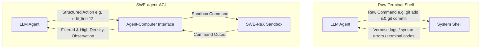

# Qualoop 相关开源产品调研与补充价值报告

本报告汇总并提炼与 Qualoop（质环）方法论及智能体系统相关的优秀开源产品。每半小时进行的深度调研都会将最新的分析与潜在的升级改进建议整理并记录入此文档中，供后续 Qualoop 的升级与完善使用。

---

## 🔍 开源产品调研时间轴

### 📅 首次调研（2026-05-23）: 深入分析 SWE-agent 与 Aider 的核心架构设计及对 Qualoop 的升级价值

#### 1. SWE-agent（普林斯顿 NLP 实验室）
*   **核心创新一：ACI（Agent-Computer Interface，人机界面）**
    *   *机制原理*：传统 Shell（Bash/PowerShell）输出是面向人类设计的，包含大量的格式化控制符、冗长系统噪声，容易导致 LLM 的上下文窗口溢出或因环境不稳定崩溃。SWE-agent 自定义了一个专为 Agent 设计的 Shell（SWE-shell），通过受限的专用命令（如 `find_by_name`, `edit_line`, `view_line_range`），精简了输入与输出，减少了上下文噪声。
    *   *错误防护*：设计了内建的输入输出校验拦截器，在 LLM 尝试运行非法/破坏性命令时进行干预与提醒，避免产生级联错误。
*   **核心创新二：SWE-ReX 沙盒执行环境**
    *   *机制原理*：为了安全且可重现地执行修复，SWE-agent 通过 SWE-ReX 管理容器化环境（Docker / Modal 等）。所有的代码搜索、修改和验证运行均隔离在沙盒内。

---

#### 2. Aider（最流行的协作 AI 编程器）
*   **核心创新一：基于 Tree-sitter 的 Repository Map（仓库地图）**
    *   *机制原理*：为了让 LLM 在庞大的项目库中准确定位代码却不超限，Aider 利用 Tree-sitter 将所有源文件解析为抽象语法树（AST）。它会提取全局的类定义、函数签名、导出类型等符号，构建符号依赖关系的有向图。
    *   *PageRank 权重计算*：对符号关系图应用 PageRank 算法进行重要性评分，筛选最重要的前 1024 级 Token 大小的符号形成静态的“地图”发送给 LLM。
*   **核心创新二：Architect/Editor 双模型协同模式**
    *   *机制原理*：推理（规划）与写码（执行）的分离。由高推理（但可能速度慢、费用高）的“架构师模型”（如 Claude 3.5 Sonnet / o1）负责生成架构设计蓝图和变更建议；再由代码输出精度极高的“编辑器模型”（如 DeepSeek / Fast Llama）负责将具体的 Diff 或 Patch 落库。

---

## 📊 跨维度深度对比分析

| 维度 | Qualoop (L1-L3 当前实现) | SWE-agent | Aider | 补充性价值与 Qualoop 演进方向 |
| :--- | :--- | :--- | :--- | :--- |
| **上下文管理** | 静态读取特定文件与 issues 列表 | 无，通过 ACI 限制只读特定行区间 | Tree-sitter PageRank 仓库地图 | **极高**：引入 Tree-sitter 构建 Qualoop 代码地图，极大降低 Tester 的上下文开销。 |
| **执行安全性** | 本地终端直接运行，无沙盒 | Docker / AWS Modal 沙盒隔离 (SWE-ReX) | 本地 Git 自动 Commit/Rollback 防灾 | **高**：L3 级 Executor 应支持本地虚拟沙盒或临时分支防灾机制。 |
| **命令交付形式** | 自然语言转 Python 脚本或 CLI 运行 | 专为 Agent 裁剪的高密 ACI 指令集 | 命令行快捷指令 + Chat 面板 | **高**：设计 `qualoop-shell`，消除 Windows 平台 CLI 命令执行不兼容问题。 |
| **智能体架构** | 五/六角色（从发现到验证闭环） | 单一 Agent 状态循环 (Action Loop) | 经典的双模型 (Architect/Editor) 协同 | **中**：将 Executor 进一步细分为 Planner/Editor 双层，解耦复杂算法设计与文本修改。 |

---

## 💡 核心价值提炼与升级建议

### 1. 执行器沙盒与安全性保障 (Sandbox & Safety)
*   **来源参考**：SWE-agent (SWE-ReX) / Aider (Git Savepoints)
*   **提炼价值**：自动修复必须在边界安全的环境下进行，直接修改物理文件可能引发逻辑冲突甚至丢失未暂存代码。
*   **Qualoop 升级方向**：
    > [!TIP]
    > **升级建议一（沙盒隔离）**：当 Qualoop 处于 L3 成熟度时，允许配置 `qualoop.json` 中的 `sandbox_type: "docker"` 或 `"temp_branch"`。在执行自动修复前，自动创建名为 `qualoop-temp-branch` 的安全暂存点，并在测试通过后通过 Rebase 或 PR 方式合并入主干。

### 2. 智能体冲突预防与并发机制 (ACI & Concurrency)
*   **来源参考**：SWE-agent ACI (Agent-Computer Interface)
*   **提炼价值**：避免让 AI 角色直面底层的 Bash 或 PowerShell 环境。前几次 Windows 系统兼容性 Bug（如 `&&` 连接符故障）本质就是底层 OS CLI 不一致引入的。
*   **Qualoop 升级方向**：
    > [!IMPORTANT]
    > **升级建议二（Qualoop-ACI）**：为 Tester 和 Executor 提供高密度的中介层 API（例如抽象出 `FileViewer.read_range(file, start, end)` 和 `ShellExecutor.safe_run(cmd)`），不允许 Agent 随意编写原始命令行语句，以此实现跨 OS（Windows/macOS/Linux）行为一致性。

### 3. 精准缺陷定位与自动修复决策 (Repo-Map & Tree-sitter)
*   **来源参考**：Aider (PageRank Repository Map)
*   **提炼价值**：大型项目的核心挑战是“依赖链条长”。若没有关系图，Tester 在判定缺陷影响时常常遗漏受影响的调用方代码。
*   **Qualoop 升级方向**：
    > [!TIP]
    > **升级建议三（语法分析地图）**：引入 Python `tree-sitter` 绑定，对整个业务库生成符号依赖表（`automation/repo_map.json`）。当 Tester 探测到某个函数异常时，顺着依赖链把所有的可能调用方（Caller）标注为潜在缺陷 Issue 并写入 Store，实现深度可追溯。

### 4. 工具链拓展与版本控制集成 (Architect/Editor Mode)
*   **来源参考**：Aider Architect-Editor / o1-style Reasoning
*   **提炼价值**：不同等级的模型擅长不同的子任务。推理角色需要强逻辑但不需要输出格式敏感代码；编辑角色需要对 Diff 和占位符非常敏感。
*   **Qualoop 升级方向**：
    > [!NOTE]
    > **升级建议四（Executor 精细解耦）**：将 `automation/executors/` 下的修复动作划分为 **Planner-Executor**（由 Claude 3.5 或 o1-mini 生成修复逻辑说明）和 **Diff-Editor**（由 DeepSeek 快速生成具体的 patch），两者通过结构化 json 桥接，规避“幻觉”和“输出代码缺失”痛点。
